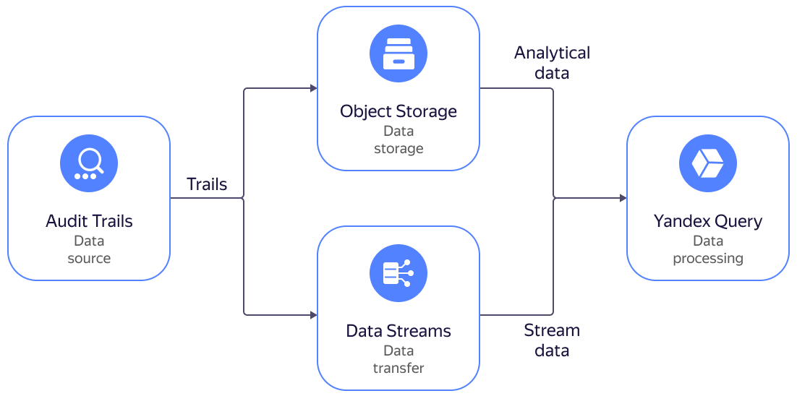

# Searching for {{ yandex-cloud }} events in {{ yq-full-name }}

{{ at-name }} support is integrated in [{{ yq-full-name }}](../../query/). You can analyze events of {{ yandex-cloud }} resources by executing [analytical](../../query/concepts/batch-processing.md) and [streaming](../../query/concepts/stream-processing.md) {{ yql-short-name }} queries.

You can execute analytical queries for logs stored in a [bucket](../operations/export-organization-bucket.md) and streaming queries for logs stored in a {{ yds-full-name }} [data stream](../operations/export-organization-data-streams.md).



To connect a bucket with [audit logs](../concepts/events.md) to {{ yq-full-name }} and execute [{{ yql-short-name }}](../../query/yql-tutorials/index.md) queries:

1. [Prepare the environment](#prepare-environment).
1. [Create a connection between a trail and {{ yq-short-name }}](#trail-yq).
1. [Execute a query to logs in {{ objstorage-name }}](#perform-request).

If you no longer need these resources, [delete them](#clear-out).


## Before you begin {#before-begin}






## Required paid resources {#paid-resources}

The cost of infrastructure support includes a fee for a bucket (see [Pricing for {{ objstorage-name }}](../../storage/pricing.md)).


## Prepare the environment {#prepare-environment}


### Create a bucket for audit logs {#create-backet}



- Management console

   1. In the [management console]({{ link-console-main }}), select the folder where you wish to create a [bucket](../../storage/concepts/bucket.md), for example, `example-folder`.
   1. Select **{{ objstorage-name }}**.
   1. Click **Create bucket**.
   1. On the bucket creation page:
      * Enter the **Name**: `bucket-yq`.
      * For the other parameters, leave the default settings.
   1. Click **Create bucket**.




### Create service accounts {#create-sa}

Create a service account named `trail-sa`:



- Management console

   1. In the [management console]({{ link-console-main }}), go to the `example-folder` folder.
   1. Go to the **Service accounts** tab.
   1. Click **Create service account**.
   1. Enter the **Name**: `trail-sa`.
   1. Click **Create**.



Use the same method to create a service account named `bucket-yq-sa`.


### Assign rights to service accounts {#grant-roles}

Assign the `audit-trails.viewer` and `storage.uploader` roles to the `trail-sa` service account:



- CLI

   1. The `audit-trails.viewer` role to the organization:

      ```bash
      yc organization-manager organization add-access-binding \
      --role audit-trails.viewer \
      --id <organization_ID> \
      --service-account-id <trail-sa_service_account_ID>
      ```

      Result:

      ```text
      done (1s)
      ```

      For more information about the `yc resource-manager organization add-access-binding` command, see the [CLI reference](../../cli/cli-ref/managed-services/organization-manager/organization/add-access-binding.md).

   1. The `storage.uploader` role to `example-folder`:

      ```bash
      yc resource-manager folder add-access-binding example-folder \
          --role storage.uploader \
          --subject serviceAccount:<trail-sa_service_account_ID>
      ```

      Result:

      ```text
      done (1s)
      ```

      For more information about the `yc resource-manager folder add-access-binding` command, see the [CLI reference](../../cli/cli-ref/managed-services/resource-manager/folder/add-access-binding.md).



Assign the `bucket-yq-sa` service account the `storage.viewer` role to `example-folder`:



- CLI

   ```bash
   yc resource-manager folder add-access-binding example-folder \
       --role storage.viewer \
       --subject serviceAccount:<bucket-yq-sa_service_account_ID>
   ```

   Result:

   ```text
   done (1s)
   ```

   For more information about the `yc resource-manager folder add-access-binding` command, see the [CLI reference](../../cli/cli-ref/managed-services/resource-manager/folder/add-access-binding.md).




## Create a trail {#create-trail}



- Management console

   1. In the [management console]({{ link-console-main }}), select the `example-folder` folder.
   1. Select **{{ at-name }}**.
   1. Click **Create trail** and specify:
      * **Name**: `logsyq`.
      * **Resource**: Select `Organization`.
      * **Organization**: An automatically populated field containing the name of the current organization.
      * **Destination**: `{{ objstorage-name }}`.
      * **Bucket**: `bucket-yq`.
      * **Service account**: `trail-sa`.
      * For the other parameters, leave the default settings.
   1. Click **Create**.




## Create a connection between a trail and {{ yq-short-name }} {#trail-yq}

A connection must be created only the first time a trail is connected to {{ yq-short-name }}.



- Management console

   1. In the [management console]({{ link-console-main }}), select the `example-folder` folder.
   1. Select **{{ at-name }}**.
   1. Select the `logsyq` trail.
   1. Click **Process in {{ yq-short-name }}**.
   1. Create a connection.
      * Select **Service account**: `bucket-yq-sa`.
      * For the other parameters, leave the default settings.
   1. Click **Create**.
   1. In the window with data binding options, click **Create**.

   You will go to the page for creating a query to trail logs.




## Execute a query to logs in {{ objstorage-name }} {#perform-request}

Open the page to create an analytical query to {{ at-name }} logs:



- Management console

   1. In the [management console]({{ link-console-main }}), select a folder with a trail.
   1. In the list of services, select **{{ at-name }}**.
   1. Select the trail for which a [connection to {{ yq-short-name }}](#trail-yq) is configured.
   1. Click **Process in {{ yq-short-name }}** to go to the analytical query execution page.



Execute event queries to bind `audit-trails-logsyq-object_storage`:

1. Deleting a folder:

   1. From the list, select query **1. Find out who deleted a folder**.
   1. Edit the query by specifying the folder ID:

      ```SQL
      SELECT * FROM bindings.`audit-trails-logsyq-object_storage`
      WHERE
          JSON_VALUE(data, "$.event_type") = 'yandex.cloud.audit.resourcemanager.DeleteFolder'
          and JSON_VALUE(data, "$.details.folder_name") = '<folder_ID>'
          LIMIT 100;
      ```

   1. Click **Execute**.

1. Enabling access via the serial console:

   1. From the list, select query **6. Changing a VM: Adding access to the serial console**.
   1. Edit the query by specifying the number of displayed records:

      ```SQL
      SELECT * FROM bindings.`<audit-trails-logsyq-object_storage>`
      WHERE
          JSON_VALUE(data, "$.event_type") = 'yandex.cloud.audit.compute.UpdateInstance'
          and JSON_VALUE(data, "$.details.metadata_serial_port_enable") = '1'
          LIMIT <number_of_records>;
      ```

   1. Click **Execute**.

1. Changing access rights to an {{ objstorage-name }} bucket:

   1. From the list, select query **11. Suspicious activities with the {{ at-name }} log repository ({{ objstorage-name }} Bucket)**.
   1. Edit the query by specifying the number of displayed records:

      ```SQL
      SELECT * FROM bindings.`audit-trails-logsyq-object_storage`
      WHERE
          (JSON_VALUE(data, "$.event_type") = 'yandex.cloud.audit.storage.BucketAclUpdate'
          or JSON_VALUE(data, "$.event_type") = 'yandex.cloud.audit.storage.BucketPolicyUpdate')
          LIMIT <number_of_records>;
      ```

   1. Click **Execute**.

1. Assigning administrator rights:

   1. From the list, select query **20. Assigning admin rights (for resources: folder, cloud)**.
   1. Edit the query by specifying the number of displayed records:

      ```SQL
      SELECT * FROM bindings.`audit-trails-logsyq-object_storage`
      WHERE
          JSON_VALUE(data, "$.details.access_binding_deltas.access_binding.role_id") = 'admin'
          LIMIT <number_of_records>;
      ```

   1. Click **Execute**.


## How to delete created resources {#clear-out}

If you created a separate bucket to follow these instructions, you can [delete it](../../storage/operations/buckets/delete.md) to stop paying for [bucket use](../../storage/pricing.md).
