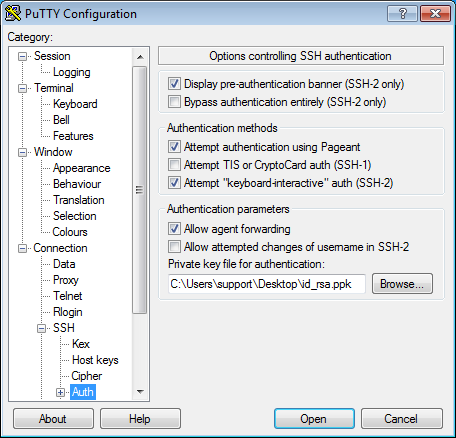
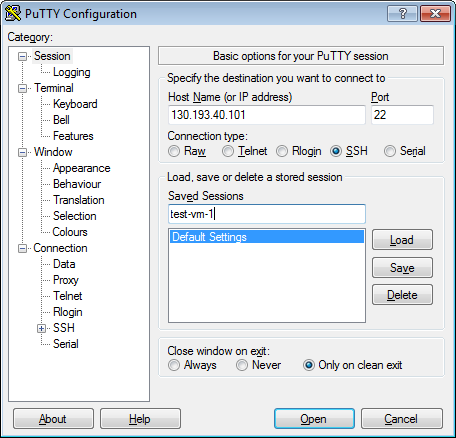
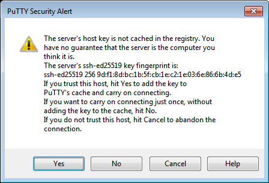
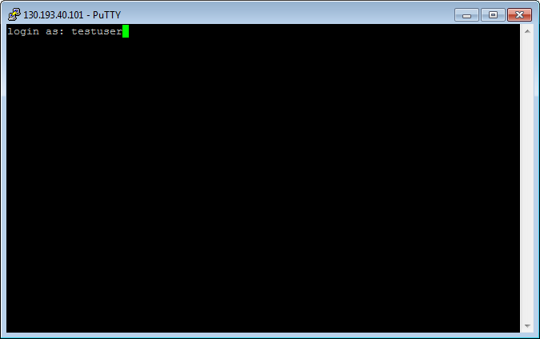

# Connecting to a Linux VM via SSH

The recommended method for connecting to a [VM](../../concepts/vm.md) over SSH uses a key pair: the public key is placed on the VM and the private key is stored on the user device. To enable another user to connect to your VM, add an SSH key for them by following this [guide](#vm-authorized-keys). Connecting with a key pair is more secure than doing so with a username and password.


## Creating an SSH key pair {#creating-ssh-keys}





Save the private key in a secure location, as you will not be able to connect to the VM without it.



## Copying a public key to the clipboard {#copy-key}

Copy the key from the `<key_name>.pub` file using any text editor, such as Notepad. Please note that the key must be written as a **single line** (no returns or line breaks).

You can also copy the key using the command line:



- Linux

   1. Run the terminal.
   1. Output the file contents:

      ```bash
      cat ~/.ssh/<key_name>.pub
      ```

      Where `<key_name>` is the key name, such as `id_ed25519` or `id_rsa`.

      The command will output the public key. Select and copy its text to the clipboard. For example, it could be `ssh-ed25519 AAAAC3NzaC1lZDI1NTE5ABFLIFyapYheN7OZNhTaNqEHefjmU5mtzK7roNnfzL+gRPCz user@Desktop`.
   1. You can copy the file contents right to the clipboard:

      ```bash
      cat ~/.ssh/id_ed25519.pub | xclip -selection clipboard
      ```

      Paste the public key into the **{{ ui-key.yacloud.compute.instances.create.field_key }}** field when creating a new VM in the [management console]({{ link-console-main }}).

- MacOS

   1. Run the terminal.
   1. Output the file contents:

      ```bash
      cat ~/.ssh/<key_name>.pub
      ```

      Where `<key_name>` is the key name, such as `id_ed25519` or `id_rsa`.

      The command will output the public key. Select and copy its text to the clipboard. For example, it could be `ssh-ed25519 AAAAC3NzaC1lZDI1NTE5ABFLIFyapYheN7OZNhTaNqEHefjmU5mtzK7roNnfzL+gRPCz user@Desktop`.
   1. You can copy the file contents right to the clipboard:

      ```bash
      cat ~/.ssh/id_ed25519.pub | pbcopy
      ```

      Paste the public key into the **{{ ui-key.yacloud.compute.instances.create.field_key }}** field when creating a new VM in the [management console]({{ link-console-main }}).

- Windows

   1. Run `cmd.exe` or `powershell.exe`.
   1. Output the file contents:

      ```bash
      type C:\Users\<username>\.ssh\<key_name>.pub
      ```

      Where:
      * `<username>`: Your Windows account name, such as `User`.
      * `<key_name>`: Key name, such as `id_ed25519` or `id_rsa`.

      The command will output the public key. To copy the key, select and right-click it. For example, it could be `ssh-ed25519 AAAAC3NzaC1lZDI1NTE5ABFLIFyapYheN7OZNhTaNqEHefjmU5mtzK7roNnfzL+gRPCz`.
   1. You can copy the file contents right to the clipboard:

      ```bash
      type C:\Users\User\.ssh\id_ed25519.pub | clip
      ```

      Paste the public key into the **{{ ui-key.yacloud.compute.instances.create.field_key }}** field when creating a new VM in the [management console]({{ link-console-main }}).



## Connecting to a VM {#vm-connect}

You can connect to a VM with the `RUNNING` status over SSH. Some time may be required to initialize all the services after the VM [starts](../vm-control/vm-stop-and-start.md#start). If there is a connection error, retry after a few minutes.

To connect, you can use the `ssh` utility on Linux/macOS/Windows 10 and [PuTTY](https://www.chiark.greenend.org.uk/~sgtatham/putty/) on Windows 7/8.

VM [security groups](../../../vpc/concepts/security-groups.md) must allow incoming TCP traffic to port 22.



To connect, specify the VM's [public IP address](../../../vpc/concepts/address.md#public-addresses). You can find out the public IP address in the management console. On the VM's page, go to the **{{ ui-key.yacloud.compute.instance.overview.section_network }}** section and find the **{{ ui-key.yacloud.compute.instance.overview.label_public-ipv4 }}** field. If you created a VM with an internal IP address only, [bind it to a public IP address](../vm-control/vm-attach-public-ip.md).

You can also use the [internal IP addresses](../../../vpc/concepts/address.md#internal-addresses) and [FQDNs](../../../vpc/concepts/address.md#fqdn) to establish an SSH connection between the VMs on a single [cloud network](../../../vpc/concepts/network.md#network) in {{ yandex-cloud }}.



- Linux/macOS

   In the terminal, run this command:

   ```bash
   ssh <username>@<VM_public_IP_address>
   ```

   Where `<username>` is the VM account username.

   If you have multiple private keys, specify the one you need:

   ```bash
   ssh -i <key_path/key_file_name><username>@<VM_public_IP_address>
   ```

   If this is the first time you connect to a VM, you will see a warning about an unknown host:

   ```text
   The authenticity of host '130.193.40.101 (130.193.40.101)' can't be established.
   ECDSA key fingerprint is SHA256:PoaSwqxRc8g6iOXtiH7ayGHpSN0MXwUfWHkGgpLELJ8.
   Are you sure you want to continue connecting (yes/no)?
   ```

   Type `yes` in the terminal and press **Enter**.

- Windows 10

   Make sure that the Windows account has read privileges on the folder containing the keys.

   To connect to the VM, execute the following command in the command line:

   ```shell
   ssh <username>@<VM_public_IP_address>
   ```

   Where `<username>` is the VM account username.

   If you have multiple private keys, specify the one you need:

   ```shell
   ssh -i <key_path\key_file_name> <username>@<VM_public_IP_address>
   ```

   If this is the first time you connect to a VM, you will see a warning about an unknown host:

   ```text
   The authenticity of host '130.193.40.101 (130.193.40.101)' can't be established.
   ECDSA key fingerprint is SHA256:PoaSwqxRc8g6iOXtiH7ayGHpSN0MXwUfWHkGgpLELJ8.
   Are you sure you want to continue connecting (yes/no)?
   ```

   Type `yes` in the command prompt and press **Enter**.

- Windows 7/8

   In Windows, a connection is established using the PuTTY application.
   1. Run the Pageant application.
      1. Right-click on the Pageant icon in the task bar.
      1. In the context menu, select **Add key**.
      1. Select a PuTTY-generated private key in the `.ppk` format. If a password is set for the key, enter it.
   1. Run PuTTY.
      1. In the **Host Name (or IP address)** field, enter the public IP address of the VM you want to connect to. Specify port `22` and **SSH** as the connection type.

         

      1. In the tree on the left, select **Connection** → **SSH** → **Auth**.
      1. Set the **Allow agent forwarding** option.

         

      1. In the tree on the left, select **Connection** → **SSH** → **Auth** → **Credentials**.

      1. In the **Private key file for authentication** field, select the file with the private key.

         

      1. Go back to the **Sessions** menu. In the **Saved sessions** field, enter any session name and click **Save**. The session settings are saved under the specified name. You can use this session profile to connect using Pageant.

         

      1. Click **Open**. If this is the first time you connect to a VM, you might see a warning about an unknown host:

         

         Click **Accept**. A terminal window opens suggesting that you enter the login of the user on whose behalf the connection is being established. Type the username that you specified when creating the VM and press **Enter**. If everything is configured correctly, the connection with the server will be established.

         

   If you saved the session profile in PuTTY, you can use Pageant to establish a connection in the future:
   1. Right-click on the Pageant icon in the task bar.
   1. Select the **Saved sessions** menu item.
   1. In the saved sessions list, select the necessary session.



## Adding SSH keys for other users {#vm-authorized-keys}

You can add SSH keys for another VM user. To do this, create a new user and add a file with the authorized keys for this user.
1. Log in to the VM under the username that you specified when creating the VM in the management console. If the VM is created via the CLI, the default `yc-user` is used.

   

   To get information about a VM with user metadata, run the command:

   ```bash
   yc compute instance get --full <VM_name>
   ```

   

1. Create a new user and specify a default `bash` wrapper for this user:

   ```bash
   sudo useradd -m -d /home/testuser -s /bin/bash testuser
   ```

1. Switch to the new user:

   ```bash
   sudo su - testuser
   ```

1. Create the `.ssh` folder in the new user's home directory:

   ```bash
   mkdir .ssh
   ```

1. In the `.ssh` folder, create the `authorized_keys` file:

   ```bash
   touch .ssh/authorized_keys
   ```

1. Add the new user's public key to the `authorized_keys` file:

   ```bash
   echo "<public_key>" > /home/testuser/.ssh/authorized_keys
   ```

1. Change the access rights `authorized_keys` to the file and `.ssh` folder:

   ```bash
   chmod 700 ~/.ssh
   chmod 600 ~/.ssh/authorized_keys
   ```

1. Disconnect from the VM using the `exit` command.
1. Restart the VM.
1. Check the connection for the new user:

   ```bash
   ssh testuser@<VM_public_IP_address>
   ```

#### What's next {#what-is-next}

* [Learn how to work with {{ yandex-cloud }} from inside a VM](auth-inside-vm.md).