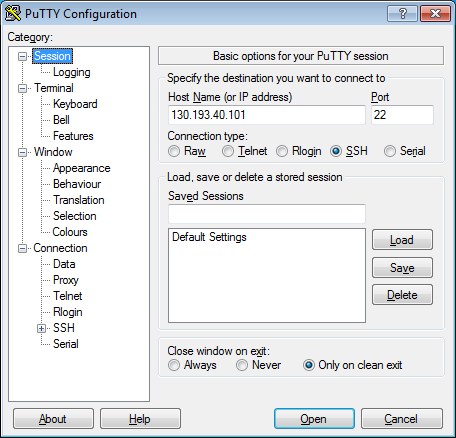

# Connecting to a Linux VM via SSH

The recommended method for connecting to a virtual machine over SSH is based on using a key pair: the open key is placed on the virtual machine, and the private key is stored on the user's device. Connecting with a key pair is more secure than connecting with a username and password.

[!INCLUDE [vm-connect-ssh-linux-note](../../../_includes/vm-connect-ssh-linux-note.md)]

[!INCLUDE [vm-ssh-prepare-key](../../../_includes/vm-ssh-prepare-key.md)]

## Connecting to a VM {#vm-connect}

You can connect to a VM using the SSH protocol when it is running (the VM's status is `RUNNING`). You can use the `ssh` tool on Linux and macOS or [PuTTy](https://www.chiark.greenend.org.uk/~sgtatham/putty/) for Windows.

To connect to the VM, specify its public address. You can find out the public IP address in the management console. Go to the VM's page, find the **Network** section, and see the **Public IPv4** field. If you created a VM with only an internal address, you need to create a new VM with a public address to make it accessible through the internet.

You can also use the internal IP addresses and FQDNs to establish an SSH connection between the VMs within a single cloud network of Yandex.Cloud.

---

**[!TAB Linux/macOS/Windows 10]**

In the terminal, run the following command:

```
$ ssh <user_name>@<VM_public_IP_address>
```

If this is the first time you connect to a VM, you might see a warning about an unknown host:

```
The authenticity of host '130.193.40.101 (130.193.40.101)' can't be established.
ECDSA key fingerprint is SHA256:PoaSwqxRc8g6iOXtiH7ayGHpSN0MXwUfWHkGgpLELJ8.
Are you sure you want to continue connecting (yes/no)?
```

Type `yes` in the terminal and press `Enter`.

**[!TAB Windows 7/8]**

In Windows, a connection is established using the PuTTY app.

1. Run the Pageant app.
   1. Right-click on the Pageant icon in the task bar.
   1. In the context menu, select **Add key**.
   1. Select a PuTTY-generated private key in the `.ppk` format. If a password is set for the key, enter it.
1. Run the PuTTY app.
   1. In the **Host Name (or IP address)** field, enter the public IP address of the VM you want to connect to. Specify port `22` and **SSH** as the connection type.

      

   1. In the tree on the left, select **Connection** - **SSH** - **Auth**.

   1. Set the **Allow agent forwarding** option.

   1. In the **Private key file for authentication** field, select the file with the private key.

      

   1. Go back to the **Sessions** menu. In the **Saved sessions** field, enter any session name and click **Save**. The session settings are saved under the specified name. You can use this session profile to connect to VMs using Pageant.

      

   1. Click **Open**. If this is the first time you connect to a VM, you might see a warning about an unknown host:

      

      Click **Yes**. A terminal window opens suggesting that you enter the login of the user on whose behalf the connection is being established. Type the user name that you specified when creating the VM and press `Enter`. If everything is configured correctly, the connection with the server will be established.

      

If you saved the session profile in PuTTY, you can use Pageant to establish a connection in the future:

1. Right-click on the Pageant icon in the task bar.
1. Select the **Saved sessions** menu item.
1. In the saved sessions list, select the necessary session.

---

## Adding SSH keys for other users {#vm-authorized-keys}

You can add SSH keys for another user of the VM. To do this, create a new user and add a file with the authorized keys for this user.

1. Log in to the VM under the username that you specified when creating the VM in the management console.

1. Create a new user and specify the `bash` wrapper to be used by default for this user:

   ```
   $ sudo useradd -m -d /home/testuser -s /bin/bash testuser
   ```

1. Switch to the new user:

   ```
   $ sudo su - testuser
   ```

1. Create the `.ssh` folder in the new user's home directory:

   ```
   $ mkdir .ssh
   ```

1. In the `.ssh` folder, create the `authorized_keys` file:

   ```
   $ touch .ssh/authorized_keys
   ```

1. Add the new user's public key to the `authorized_keys` file:

   ```
   $ echo "ssh-rsa <public_key>" > /home/testuser/.ssh/authorized_keys
   ```

1. Disconnect from the VM.
1. Make sure you have access to the VM by connecting to it under the new user's name:

   ```
   $ ssh testuser@<VM-public-IP-address>
   ```

