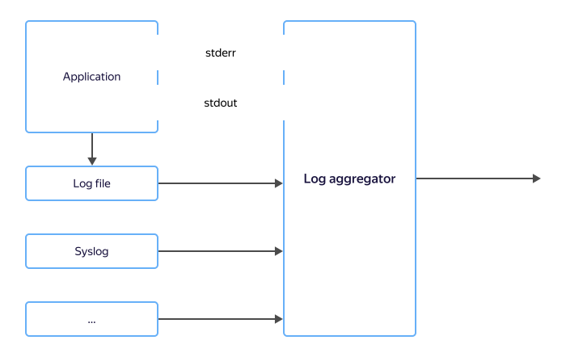

# Storing application runtime logs

Logging is used for app diagnostics. However, just having logs is not sufficient to perform analysis, they need to be stored and handled in a convenient way. To accomplish this, logs are sent to storage systems: [Hadoop](https://cloud.yandex.com/services/data-proc), [{{ CH }}](https://cloud.yandex.com/services/managed-clickhouse), [{{ ES }}](https://cloud.yandex.com/services/managed-elasticsearch), or to specialized cloud systems, such as [{{ cloud-logging-name }}](../../logging/).

Applications do not usually write logs to storage systems directly. Instead, they send them to intermediate aggregator applications. These aggregators can receive logs by intercepting stdout/stderr streams, read log files from disk, get them via syslog or over HTTP, and in many other ways.

After receiving logs, aggregator applications accumulate them and then send them to different targets using plugins. This approach lets application developers focus on writing code and delegate log delivery to specially allocated systems.

Standard log delivery systems are [fluentd](https://www.fluentd.org), [fluentbit](https://fluentbit.io), [logstash](https://www.elastic.co/logstash/), and more.

Though aggregator applications can write data to storage systems directly, to enhance reliability, data is first sent to an intermediate buffer (a data streaming bus, message broker), that is {{ yds-full-name }}, and then to a storage system from it.

## Benefits {#advantages}

### Reliability {#reliability}

For higher reliability, applications can just configure a log aggregator to deliver data to a bus as quickly as possible and the bus will ensure reliable data storage up to the point when the data is processed and written to storage systems.

### Multiple storage systems {#multiple}

The same logs are often stored in multiple storage systems at once: in {{ CH }} for fast analysis and in {{ objstorage-name }} for long-term storage. To implement this, you can set up your aggregator applications so that they send two data streams: one to {{ CH }} and the other one to {{ objstorage-name }}.

With data buses, this can be done even more easily: just send a log once to a data bus and then, from it, run two data transfer processes inside {{ yandex-cloud }}. This solution will also let you add a third storage system, such as {{ GP }} or {{ ES }}, at any time.

The approach using multiple storage systems is very convenient to ensure compliance with Federal Law No. 152-FZ, PCI DSS, and other standards that stipulate that logs shall be stored for at least a year. In this case, logs for the past month can be sent to one storage system so that they can be accessed whenever required, while logs to be stored for a long term can be sent to {{ objstorage-name }} cold storage.

### Masking data and processing logs {#mask}

Some logs are not accessible to all employees. For example, logs may contain users' personal data access to which must be limited.

Transmitted logs can be sent to {{ sf-name }} where they can by masked or handled in any other way.

Once processed, the logs can be sent to multiple target systems at once: access to the logs containing masked personal data can be granted to all employees while access to the full logs to administrators only.

## Setup {#setup}

To set up log storage:

1. [Create a data stream](../quickstart/create-stream.md) {{ yds-short-name }}.
1. Set up a log aggregator: [fluentd](../quickstart/fluentd.md), [logstash](../quickstart/logstash.md), or any other aggregator that supports the [Kinesis Data Streams API](../kinesisapi/api-ref.md).
1. Set up {{ data-transfer-full-name }} to transfer data to the selected storage system.

   An example of setting up data delivery from {{ yds-short-name }} is given in the [instructions on saving data to {{ CH }}](../quickstart/send-to-clickhouse.md).
1. Connect an arbitrary data processing function to {{ data-transfer-full-name }}. The [example](https://github.com/yandex-cloud/examples/tree/master/ydt/nginx-logs) shows a sample function code.
