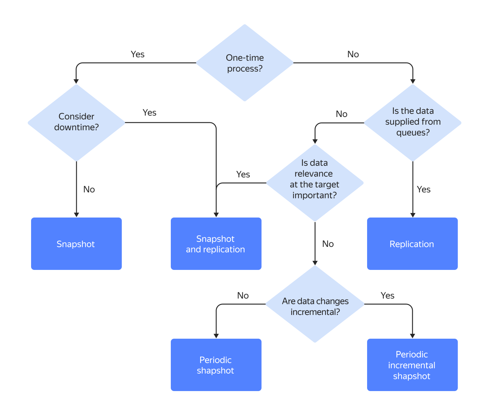
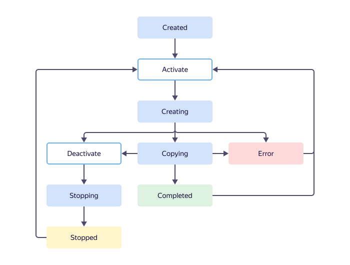
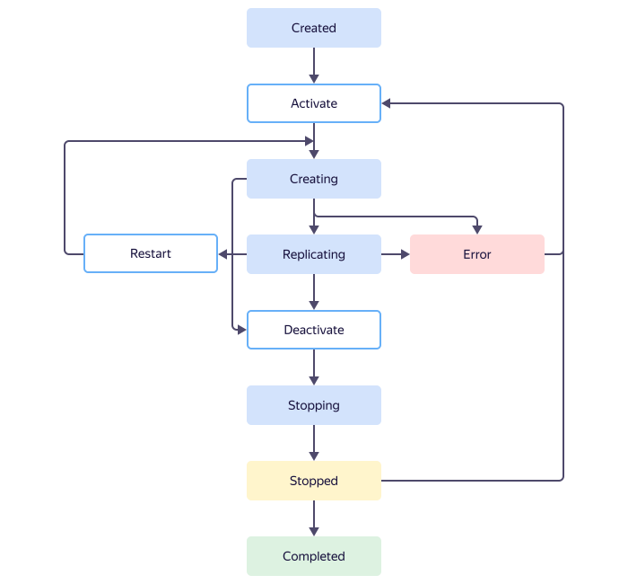
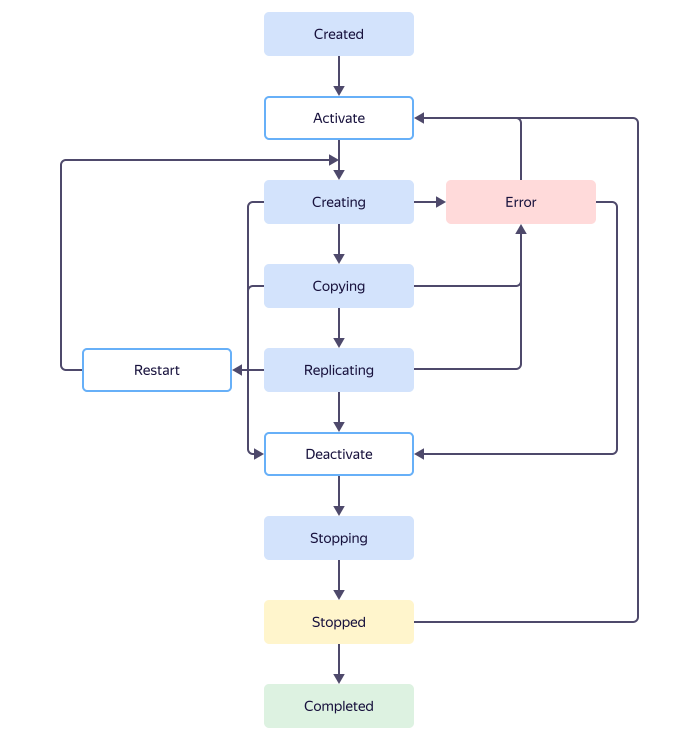

# Transfer types and lifecycles

A transfer lifecycle includes various statuses following one another in the order determined by the transfer type.

## Transfer types {#transfer-types}



The transfer type you select depends on data changes on the source endpoint, requirements for the frequency of data delivery, and the relevance of data.

### Copy {#copy}

The _{{ dt-type-copy }}_ transfer is designed for transferring the state of the source database to the target without keeping it up-to-date. Changes occurring on the source after the transfer is completed will not be transferred. This type of transfer can prove useful when there is no writing load on the source or no need to keep the target database up-to-date, e.g., [when deploying test environments](./use-cases.md#testing).

When the transfer is ready, its status automatically switches to {{ dt-status-copy }}. It is maintained until all data in the source is transferred to the target. Then the transfer is automatically deactivated and switches its status to {{ dt-status-finished }}.

The transition between statuses for the _{{ dt-type-copy }}_ transfer type is shown below:

{{ data-transfer-full-name }} supports three types of data copy:

* _{{ dt-copy-snapshot }}_: Copies all data from the source to the target when activating a transfer. This type of copy may take a long time if the amount of data to transfer is large. In addition, one-time copying does not factor in data changes. You can recopy the data only after the previous operation is completed.
* _{{ dt-copy-regular }}_: Copies all data from the source to the target at certain time intervals. This copy method lets you set up regular data delivery. It is recommended for small tables that are frequently modified.
* _{{ dt-copy-regular-incremental }}_: Copies to the target at certain time intervals only the data that has been modified in the source since the previous copy. This approach allows you to arrange data delivery to the target with the minimum possible latency and load on the data source. However, it does not allow you to factor in data delete operations in the source. For more information, see [{#T}](./regular-incremental-copy.md).

### Replication {#replication}

The _{{ dt-type-repl }}_ transfer is designed for transferring changes from the source to the target without completely copying all data; when the transfer is [activated](../operations/transfer.md#activate), only the data schema will be transferred.

When the transfer is ready, its status automatically switches to {{ dt-status-repl }}, which is maintained indefinitely. Changes occurring in the source are automatically transmitted to the target.

The transition between statuses for the _{{ dt-type-repl }}_ transfer type is shown below:

### Copy and replication {#copy-and-replication}

The _{{ dt-type-copy-repl }}_ transfer combines the features of _{{ dt-type-copy }}_ and _{{ dt-type-repl }}_ transfers, i.e., the source data is completely transferred to the target and is kept up-to-date. Typically, such transfers are used in migration scenarios.

After successful [activation](../operations/transfer.md#activate) and preparation for work, the status of the transfer automatically switches to {{ dt-status-copy }}. It is maintained until all data in the source is transferred to the target.

Then the status of the transfer switches to {{ dt-status-repl }}: all changes occurring on the source are automatically transferred to the target.

The transition between statuses for the _{{ dt-type-copy-repl }}_ transfer type is shown below:

## Statuses {#statuses}

The current transfer status determines available actions with transfers. For more information, see [{#T}](../operations/transfer.md).

* {{ dt-status-created }}: Assigned to a transfer immediately after [creation](../operations/transfer.md#create).

* {{ dt-status-creation }}: Assigned to a transfer after [activation](../operations/transfer.md#activate).

   At this time, the service checks the connection to the source and target and creates the resources necessary for the transfer. Depending on the [transfer type](./index.md#transfer-type) and [endpoint](./index.md#endpoint) settings, additional actions may be available, e.g., creating replication slots, copying a data schema, and so on.

* {{ dt-status-stopping }}: Assigned to the transfer after [deactivation](../operations/transfer.md#deactivate).

   At this time, the service performs the actions necessary to properly disconnect from the source and target. Depending on the [transfer type](./index.md#transfer-type) and [endpoint](./index.md#endpoint) settings, additional actions may be performed, e.g., closing replication slots, transferring triggers, stored procedures, and functions, creating indexes in the target database, and so on.

* {{ dt-status-stopped }}: Assigned to the transfer after [deactivation](../operations/transfer.md#deactivate) is complete.

   Only successful transfer deactivation guarantees the operability of the target and the source.

* {{ dt-status-copy }}: Assigned to _{{ dt-type-copy }}_ and _{{ dt-type-copy-repl }}_ transfers for the period while data is copied from the source.

* {{ dt-status-repl }}: Assigned to _{{ dt-type-repl }}_ and _{{ dt-type-copy-repl }}_ transfers.

   * _{{ dt-type-repl }}_: After a successful [activation](../operations/transfer.md#activate).
   * _{{ dt-type-copy-repl }}_: After successfully copying data from the source.

* {{ dt-status-finished }}: Assigned to transfers that have successfully transferred the data.

* {{ dt-status-error }}: Assigned to the transfer if any issues occur.

   A transfer's status may switch to **{{ dt-status-error }}** during activation, data replication, or copying. Depending on the status that preceded the error, the transfer can be [reactivated](../operations/transfer.md#activate). Errors may occur both on the source and the target.

   Learn more about possible error causes and how to resolve them in [{#T}](../troubleshooting/index.md).