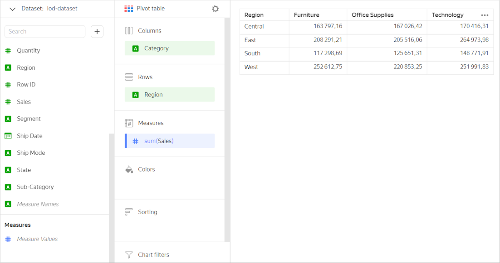
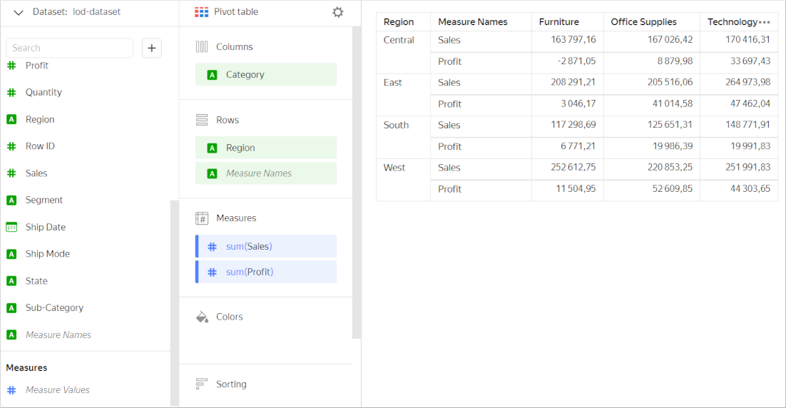
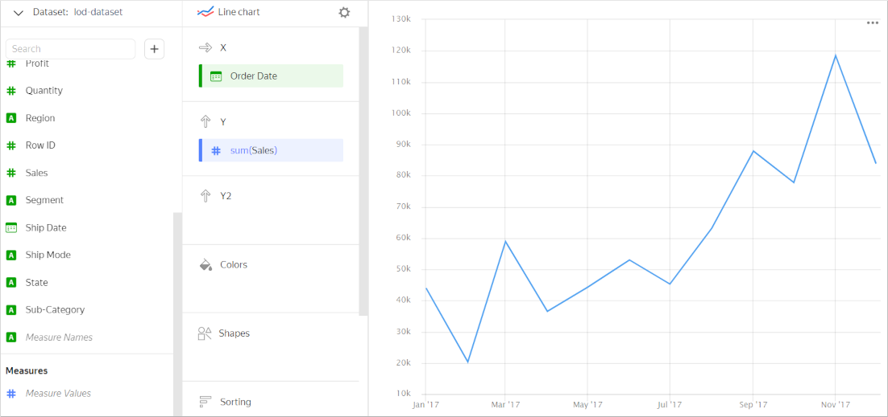
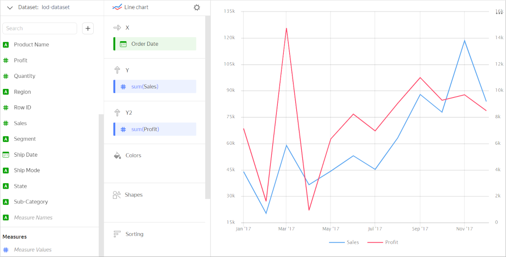
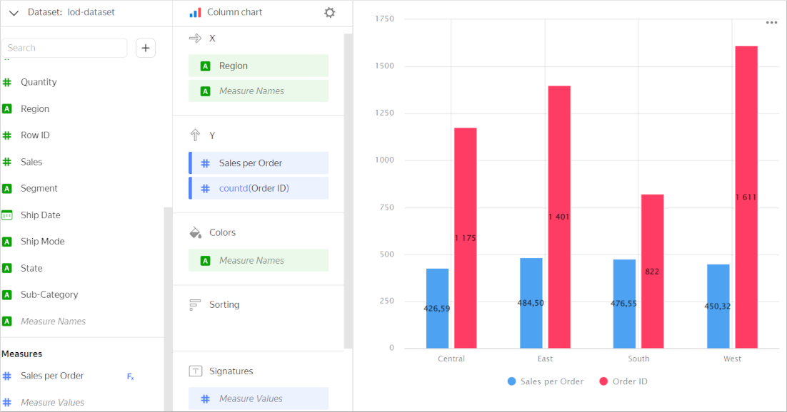

# Measure Names and Measure Values

When you add a measure to a chart section, two auxiliary fields are added to the dataset field list: `Measure Names` and `Measure Values`. They are absent in the original dataset field list: {{ datalens-short-name }} creates them automatically. The `Measure Names` and `Measure Values` fields are used to create charts with multiple measures.

`Measure Names` is a **dimension** (a green field) that includes **names** of all measures in the chart. It's used to group chart values or to show measure names as legends. For example, you can use `Measure Names` to build a bar chart grouped by multiple measures or to label sectors in a pie chart.

`Measure Values` is a **measure** (blue field) that includes **values** of all measures in the chart. It's used to label values of each measure. For example, you can use `Measure Values` to label each line in a chart or each column in a bar chart.

## Using Measure Names and Measure Values in charts {#usage}

Look at practical examples of using `Measure Names` and `Measure Values` in charts. As a data source in our examples, we'll use a direct [connection](../../quickstart.md#create-connection) to a demo database (the dataset is based on the `SampleSuperstore` table).

**Example 1**

Create a pivot table with total sales across each product category by region.

Now, let's also use the table to show profit for each category and region. For this, drag the `Profit` field to **Measures**. The `Measure Names` field will be added automatically to the **Columns** section. This way, you can group your chart by measure names.

You can edit grouping by table measure names. For this, drag the `Measure Names` field to the **Rows** section.

**Example 2**

Let's use the graph to show monthly sales during a year.

Now let's add a second Y axis to show the profit.

Add labels with measure values to each line. The chart uses two measures, but you can only add one of them to the **Labels** section. To label each line in this case, add `Measure Values` to **Labels**. Every line will be labeled by values of its measure.

**Example 3**

Compare the order count and average order value by region. Add the measures to the **Y** section to build a stacked bar chart. The `Measure Names` field will be added automatically to the **Colors** section for grouping by measure name.

This is not the best way to compare measures, however. Show an X-axis grouped column chart. For this, drag the `Measure Names` dimension to the **X** section.

To label each column with its measure name, add `Measure Values` to the **Labels** section.

## Limitations {#restrictions}

The following restrictions apply to the `Measure Names` and `Measure Values` fields:

* You cannot use `Measure Names` and `Measure Values` to filter your chart.
* You can use `Measure Values` to sort data only in the [{#T}](../../visualization-ref/area-chart.md) and [{#T}](../../visualization-ref/normalized-area-chart.md) charts after you add `Measure Names` to the **Colors** section.
