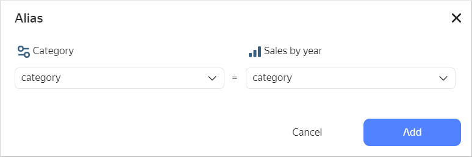

# Adding selectors to dashboards

Before adding a selector, make sure that you have the `Write` or `Admin` permission for a dashboard. For more information, see the [section](../../security/index.md).

To add a selector to a dashboard:



1. In the left-hand panel, click  **Dashboards** and select the dashboard you need.
1. At the top of the page, click **Edit**.
1. Click **Add** and choose **Selector**.
1. Choose your selector type:

   

   - Based on dataset

      Specify the selector parameters:

      * Under **General settings**:

         * **Datasets**: Defines a dataset with data for the selector.
         * **Field**: Defines a dataset field with selector values. It can be a dimension or a measure (for more information, see [{#T}](../../concepts/dataset/data-model.md#field)).
         * **Selector type**: Defines the selector type: drop-down list, input field, or calendar. The **Calendar** type is only available for the `Date` or `Date and time` dataset fields. If a measure is selected in the **Field**, only the **Input field** selector type is available.
         * **Operation**: Defines the comparison operation by which the selector filters the chart values (for example, **Equal to**, **Greater than**, or **Less than**). If the field is left blank, the selector will filter by the **Equal to** operation by default. The list of available operations depends on the field type. Do not specify an operation if the selector filters the QL chart.
         * **Multiple choice**: Determines whether multiple values can be selected. The option is only available for the **List** type.
         * **Range**: Defines the selection of a time period. The option is only available for the **Calendar** type.
         * **Default value**: It is displayed once you open the dashboard.

      * Under **Appearance**:

         * **Name**: Defines the selector name. It is used to choose a selector when establishing a link with other widgets. The option enables you to control the display of the name on the dashboard.
         * **Inner title**: Text that is displayed in the selector to indicate a comparison operation. You can change the default value to your own one. For example, you can specify the `=` or `equal to` value for the **Equal to** operation. The parameter is only available for the **List** type.

            

   - Manual input

      Specify the selector parameters:

      * Under **General settings**:

         * **Name of the field or parameter**: Sets the field name to link the selector with other widgets to in the [alias](create-alias.md) configuration window.

            

         * **Selector type**: Defines the selector type: drop-down list, input field, or calendar.
         * **Operation**: Defines the comparison operation by which the selector filters the chart values (for example, **Equal to**, **Greater than**, or **Less than**). If the field is left blank, the selector will filter by the **Equal to** operation by default. The list of available operations depends on the field type. Do not specify an operation if the selector filters the QL chart.
         * **Multiple choice**: Determines whether multiple values can be selected. The option is only available for the **List** type.
         * **Range**: Defines the selection of a time period. The option is only available for the **Calendar** type.
         * **Default value**: It is displayed once you open the dashboard. This field is mandatory for a **List** selector: if you omit it, the selector will have no value available.

      * Under **Appearance**:

         * **Name**: Defines the selector name. It is used to choose a selector when establishing a link with other widgets.

            

            The option enables you to control the display of the name on the dashboard.

         * **Inner title**: Text that is displayed in the selector to indicate a comparison operation. You can change the default value to your own one. For example, you can specify the `=` or `equal to` value for the **Equal to** operation. The parameter is only available for the **List** type.

            

   

   In [QL charts](../../concepts/chart/index.md#sql-charts), you can control [selector parameters](../chart/create-sql-chart.md#selector-parameters) from the **Parameters** tab in the chart editing area and use the **Query** tab to specify a variable in the query itself in `not_var{{variable}}` format.

1. Click **Add**. The widget will be displayed on the dashboard.



When adding a selector by a certain field to your dashboard, filters added at the chart level are no longer applied to the dashboard's chart.



## Limitations {#restrictions}

* For measure selectors, only one selector type is available: **Input field**.
* We recommend making measure selectors independent of other selectors (you must specify the **Ignore** [link](../../dashboard/link.md) type with other selectors in the **Links** section when editing a dashboard).
