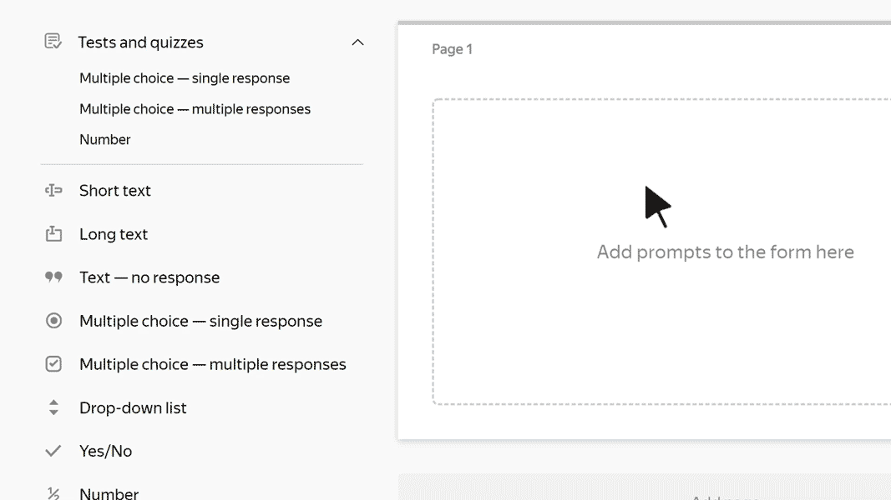
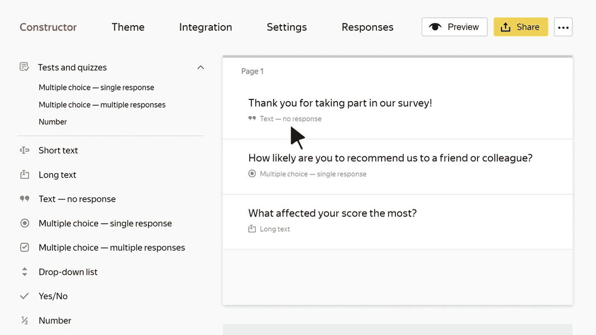

# Add prompts

A form consists of blocks of prompts — these are fields or lists where users can respond to a prompt or enter some data. You can set limits or response options for blocks, and you can also set conditions for showing or hiding blocks depending on how the user responded to other prompts.

## Add a prompt block {#section_zlk_g4z_sbb}

1. Select a form and go to **Constructor**.

1. To add a prompt block to the form, select it from the list on the left and drag it to the workspace. To learn more about how different prompt blocks work, go to [{#T}](#sec_questions_ref).

1. In the **Edit a response** window that opens, [set the parameters of the block](#section_jpy_2xg_qbb). To configure a previously added block, click it.

1. To change the order of prompts, hover over the block and drag the  icon to where you want it.

    

1. If you want to show or hide a block depending on how the user responded to other prompts, [set the display conditions for it](#section_q2t_zqz_sbb).

1. To remove a prompt block, click .

1. To split a form into multiple pages, click the **Add page** button at the bottom of the workspace. Users can switch between form pages using the **Next** and **Back** buttons.

    

    Users can't go to the next page until they fill in the required fields on the previous page.

    

1. To see what the form you created looks like, click **Preview**.

## Configure prompt parameters {#params}

To configure the parameters of the prompt block, click it. This opens the **Edit a response** window:

- In the left part of the window, you can configure prompt parameters.

- In the right part of the window, you can see what the prompt looks like on the form.

Depending on the prompt type, different parameters are available for editing. Block parameters are divided into three groups:

- **Prompt**: The main text in the block. It is usually a field heading or a prompt for the user to respond to.

- **Responses**: Parameters for blocks where the user needs to select responses from multiple options. You can set a list of acceptable responses or limit the choice of responses (for example, for prompts to select a date or city).

- **Settings**: Parameters you can use to set limits or additional block properties. For instance, you can require the user to fill in a field or configure the sorting of response options.

To learn more about parameters, go to [{#T}](blocks-ref/blocks-reference.md).

## Set conditions for showing a prompt {#conditions}

You can show or hide any block depending on how the user responded to previous prompts:

1. Hover over the block and click the  icon that appears.

1. Select **On condition**.

1. Set the condition for showing the prompt:

    - Select the prompt that determines whether to show or hide the block.

    - Select a relational operator: **equal** or **not equal**.

    - Select or enter a response that the user's response needs to match.

1. To add multiple conditions, click **Add condition** and set a logical operator.

    If you put the **and** logical operator between two conditions, they must both be met. If you use the **or** operator, at least one condition must be met.

    If you add multiple conditions with different operators, the conditions are checked from top to bottom. The **and** operator doesn't take priority over the **or** operator.

    

    To make sure results are predictable when checking a group of conditions, we recommend using just one operator type: all conditions with **and** or all conditions with **or**.

    

## How to add a field for a free response {#field-free-answ}

To allow a user to give an arbitrary response on a form with a fixed set of responses, use a condition for showing the prompt:

1. Add prompts to your form:

    - **Multiple answers** or **One answer** with multiple response options. In addition to fixed responses, set an arbitrary response, like "Other".

    - **Short text**. The user can enter any text in this field.

1. In the constructor, hover over the "Short text" prompt and click .

1. Select **On condition**.

1. Set the condition for showing the prompt:

    - Select a prompt with fixed response options that determine whether to show or hide the block.

    - Select the **equal** relational operator.

    - Select "Other".

This means that a field for entering any text is shown to the user if they select "Other" in a multiple-choice prompt.

## What prompts to use {#sec_questions_ref}

If you aren't sure which prompt block is right for your form, use the table:

| What kind of response you want to get | Which block to choose |
| ----- | ----- |
| Any word or short phrase, like a name. | [{#T}](blocks-ref/short-text.md) |
| Any long text, like a review. | [{#T}](blocks-ref/long-text.md) |
| A number, like an amount of money. | [{#T}](blocks-ref/number.md)  [{#T}](blocks-ref/integer.md) |
| A date or date range, like the date of an event. | [{#T}](blocks-ref/date.md) |
| Email address | [{#T}](blocks-ref/email.md) |
| Phone number | [{#T}](blocks-ref/phone.md) |
| A link, like the link to a social media profile. | [{#T}](blocks-ref/link.md) |
| A file uploaded by the user, like a photo. | [{#T}](blocks-ref/file.md) |
| A response selected from the suggested options, like a product color. | [{#T}](blocks-ref/dropdown.md)  [{#T}](blocks-ref/radiobutton.md) |
| Multiple responses selected from the suggested options, like a request for multiple services. | [{#T}](blocks-ref/multiple.md) |
| A name of a city or country, like the user's place of residence. | [{#T}](blocks-ref/cities.md) |
| Multiple ratings on a scale, like rating an event using multiple criteria. | [{#T}](blocks-ref/rating.md) |
| Agreement with a statement or acceptance of an action, like agreeing to receive emails. | [{#T}](blocks-ref/yes-no.md) |
| A response to a [test](tests.md) prompt that earns points for correct responses. | Prompts from the **Tests and quizzes** category:<ul><li>[{#T}](blocks-ref/test-single.md)<li>[{#T}](blocks-ref/test-multiple.md)<li>[{#T}](blocks-ref/test-number.md)<ul/> |
| Information that doesn't require a response, like a heading for a group of prompts. | [{#T}](blocks-ref/no-question.md) |
| Company TIN | [{#T}](blocks-ref/inn.md) |
| Responses to a group of repeating prompts. For example, you may need to specify the details of several participants to register them for an event. | [{#T}](blocks-ref/series.md) |
| The name of an employee of a {{ org-full-name }} organization | [{#T}](blocks-ref/people.md) |
| The name of a department or team in a {{ org-full-name }} organization | [{#T}](blocks-ref/departments.md) [{#T}](blocks-ref/teams.md) |
|  |
|  |
| A block with response options that are loaded from a [dynamic {{ wiki-name }} table](../wiki/create-grid.md) | [{#T}](blocks-ref/wiki.md) |
|  |

