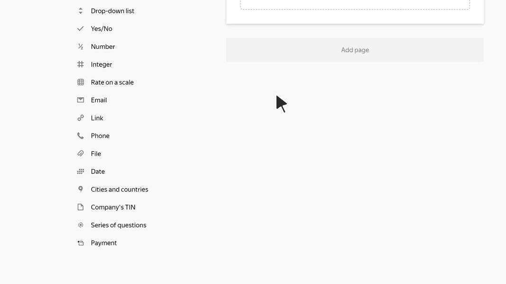

# Drop-down list

In this block, the user can select an item from the drop-down list. For example, their marital status.

## Block settings {#sec_settings}

### Question {#question}

Enter the list title or the prompt you want to use.

* To add an image to the title, click .

* To add a comment or hint to the prompt, click **+ Add comment**. The comment is displayed in a small font.

* To format the text of your prompt or comment, use [Markdown](../appearance.md#section_pzm_m1j_j3b).

### Responses {#answer}

Set the options that the user can choose:

* To add a response option, select **Add option** and enter the text of the response.

* To format the text of the response, use [Markdown](../appearance.md#section_pzm_m1j_j3b).

* To move an option to a different position in the list, drag it to the  icon.

### Question ID {#id}

Use the question ID to [pre-fill forms](../pre-fill.md).

You can edit the ID. All questions in the same form must have unique IDs.

### Required prompt {#required}

Turn this option on to mark required prompts with an <q>asterisk</q>. If the user doesn't respond to this prompt, they can't submit the completed form.

### Hidden question {#hidden}

Turn on this option if you don't want to show a prompt on the form. You can use hidden questions to [send technical parameters](../pre-fill.md#hidden-query).



Don't turn on **Hidden question** and **Required prompt** at the same time, otherwise users won't be able to submit the completed form.



### Sort responses {#sort}

Turn on this option and choose one of the sorting methods:

* **Alphabetical**.

* **Random for each user**: Select this sorting method if you don't want the user's choice to be affected by the order in which responses are displayed.

### Automatically insert the first response option {#first}

Turn on this option to insert the first response in the list by default. For example, do this if you think that this option fits most users.

Sorting responses affects which response is automatically inserted.

### Filter responses when typing text in the field {#filter}

Turn on this option so the user can type in the field with the list. In this case, only the response options that match the entered text are displayed in the list.

