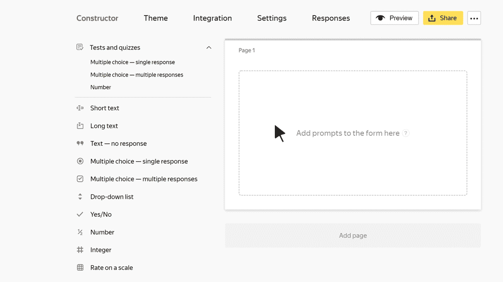

# Rate on a scale

In this block, the user can evaluate an item or event on a given scale. For example, if you want to collect feedback about an event, you can ask users to rate it on a five-point scale for categories like how well it was organized, topics that were presented, and how the host or moderator did their job.

## Block settings {#sec_settings}

### Question {#param-question}

Enter your prompt. For example, ask the user to rate something.

- To add an image to the prompt, click .

- To add a comment or hint to the prompt, click **+ Add comment**. The comment is displayed in a small font.

- To format the text of your prompt or comment, use [Markdown](../appearance.md#section_pzm_m1j_j3b).

### Criteria {#param-criterion}

In the **Criteria** section, set the criteria for evaluating items or list multiple items to evaluate. For example, you can set the following criteria for evaluating an event: how well it was organized, the topics presented, and how the host or moderator did their job.

- To add a criterion, select the **Add option** field and enter a name.

- To move a criterion to a different position in the list, drag it to the  icon.

- To delete a criterion, click the  icon.

### Responses {#param-answers}

In the **Responses** section, set the rating scale. The user needs to select a response option for each criterion. For example, for rating on a five-point scale, you can set numbers from 1 to 5 as responses. Or you can set three grades: <q>good</q>, <q>satisfactory</q>, and <q>bad</q>.

- To add a response option, select **Add option** and enter the text of the response.

- To format the text of the response, use [Markdown](../appearance.md#section_pzm_m1j_j3b).

- To move an option to a different position in the list, drag it to the  icon.

### Question ID {#param-question-id}

Use the question ID to [pre-fill forms](../pre-fill.md). You can edit the ID. All questions in the same form must have unique IDs.

### Required prompt {#param-question-perm}

Turn this option on to mark required prompts with an <q>asterisk</q>. If the user doesn't respond to this prompt, they can't submit the completed form.

### Hidden question {#param-question-hide}

Turn on this option if you don't want to show a prompt on the form. You can use hidden questions to [send technical parameters](../pre-fill.md#hidden-query).



Don't turn on **Hidden question** and **Required prompt** at the same time, otherwise users won't be able to submit the completed form.



