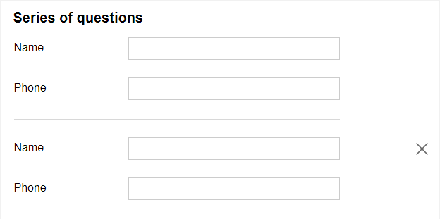

# Get IDs for questions and responses

The questions and responses ID are used to prefill the form. There are several ways to get IDs for different types of questions.

## ID of the question {#sec_question}

You can get the question ID in the **Settings** section of the [Edit a response](add-questions.md#section_jpy_2xg_qbb) window.

## IDs for a series of questions {#series}

You can add a [series of questions](blocks-ref/series.md) to a form several times. This means that questions from a series may repeat. To distinguish between multiple instances of the same question, question IDs that belong in a series get a suffix, which is the instance number after a double underscore. The numbers start with zero: `__0`, `__1`, `__2`.

For example, the form has a series of questions:

* <q>Name</q> with ID `text_2643945`.

* <q>Phone</q> with ID `phone_2752014`.

To prefill the fields in a series of questions, configure [GET parameters](get-params.md):

* For the first instance of the series, which is displayed in the form by default, use `text_2643945__0`and `phone_2752014__0` question IDs.

* For the second instance of the series, which can be added by clicking **more "series of questions"**, use `text_2643945__1` and `phone_2752014__1` question IDs.

## Response ID {#sec_answer}

To find out the response ID:

1. Select the question section.

1. Click the **Advanced parameters** icon in the **Responses** section on the left panel.

1. Copy the **ID** field value.



IDs can be edited. IDs of responses to a single question must be unique.



## Response IDs for the question types <q>Rate on a scale</q>, <q>Wiki</q>, <q>Cities and countries</q> {#sec_rating}

You can find out the response IDs in your browser by using developer tools. This feature is available both to the creator and user of the form.

Let's see how to get IDs using Yandex&#160;Browser:

1. [Open the form by following a link](publish.md#section_link).

1. Open the developer tools using the keyboard shortcut **Ctrl+Shift+I** (for Windows and Linux) or **⌘ + Option + I** (for macOS).

1. Select the  tool and click the necessary response field, list, or marker.
   

1. You'll see a fragment of the page code with the question or response parameters highlighted in the **Elements** tab.

1. Find the ID values in the code:
   * Question ID: Find the `name` parameter value (except for the <q>Rate on a scale</q> question type).

   * Response ID: Find the `value` parameter value.
      

   
   * For the <q>Drop-down list</q> question type, the code lists all available response options.
      

   * For the <q>Rate on scale</q> question type, the `name` parameter has the question ID and criterion ID.
      

   * For the <q>Cities and countries</q>, or <q>Wiki</q> question type, first enter the desired response in the field, and then you will see its ID in the code.
      
