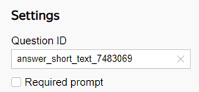
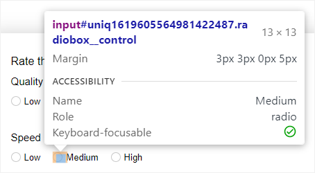

# Get question and response IDs

Question and response IDs are used for pre-filling forms. There are several ways to get IDs for different prompt types.

## Question ID {#sec_question}

You can find the question ID in the **Settings** section of the [question editing window](add-questions.md#section_jpy_2xg_qbb).

## IDs for a series of questions {#series}

A series of questions can be added to the form several times. This means that questions from a series may repeat. To distinguish between multiple instances of the same question, question IDs that belong in a series get a suffix, which is the instance number after a double underscore. The numbers start with zero, so the suffix may look like `__0`, `__1`, `__2`.

For example, the form has a series of questions:

* <q>Name</q> with question ID `text_2643945`.

* <q>Phone</q> with question ID `phone_2752014`.

To set pre-filling for a series of questions:

* For the first instance of the series, which is displayed on the form by default, use `text_2643945__0` and `phone_2752014__0` question IDs.

* For the second instance of the series, which can be added by clicking **more "series of questions"**, use `text_2643945__1` and `phone_2752014__1` question IDs.

## Response IDs  {#sec_rating} questions

You can find out the response IDs in your browser by using developer tools.

To learn about getting IDs, let's use Yandex Browser as an example:

1. [Open the form via the link](publish.md#section_link).

1. Open the developer tools using the keyboard shortcut **Ctrl+Shift+I** (for Windows and Linux) or **⌘ + Option + I** (for macOS).

1. Select the  tool and click the necessary response field, list, or marker.

1. On the **Elements** tab, a fragment of the page code with the question or response parameters is highlighted.

1. Find the ID values in the code:

    * Question ID: Find the `name` parameter value (except for the <q>Rate on a scale</q> question type).

    * Response ID: Find the `value` parameter value.

    

    
    * For the <q>Drop-down list</q> question type, the code lists all available response options.

    

    * For the <q>Rate on a scale</q> question time, the `name` parameter has the question ID and criterion ID.

    

    * For the <q>Cities and countries</q> question times, enter the response you want first, and you'll see its ID in the code.
    
    

