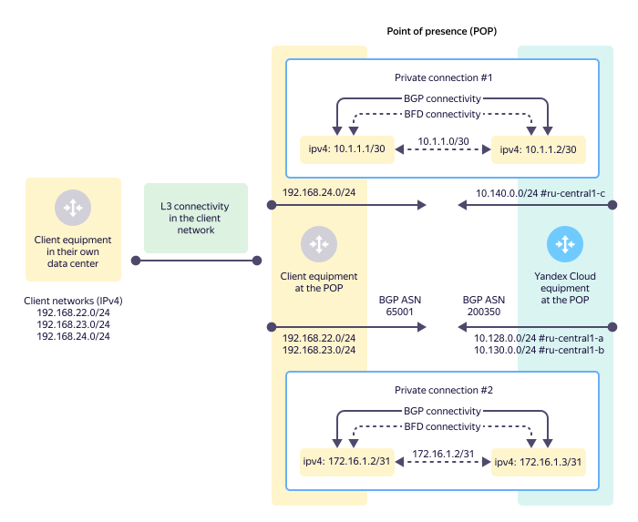
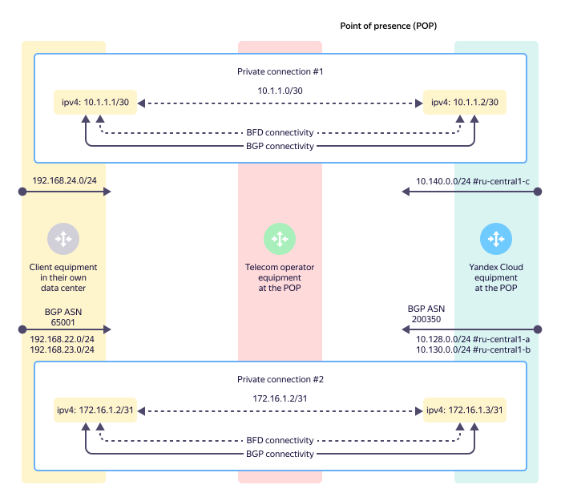

# IP and BGP connectivity (L3)

Layer 3 of the [OSI model](https://en.wikipedia.org/wiki/OSI_model) determines IP connections inside the VLAN. IP connections are divided into [private](#private-connection) or [public](#public-connection) ones depending on the type of used IP addresses (private or public).



When you set up a private or public connection, only IPv4 addresses are used. IPv6 addresses are not supported.



## Private connection {#private-connection}

A private connection is the type of connections using private IPv4 addresses that are not routed to the internet. For more information about the set of subnets that private addresses are allocated from, see [RFC-1918](https://datatracker.ietf.org/doc/html/rfc1918). For private connections, `/30` or `/31` subnets are used. Private connection data streams are transferred via a [trunk connection](l2-trunk.md) and tagged with a certain VLAN ID value.

## Public connection {#public-connection}

A public connection is the type of connections using public IPv4 addresses from the [address pool](../../vpc/concepts/ips.md), which are routed to the internet. For public connections, a `/31` subnet is used. Public connection data streams are transferred via a trunk connection and tagged with a certain VLAN ID value.

A public connection is normally used for direct interaction with the {{ yandex-cloud }} services. For example:
* [{{ api-gw-name }}](../../api-gateway/).
* [{{ sf-name }}](../../functions/).
* [{{ container-registry-name }}](../../container-registry/).
* [{{ objstorage-name }}](../../storage/).

For a public connection, use the [NAT](https://en.wikipedia.org/wiki/Network_address_translation) technology on the client side. Options for implementing NAT:
* NAT on the client equipment side from the IPv4 address in a `/31` point-to-point subnet for public connections.
* NAT on the client equipment that is not used for a point-to-point configuration of public connections. In this case, the client is allocated an additional public `/30` IPv4 subnet. The client equipment needs to announce this subnet over BGP towards {{ yandex-cloud }} via the point-to-point subnet for public connections.

## BGP connectivity {#bgp-connectivity}

BGP connectivity takes place within each private or public connection between the client equipment and {{ yandex-cloud }} equipment at the [point of presence](points-of-presence.md) for exchanging network (prefix) data. After exchanging this routing data, the sides can pass IPv4 traffic between the networks they've communicated to each other. This is the {{ interconnect-name }} target state.



If the [limit](limits.md#interconnect-limits) of received prefixes is exceeded, a BGP session is terminated for 30 minutes. We recommend setting up [alerting](../../monitoring/operations/alert/create-alert.md) for the `ipv4_announces_received_by_cloud_num` [metric](user-metrics.md) and set alert thresholds to prevent the termination of a BGP session when the number of prefixes is suddenly exceeded.



To set up BGP connectivity, each side must specify the BGP autonomous system number (ASN). The BGP ASN for {{ yandex-cloud }} is fixed at `200350`. On the client side, a public BGP ASN (if any) can be set up or any number from private BGP ASNs in the range of `64512`–`65534` can be used.



The BGP ASN value on the {{ yandex-cloud }} side (`200350`) is 4 bytes. By default, network equipment uses 2-byte BGP ASN values. When setting up BGP connectivity on the client equipment, you should explicitly permit 4-byte BGP ASNs.



If you can't connect your router directly to the {{ yandex-cloud }} equipment, use intermediate devices (switches). For fast fault detection on the intermediate devices, use the BFD protocol. To improve convergence (the time of network response to changes), also use the BGP protocol.

### L3 and BGP connectivity over direct physical link {#l3-bgp-connectivity-over-direct-link}

L3 and BGP connectivity is set up between the client equipment at the point of presence and the {{ yandex-cloud }} equipment. When setting up IPv4 connectivity, `/30` or `/31` IPv4 subnets can be used. In this case, the client ensures L3 connectivity from their equipment in the data center to their own equipment at the point of presence. All route announcements over BGP from the client side enter all {{ yandex-cloud }} [availability zones](../../overview/concepts/geo-scope.md).

### L3 and BGP connectivity over operator's link {#l3-bgp-connectivity-over-operator-link}

The client with no equipment of their own at the point of presence uses a telecom operator (or a partner) to provide L1 and L2 connectivity from the {{ yandex-cloud }} equipment to the equipment in their data center (see PHY2, PHY3, and TRN2). L3 and BGP connectivity is set up between the client equipment in their data center and the {{ yandex-cloud }} equipment at the point of presence.

### L3 and BGP + L3VPN over operator's link {#l3-bgp-l3vpn-connectivity-over-operator-link}

If the client doesn't want to provide BGP interaction on their own or it's not technically possible, this can be delegated to a telecom operator. In this case, the telecom operator connects the client equipment in the client data center to their own equipment at the appropriate point of presence using the L3VPN service that ensures L3 connectivity through static routing or one of the IGP protocols for dynamic routing.

All L3 and BGP connectivity with {{ yandex-cloud }} is set up between the telecom operator's equipment and the {{ yandex-cloud }} equipment at the point of presence. This connection becomes a part of the client L3VPN, which ensures direct connectivity between the client equipment in their data center and {{ yandex-cloud }}.

Using L3VPN, a telecom operator can potentially provide L3 connectivity over one physical connection from the client data center to {{ yandex-cloud }} via two or more points of presence. This option should be considered when the client migrates from other locations to {{ yandex-cloud }}.
