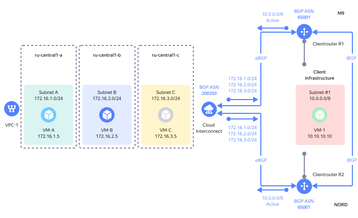
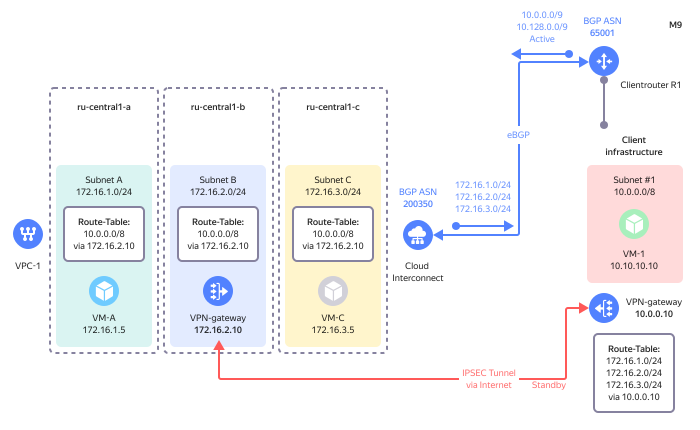
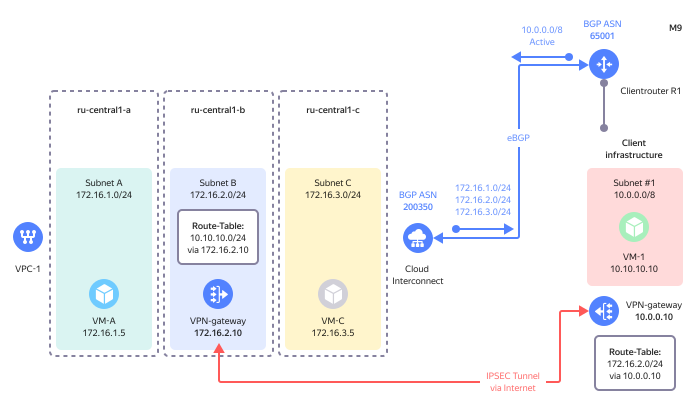
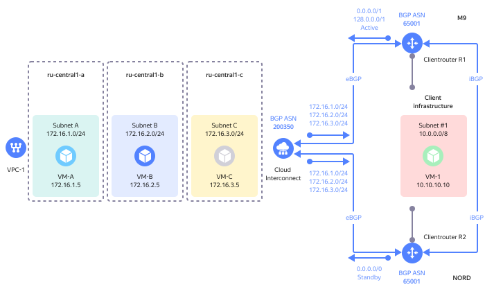

# Routing

When connecting a client infrastructure via {{ interconnect-full-name }}, it is usually required to set up traffic routing between cloud resources and client infrastructure resources.

**Routing** is a set of tools for traffic management in {{ yandex-cloud }}.

## General recommendations for routing in {{ interconnect-name }} {#cic-routing}

* Carefully plan IP addressing before deploying cloud resources. IP addressing of subnets in {{ yandex-cloud }} and subnets in the client infrastructure must not overlap.
* Always set up two channels for connections via two [points of presence](pops.md).
* Use the same [BGP ASN](priv-con.md#bgp-asn) on client routers. If the [BGP ASN](priv-con.md#bgp-asn) values are different on different client routers, fault tolerance mechanisms will not work.
* Each client router that sets [BGP connectivity](priv-con.md#bgp-peering) with the {{ yandex-cloud }} equipment over **eBGP** should also set BGP connectivity with other client routers over **iBGP**.
* Use prefixes of a different length on client routers for BGP announcements to distribute outgoing traffic from cloud subnets via the following communication channels:
   * A prefix with a length of `/8` (short prefix) indicates the lowest priority of a route.
   * A prefix with a length of `/32` (long prefix) indicates the highest route priority.
* To choose a communication channel for outgoing traffic from the client infrastructure to cloud networks on a client router, you can, for example, use a standard BGP attribute named `Local Preference`.
* You can use {{ interconnect-name }} and a [NAT gateway](../../vpc/operations/create-nat-gateway.md) simultaneously if client routers do not announce the default `0.0.0.0/0` route over BGP to {{ yandex-cloud }}. If client routers do announce the default `0.0.0.0/0` route over BGP to {{ yandex-cloud }}, you cannot use a [NAT gateway](../../vpc/operations/create-nat-gateway.md)!
* Currently, {{ yandex-cloud }} does not support distribution of outgoing traffic from cloud subnets to the client infrastructure based on the [BGP AS-Path Prepend](https://linkmeup.gitbook.io/sdsm/8.-bgp-i-ip-sla/2.-bgp/4.-balansirovka-nagruzki/2.-as-path-prepend) or [BGP community](https://linkmeup.gitbook.io/sdsm/8.1.-ibgp/3.-atributy-bgp/4.-community/0.-teoriya) mechanisms.

## Even traffic distribution (Active-Active) {#cic-routing-aa}

Below is an example of even distribution of traffic using two private connections set up through two points of presence.

The client infrastructure prefix, `10.0.0.0/8`, is announced over BGP by client routers via two points of presence to {{ yandex-cloud }}. {{ yandex-cloud }} will perform ECMP load balancing and distribute traffic between the points of presence.



Note that this balancing mode can lead to asymmetric traffic. For example, a request from the client infrastructure to cloud resources can be received via the `M9` point of presence, while a response to the request will be sent via the `NORD` point of presence.

Traffic asymmetry is allowed and handled correctly on the {{ yandex-cloud }} equipment, but may not be supported by certain types of equipment in the client infrastructure, such as firewalls.

To allow asymmetric traffic from {{ yandex-cloud }}, disable the [RPF](https://en.wikipedia.org/wiki/Reverse-path_forwarding) mechanism on the network elements handling traffic in the client infrastructure. This will enable you to use all active {{ interconnect-name }} connections with a redundant connection via two or more points of presence.


## Traffic prioritization by direction (Active-Standby) {#cic-routing-as}

Below is an example of traffic prioritization using two private connections set up via two points of presence.

A short prefix from the client infrastructure, `10.0.0.0/8`, is announced over BGP by a client router via the `NORD` point of presence to {{ yandex-cloud }}.

Two long (more specific) prefixes from the client infrastructure, `10.0.0.0/9` and `10.128.0.0/9`, are announced over BGP by a client router via the `M9` point of presence to {{ yandex-cloud }}.


Announcements via the `M9` point of presence will be treated in {{ yandex-cloud }} as more specific, i.e., of higher priority.

This way, for all traffic from the `172.16.1.0/24, 172.16.2.0/24, and 172.16.3.0/24` cloud subnets to the client infrastructure, the private connection to the `M9` point of presence will be selected. If this connection fails, traffic will be automatically switched over to the private connection to the `NORD` point of presence.


## Traffic reservation via a VPN gateway {#cic-routing-vpn}

If you cannot set up two physical channels via two points of presence to ensure a fault-tolerant connection of the client infrastructure to {{ yandex-cloud }}, you can use a VPN gateway to protect a {{ interconnect-name }} connection from failure.



Two long prefixes from the client infrastructure, `10.0.0.0/9` and `10.128.0.0/9`, are announced over BGP by a client router via the `M9` point of presence to {{ yandex-cloud }}.

A backup connection from {{ yandex-cloud }} to the client infrastructure is set up by deploying a VPN gateway with IPSEC support in the `{{ region-id }}-b` availability zone and setting up static routing in the VPC network.

For each subnet with cloud resources in all three availability zones, a single route table with the static route (prefix) `10.0.0.0/8 via 172.16.2.10` is used. Since this `/8` route (prefix) is shorter than the longer `/9` prefixes announced over BGP, it will have a lower priority while the {{ interconnect-name }} connection is running.

If the {{ interconnect-name }} connection fails, the longer `/9` prefixes will be removed from the cloud network and the entire traffic to the client infrastructure will be automatically routed via the shorter `/8` prefix using a static route to the VPN gateway.


## Static route priority {#cic-routing-static}

If you need to set up traffic from the cloud network via a VPN gateway for a separate prefix while using the {{ interconnect-name }} connection for all remaining traffic, you can do this as follows:



A short prefix from the client infrastructure, `10.0.0.0/8`, is announced over BGP by a client router via the `M9` point of presence to {{ yandex-cloud }}.

A long prefix from the client infrastructure, `10.10.10.0/24`, is set up using a static route table to transmit traffic to the VPN gateway with the `172.16.2.10` IP address deployed in the `{{ region-id }}-b` availability zone.

This way, all traffic from the cloud network to the `10.0.0.0/8` client infrastructure will be transmitted via the {{ interconnect-name }} connection, while the traffic heading to the `10.10.10.0/24` subnet will be transferred via the VPN gateway.


## Even traffic distribution for the 0.0.0.0/0 route {#cic-routing-default-aa}

In some cases, for example, to connect cloud resources to the internet via the client infrastructure, you need to set up `0.0.0.0/0` route announcement over BGP to {{ yandex-cloud }}.


In this flowchart, traffic from cloud subnets connected to {{ interconnect-name }} is unconditionally routed to client routers via both points of presence.

In this case, the customer can configure traffic filtering rules on client routers before sending it to the internet via their own NAT gateway without using the {{ yandex-cloud }} infrastructure.


## Traffic prioritization by direction for the 0.0.0.0/0 route {#cic-routing-default-as}

Below is an example of traffic prioritization using two private connections set up via two points of presence.

The default route from the client infrastructure, `0.0.0.0/0`, is announced over BGP by a client router via the `NORD` point of presence to {{ yandex-cloud }}.

Two long (more specific) prefixes from the client infrastructure, `0.0.0.0/1` and `128.0.0.0/1`, are announced over BGP by a client router via the `M9` point of presence to {{ yandex-cloud }}.




Announcements via the `M9` point of presence will be treated in {{ yandex-cloud }} as more specific, i.e., of higher priority.

This way, for all traffic from the cloud subnets, the private connection to the `M9` point of presence will be selected. If this connection fails, traffic is automatically switched over to the private connection to the `NORD` point of presence.


## Working with security groups {#cic-sg}

[Security groups](../../vpc/concepts/security-groups.md) are used to protect {{ yandex-cloud }} resources and cannot be used for filtering traffic outside {{ yandex-cloud }}.

Security group rules should be set up for the prefixes announced by client routers to {{ yandex-cloud }}.
For example, to allow access from the client infrastructure to a web app (port 443) deployed in {{ yandex-cloud }}, set up a security group as follows:
```
ingress {
      protocol       = "TCP"
      port           = 443
      description    = "Allow ingress traffic from Interconnect to Web server"
      v4_cidr_blocks = ["172.16.1.5/32"]
    }
egress {
      protocol       = "ANY"
      description    = "We allow any egress traffic"
      v4_cidr_blocks = ["10.0.0.0/8"]
    }
```

The `Egress` security group rule allows any cloud resources to access resources in the client infrastructure on any port without any restriction.

If required, you can use more granular rules to only allow access to specific IP addresses or subnets and ports:

```
ingress {
      protocol       = "TCP"
      port           = 443
      description    = "Allow ingress traffic from Interconnect to Web server"
      v4_cidr_blocks = ["172.16.1.5/32"]
    }
egress {
      protocol       = "TCP"
      port           = 3389
      description    = "Allow RDP traffic to server behind Interconnect"
      v4_cidr_blocks = ["10.10.10.10/32"]
    }
```


