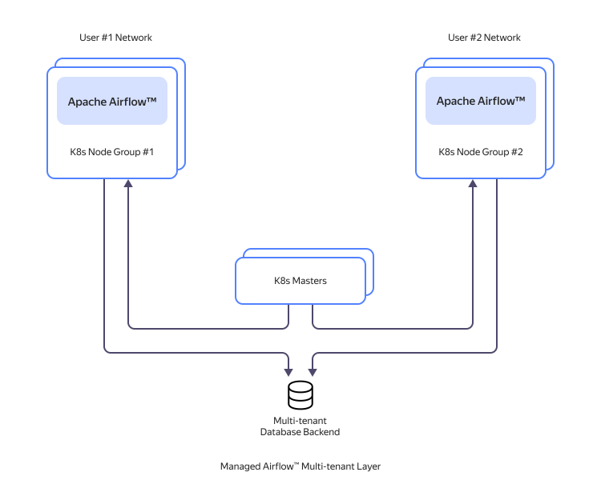
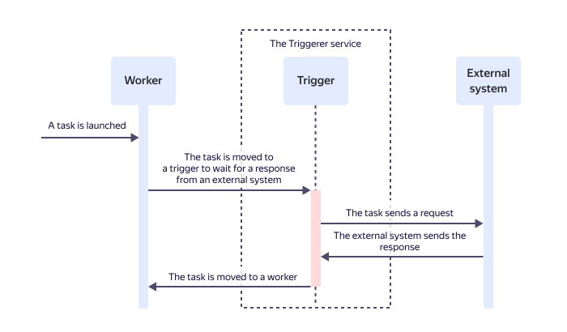

# Resource relationships in {{ maf-name }}

{{ maf-name }} helps you deploy and maintain [{{ AF }}](https://airflow.apache.org/) server clusters in the {{ yandex-cloud }} infrastructure.

The service is at the [Preview](../../overview/concepts/launch-stages.md) stage.

## About {{ AF }} {#about-the-service}

{{ AF }} is an open-source platform that enables you to create, schedule, and monitor batch-oriented _workflows_. A workflow defines job relationships and their execution sequence. It is presented as a directed acyclic graph (DAG). DAGs in {{ AF }} can be used for automation and scheduled runs of any processes, such as [data processing in {{ SPRK }}](../../data-proc/tutorials/spark-job-basics.md).

{{ AF }} uses the <q>Workflows as code</q> approach. It implies that each workflow is implemented using a Python script. Each file with this script is called a _DAG file_. It describes jobs, their run schedule, and dependencies between them. This approach allows storing workflows in a version control system, running tests, and enabling technology required for workflows.

{{ AF }} is not used for streaming and continuous data processing. If such processing is required, you can develop a solution based on [{{ mkf-full-name }}](../../managed-kafka/index.yaml).

For more information, see the [{{ AF }}](https://airflow.apache.org/docs/apache-airflow/stable/#) documentation.

## {{ maf-name }} architecture {#architecture}

The {{ maf-name }} architecture is as follows:

Each [{{ AF }} cluster](#cluster) runs in a separate {{ k8s }} node group with the required network infrastructure. This infrastructure includes a virtual network, a security group, and a service account. Node groups are isolated from each other, both through virtual networks and through {{ k8s }} itself. Node groups are managed by a common {{ k8s }} master, and {{ AF }} clusters use a common {{ PG }} cluster for data storage.

To ensure isolated data storage, the service limits the use of the {{ PG }} cluster:

* A separate database is created for each {{ AF }} cluster in the {{ PG }} cluster. Clusters can connect only to their own database.
* {{ AF }} clusters can work only with tables created by {{ AF }}. You cannot create and modify schemas, tables, functions, procedures, and triggers yourself.
* Read and write speed, as well as the available database storage space, are limited.

   

   Any malicious attempt to bypass these restrictions will result in your cluster being locked under Clause 7 of the [Acceptable Use Policy]({{ link-cloud-aup }}).

   

## {{ AF }} cluster {#cluster}

The main entity operated by {{ maf-name }} is a _cluster_. Inside a cluster, [{{ AF }} components](#components) are deployed. Cluster resources may reside in different availability zones. You can learn more about {{ yandex-cloud }} availability zones [here](../../overview/concepts/geo-scope.md).

A workflow running in a cluster may access any {{ yandex-cloud }} resource within the cloud network where the cluster is located. For example, a workflow can send requests to {{ yandex-cloud }} VMs or managed DB clusters. You can build a workflow using multiple resources. For example, a workflow that collects data from one DB and sends it to another DB or [{{ dataproc-full-name }}](../../data-proc/index.yaml).

## {{ AF }} main components {#components}

The main {{ AF }} components are as follows:

{{ AF }} components:

* _Web server_: Server in {{ yandex-cloud }} hosting an {{ AF }} instance. The web server receives user commands sent through the {{ AF }} web interface and checks, runs, and debugs Python scripts in DAG files.

   To learn more about working with the web interface, see the [{{ AF }} documentation](https://airflow.apache.org/docs/apache-airflow/stable/ui.html).

* _Scheduler_: Server in {{ yandex-cloud }} that controls the job run schedule. The scheduler gets schedule information from DAG files. It uses this schedule to notify workers that it is time to run a DAG file.

* _Workers_: Executors of jobs specified in DAG files. The workers run jobs on the schedule received from the scheduler.

* [_Triggerer_](#triggerer): Service that releases a worker in the event of its downtime while executing a job with a long event timeout (optional component).

* _DAG file storage_: [{{ objstorage-full-name }} bucket](../../storage/concepts/bucket.md) that stores DAG files. This storage can be accessed by web servers, schedulers, workers, and Triggerer.

Interaction between the components is detailed in the [{{ AF }} architecture description](https://airflow.apache.org/docs/apache-airflow/stable/core-concepts/overview.html).

To ensure fault tolerance and enhance performance, web servers, schedulers, and Triggerer may exist in multiple instances. Their number is set when creating a cluster.

For workers, you can also set the minimum and maximum number of instances while creating a cluster. Their number will be scaled dynamically. This feature is provided by the [KEDA](https://airflow.apache.org/docs/helm-chart/stable/keda.html) controller.

## Triggerer {#triggerer}

The Triggerer service reduces the workers downtime.

DAGs may contain jobs that send requests to an external system (such as a {{ SPRK }} cluster) and wait for it to respond for a certain period of time. If [standard operators](https://airflow.apache.org/docs/apache-airflow/stable/core-concepts/operators.html) are used, such a job will keep a worker busy while it is waiting for the response. This results in the worker's downtime. If this happens to a large number of workers, job queues will form, reducing the job run speed and slowing down execution.

_Deferrable operators_ help avoid a situation like this. They allow pausing a job, releasing a worker, and isolating the external system request into a separate process called a _trigger_. All triggers are independent from each other and processed by Triggerer asynchronously, with separate resources allocated for it in the cluster. Once a response is received from the external system, a trigger fires, and the scheduler returns the job to the worker.

See how to work with Triggerer in the figure below:

For more information about deferrable operators, triggers, and the Triggerer service, see the [{{ AF }}](https://airflow.apache.org/docs/apache-airflow/stable/authoring-and-scheduling/deferring.html#deferrable-operators-triggers) documentation.
