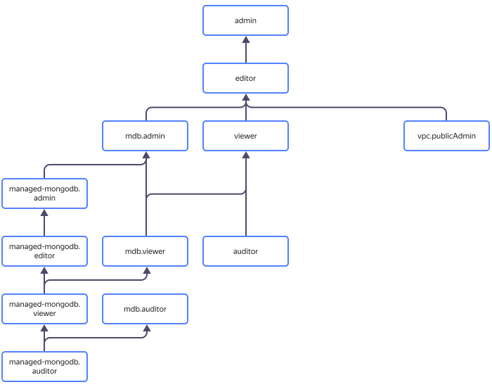

# Access management in {{ mmg-name }}

In this section, you will learn:

* [Which resources you can assign roles to](#resources).
* [Which roles exist in the service](#roles-list).
* [Which roles are required](#required-roles) for particular actions.



## Which resources you can assign roles to {#resources}



To allow access to {{ mmg-name }} service resources (DB clusters and hosts, cluster backups, databases, and their users), assign the user the appropriate roles for the folder or cloud hosting the resources.

## Which roles exist in the service {#roles-list}

The chart below shows which roles are available in the service and how they inherit each other's permissions. For example, the `{{ roles-editor }}` role includes all the permissions of `{{ roles-viewer }}`. You can find the description of each role under the chart.

### {{ roles-mdb-admin }} {#mdb-admin}



### {{ roles-mdb-viewer }} {#mdb-viewer}



### {{ roles-mdb-auditor }} {#mdb-auditor}



### {{ roles-cloud-member }} {#resmgr-clouds-member}



### {{ roles-cloud-owner }} {#resmgr-clouds-owner}





### {{ roles-viewer }} {#viewer}



### {{ roles-editor }} {#editor}



### {{ roles-admin }} {#admin}



### {{ roles.mmg.admin }} {#mmg-admin}



### {{ roles.mmg.auditor }} {#mmg-auditor}



### {{ roles.mmg.editor }} {#mmg-editor}



### {{ roles.mmg.viewer }} {#mmg-viewer}



## Roles required {#required-roles}

To use the service, you need the `{{ roles.mmg.editor }}` [role](../../iam/concepts/access-control/roles.md) or higher to the folder where a cluster is created. The `{{ roles.mmg.viewer }}` role only enables you to view the cluster list.

You can always assign a role with more permissions. For instance, you can assign `{{ roles.mmg.admin }}` instead of `{{ roles.mmg.editor }}`.

## What's next {#whats-next}

* [How to assign a role](../../iam/operations/roles/grant.md).
* [How to revoke a role](../../iam/operations/roles/revoke.md).
* [Learn more about access management in {{ yandex-cloud }}](../../iam/concepts/access-control/index.md).
* [Learn more about inheriting roles](../../resource-manager/concepts/resources-hierarchy.md#access-rights-inheritance).

