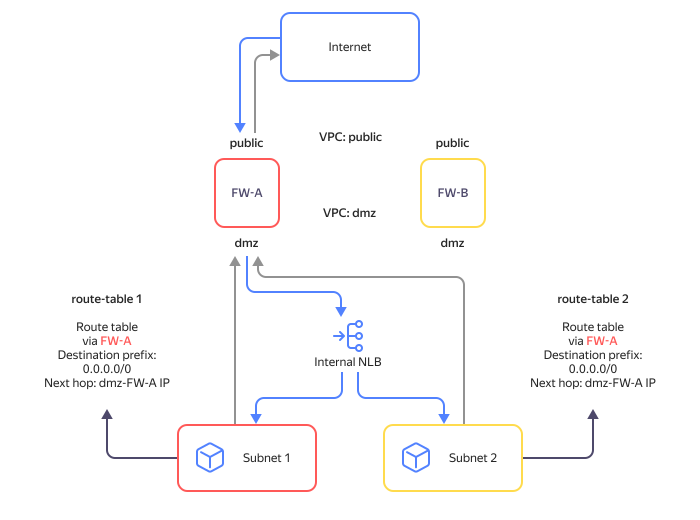
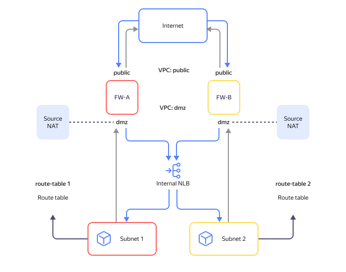
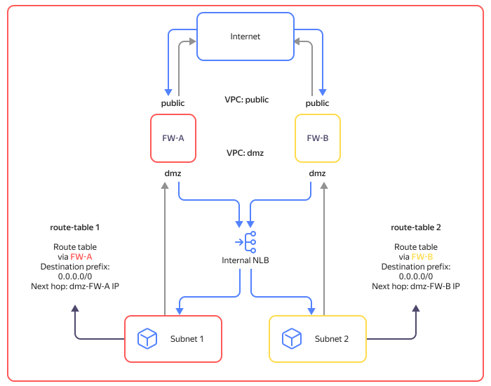

# Implementation specifics

## Listener in all availability zones {#nlb-vip}

The [traffic listener](listener.md) IP address will be externally announced as a `/32` prefix from all {{ yandex-cloud }} [availability zones](../../overview/concepts/geo-scope.md). If an availability zone fails, the incoming traffic to the listener IP address will be redirected to other active availability zones by network equipment.

## Traffic flows {#nlb-flows}

Let's look at how an `external` load balancer works:

1. The listener receives the traffic (packets) from the {{ yandex-cloud }} border router for the IP address and port it has been configured for.
2. The listener calculates the `5-tuple` hash function from the parameters of the received IP packet. The hash function receives:
   * Transmission protocol: TCP or UDP
   * Sender public IP address
   * Sender TCP or UDP port
   * Load balancer listener public IP address
   * Load balancer listener TCP or UDP port
3. Based on the hash function calculation result, the listener sends the traffic to an active resource in the target group.
4. The target group resource that has received traffic from the listener processes the traffic and sends the result back to the network load balancer.

Traffic path from a client application to the web service:

1. The traffic from the `1.2.3.4:30325` client application *(you can use any socket or port number)* is sent to an NLB as a sequence of IP packets, and the `158.160.0.x:443` traffic listener accepts it.
1. The listener calculates a `5-tuple` hash function from the parameters of the received IP packet and decides to forward it to the `vm-a1` VM in the target group. The virtual network retains information that the traffic to the `158.160.0.x:443` listener was directed to the `10.0.1.1:8443` resource.
1. After processing the received request, the `vm-a1` VM responds to the client application from its `10.0.1.1` IP address. The traffic leaves the VM via the default gateway into the virtual network.
1. The virtual network is aware that the traffic from the client application was previously received by the load balancer's listener and sent for processing to the `vm-a1` VM (see 2). This information allows the virtual network to change the sender's address and port (perform source NAT) for all packets sent from `10.0.1.1:8443` to `158.160.0.x:443`. The traffic is then sent to the destination address according to routing policies and reaches the client application.



The dashed line in the diagram above shows the backup path to the `vm-b1` VM, which the listener would have chosen if the availability check for the `vm-a1` VM had failed.



## UDP traffic processing {#nlb-udp}

By default, UDP traffic processing is disabled for the network load balancer.

This behavior is due to the lack of consistency in balancing UDP traffic: it does not guarantee the distribution of IP packets, which have the same 5-tuple hash for processing, to the same resource in the target group. With such distribution, you can use the network load balancer, e.g., for processing DNS protocol traffic, where maintaining the connection status is not required.

To enable UDP traffic processing on the network load balancer, contact [support](../../support/overview.md).

## Ensuring locality in traffic processing by the internal load balancer {#nlb-int-locality}

If a client located inside {{ vpc-short-name }} sends traffic to the internal network load balancer, the listener will distribute this traffic only to those resources in target groups that are in the same availability zone as the client.

If there are no live target resources in the same availability zone where the client resides, the traffic will be evenly distributed to the target resources in other zones.

## Achieving routing convergence in the availability zone {#nlb-zone-converge}

When the last target resource in the availability zone is disconnected (fails the health check), this zone will be evicted from traffic routing via the balancer. The process of routing protocol convergence can take up to two minutes. During this convergence interval, the traffic coming to this target resource will be dropped.

When the first target resource in the availability zone returns to service after passing a health check, the actual return of the resource to traffic processing will also occur after the convergence interval required to announce the resource prefix from this availability zone.

## Network load balancer and {{ interconnect-name }} {#nlb-cic}

The internal network load balancer enables interaction between the balancer's listener IP address and the on-premises resources.

Since the network load balancer and the resources in the target groups behind it must be in the same network, the use of the on-premises resources as part of the balancer group is not allowed.

## Routing traffic via the internal balancer {#nlb-int-routing}

An internal network load balancer uses routes of all subnets in the selected {{ vpc-name }} network. These include dynamic routes from [{{ interconnect-name }}](../../interconnect/) and [static routes](../../vpc/concepts/static-routes.md) from VPC routing tables.

If multiple routes have the same destination prefix but different [next-hop](https://en.wikipedia.org/wiki/Hop_(networking)#Next_hop) addresses in the routing table, the outgoing traffic from the balancer's target resources will be distributed to these next-hop addresses. Keep this feature in mind when the traffic comes to the balancer through network instances (e.g., firewalls) that can track incoming and outgoing traffic streams and do not allow traffic asymmetry.

If the traffic to the load balancer did not pass through a network VM, it may discard the response traffic received from target resources. To avoid traffic loss, configure routing depending on your case:

* [Route tables contain static routes with identical prefixes](#same-prefixes).
* [Source NAT configured on network VMs](#source-nat).
* [Route tables contain static routes with identical prefixes and different next hop IPs of network VMs](#divergent-next-hop).

#### Route tables contain static routes with identical prefixes {#same-prefixes}

Routes must have the next hop IP of one of the network VMs. Network VMs run in `Active/Standby` mode. To ensure fault tolerance of outgoing traffic, set up traffic forwarding, e.g., using [route-switcher](https://github.com/yandex-cloud-examples/yc-route-switcher/tree/main).

#### Source NAT configured on network VMs {#source-nat}

Make sure you set up [Source NAT](https://en.wikipedia.org/wiki/Network_address_translation#SNAT) to network VM addresses. Network VMs run in `Active/Active` mode. To set up Source NAT, refer to the documentation for software deployed on your network VM. View an [example of how to set up Source NAT](../../tutorials/routing/high-accessible-dmz.md#setup-static-nat) on a Check Point NGFW.

#### Route tables contain static routes with identical prefixes and different next hop IPs of network VMs {#divergent-next-hop}



This use case is not supported. Use one of the options described above.



