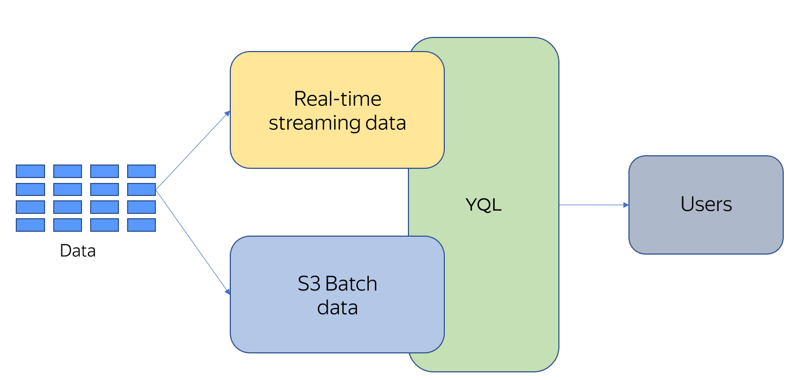

# {{ yq-full-name }} overview

{{ yq-full-name }} is a data service that can run federated queries against the [{{ objstorage-full-name }}](../../storage/concepts/index.md) object storage, managed [{{ mpg-name }}](https://cloud.yandex.ru/services/managed-postgresql) and [{{ mch-name }}](https://cloud.yandex.ru/services/managed-clickhouse) databases, and [{{ yds-full-name }}](../../data-streams/concepts/index.md) real-time streams. {{ yq-full-name }} uses YQL, a unified SQL dialect, to aggregate query execution results between these systems.

{{ yq-full-name }} is a fully managed cloud service, meaning that you do not need to have running servers where software is deployed. Any resources that are required for making queries are allocated once you run them and released after they are complete. The queries themselves start running instantly.

{{ yq-full-name }} allows you to:

* Use the same written query in scenarios for analyzing data stored in {{ objstorage-full-name }} and analyzing data in real time.
* Aggregate query execution results across different systems.
* Save on development thanks to using a common query language, YQL, and a common approach.

{{ yq-full-name }} combines data virtualization features and a real-time streaming data analysis system. This architecture is called [Unified Lambda](../concepts/unified-processing.md).

The Unified Lambda model uses a unified SQL query text for processing streaming data and data stored in storage systems of different classes.

## Support for raw data storage

Companies prefer to store large volumes of rarely accessed data in object storage of the {{ objstorage-full-name }} class. Long-term storage of rarely processed data in storage systems like this is most cost-efficient. Data is stored in {{ objstorage-full-name }} in unstructured form and this data needs to be processed in a simple and analyst-friendly way.

## Streaming data processing

Streaming processing is based on grouping window functions that receive data streams, group them by source and time window, make computations, and send execution results to external systems. A distinctive feature of {{ yq-full-name }} is a unified text of SQL queries used for both streaming and batch processing.

## Integration with external systems

### Streaming processing

Streaming queries can get data from the following sources:

* {{ yds-full-name }}. Application logs, [Debezium](../tutorials/debezium.md) database CDC streams, or any other information can be used as input data.

Streaming processing results are exported to:

* {{ monitoring-name }} as metrics for creating charts and dashboards or alerting.
* {{ yds-full-name }}. Using {{ data-transfer-full-name }}, data from {{ yds-full-name }} can be sent to different systems, including various DBMS.

### Batch processing {#analytic}

Analytical queries in {{ yq-full-name }} can get data from {{ objstorage-full-name }} in [JSON, CSV/TSV, and Parquet formats compressed using different algorithms](../sources-and-sinks/formats.md). You can also run analytical queries against the [{{ mpg-name }}](https://cloud.yandex.ru/services/managed-postgresql) and [{{ mch-name }}](https://cloud.yandex.ru/services/managed-clickhouse) managed databases.

You can use {{ yq-full-name }} for cross-service data analytics, accessing all supported data sources in a single query.

You can download the query execution results from the {{ yq-full-name }} user interface. If required, you can also save them to {{ objstorage-full-name }}.

### {{ datalens-full-name }}
With {{ yq-full-name }}, you can visualize data stored in {{ objstorage-full-name }}.
