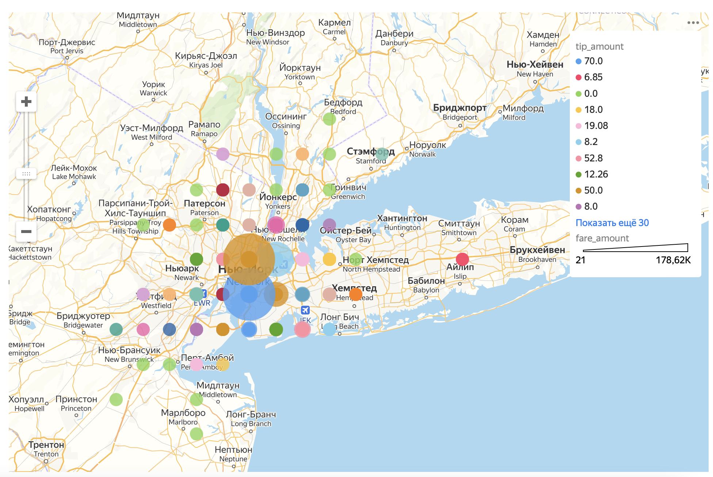

# Visualizing data from {{objstorage-full-name}} on {{datalens-full-name}} dashboards

{{datalens-full-name}} is a data visualization and analysis service. {{yq-full-name}} and {{datalens-full-name}} integration lets you visualize data stored in {{objstorage-full-name}}. {{datalens-full-name}} generates a YQL query, {{yq-full-name}} runs the query and returns its execution results, while {{datalens-full-name}} visualizes these results.

Below is the architecture of the solution with {{cloud-logging-short-name}}.


In the given example, we'll show the cost of New York City yellow taxi trips on the map, depending on the passenger drop-off area, with the driver tip amount highlighted. The data was previously uploaded to {{ objstorage-full-name }} and stored in a public bucket named `yq-sample-data`, in the `nyc_taxi_csv` folder.







## Setup {#setup}

Setup steps:
1. In {{yq-full-name}}, [create a connection](#create_connection) to data stored in {{objstorage-full-name}}.
1. In {{yq-full-name}}, [write a query](#query) that will generate a data structure.
1. [Create a data source](#create_connection_lens) in {{datalens-full-name}}.
1. In {{datalens-full-name}}, [create a dataset](#create_dataset).
1. [Create a chart](#create_chart) in {{datalens-full-name}} for data visualization.

### Creating a data connection in {{yq-full-name}} {#create_connection}

To get started, create a connection to {{objstorage-full-name}}:




### Creating a data source in {{datalens-full-name}} {#create_connection_lens}

To create a connection, you'll need a [service account](../../iam/concepts/users/service-accounts.md) with the **viewer** [role](../../iam/operations/sa/assign-role-for-sa.md).


To create a {{ yq-full-name }} connection:


1. Follow the [link](https://datalens.yandex.ru/connections/new/yq) to the connection creation wizard.


1. Select the folder to create a {{yq-full-name}} connection in.
1. Specify the connection parameters:

   * **Connection name**. Name it ``yellow-taxi``.

   * **Cloud and folder**. Select the folder where your service account will be located.
   * **Service account **. Select an existing service account or create a new one.

   * **SQL query access level**. Enables you to use an ad-hoc SQL query to [generate a dataset](../../datalens/concepts/dataset/settings.md#sql-request-in-datatset).

1. Click **Create** in the lower-left corner. The connection appears in the list.



### Creating a dataset {#create_dataset}

1. On the {{ datalens-full-name }} homepage, click **Create dataset**.
1. On the left side of the screen, click  **Add**.
1. Select the `yellow-taxi` connection you created in the previous step.
1. In the connection properties, go to the **SQL** tab and paste the query text into the **Subquery** field:

   ```sql
   SELECT
       *
   FROM
       bindings.`tutorial-analytics`
   ```

2. Click **Create**. The dataset appears in the list.
3. If everything is set up correctly, the **Preview** field will contain data like
   .
4. Create a calculated field:
   1. Go to the **Fields** tab.
   2. Click **Add field**.
   3. In the **Field name** field, specify `dropoff_point`.
   4. In the **Formula** field, enter:
      ```
      GEOPOINT(ROUND([dropoff_latitude],1),ROUND([dropoff_longitude],1))
      ```
   5. Click **Save**.
   6. The **Preview** section will contain a new field named `dropoff_point` with data like `[40.7,-74]`.
5. Click **Save** in the top right-hand corner to save the dataset.


## Charts with data {#create_chart}
To create a chart:
1. Go to the **Charts** section in the {{datalens-full-name}} interface.
1. Click **Create chart** and select **Chart**.
1. Select the `yellow-taxi` dataset.
1. Select the **Map** chart type.
1. Drag the `dropoff_point` dimension into the **Points** field.
1. Drag the `fare_amount` dimension into the **Points size** field.
1. Drag the `tip_amount` dimension into the **Color** field.

The result of running the query is a map showing the distribution of trip fares by region and with the driver tip amount highlighted.


