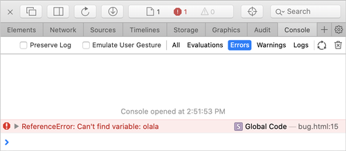

# Copying errors from the browser console

If there is a problem when working with pages and interactive elements in the {{ yandex-cloud }} [management console]({{ link-console-main }}), information from the browser console can help identify the cause. Copy the message from the error console and forward it to [technical support]({{ link-console-support }}).



- Yandex Browser

   

- Google Chrome

   1. On the error page, press **Ctrl** + **Shift** + **J** (or **⌥** + **⌘** + **J** for macOS).

      

      Open  → **More tools** → **Developer tools** and select the **Console** tab.

      

   1. To the right of the **Filter** field in the **Default levels** list, disable all options except **Errors**.

      

   1. Refresh the page or reproduce the actions that result in an error.
   1. Copy the messages:

      * Take a screenshot. If you need to scroll vertically to view messages, take several screenshots.
      * Save the error log to a text file: right-click on any message and select **Save as**.

   1. Attach the error log or screenshots to your message to [technical support]({{ link-console-support }}).

   For more information, take a screenshot of the information on the **Network** tab.

- Opera

   1. On the error page, press **Ctrl** + **Shift** + **J**.

      

      In the upper left-hand corner, click **Opera**, select **Developer** → **Developer Tools** from the menu, and go to the **Console** tab.

      

   1. To the right of the **Filter** field in the **Default levels** list, disable all options except **Errors**.

      

   1. Refresh the page or reproduce the actions that result in an error.
   1. Copy the messages:

      - Take a screenshot. If you need to scroll vertically to view messages, take several screenshots.
      - Save the error log to a text file: right-click on any message and select **Save as**.

   1. Attach the error log or screenshots to your message to [technical support]({{ link-console-support }}).

   For more information, take a screenshot of the information on the **Network** tab.

- Mozilla Firefox

   1. On the error page, press **Ctrl** + **Shift** + **J**.

      

      * Open the menu  → **Web Developer Tools** → **Console**.
      * Right-click anywhere on the page, select **Inspect**, and go to the **Console** tab.

      

   1. Make sure that only **Errors** is checked in all filters ("Network", "CSS", "JS", "Protection", "Log", "Server"). To do this, next to each filter, click .

      

      If instead of clicking , you click the filter name, error checking will be disabled.

      

      

   1. Refresh the page or reproduce the actions that result in an error.
   1. Copy the messages:

      * Take a screenshot. If you need to scroll vertically to view messages, take several screenshots.
      * Save the error log to a text file: right-click on any message and select **Export Visible Messages To** → **File**.

   1. Attach the error log or screenshots to your message to [technical support]({{ link-console-support }}).

- Microsoft Edge

   1. On the error page, press **Ctrl** + **Shift** + **J**.

      

      * Select  → **More tools** → **Developer tools** on the menu.
      * Right-click anywhere on the page, select **Inspect**, and go to the **Console** tab.

      

   1. To the right of the **Filter** field in the **Default levels** list, disable all options except **Errors**.

      

   1. Refresh the page or reproduce the actions that result in an error.
   1. Copy the messages:

      * Take a screenshot. If you need to scroll vertically to view messages, take several screenshots.
      * Save the error log to a text file: right-click on any message and select **Save as**.

   1. Attach the error log or screenshots to your message to [technical support]({{ link-console-support }}).

   For more information, take a screenshot of the information on the **Network** tab.

- Safari

   1. Activate the error console: in the menu, select **Safari** → **Preferences** → **Advanced** and enable **Show Develop menu** in the menu bar.
   1. On the error page, press **⌥** + **⌘** + **C**.

      

      * Select **Develop** → **Show JavaScript Console** from the menu.
      * Right-click anywhere on the page, select **Inspect element** and go to the **Console** tab.

      

   1. Go to the **Console** tab and turn on the **Errors** filter. In a narrow window, the filter name may be hidden: maximize the window.

      

   1. Refresh the page or reproduce the actions that result in an error.
   1. Copy the messages:

      * Take a screenshot. If you need to scroll vertically to view messages, take several screenshots.
      * Save the error log to a text file.

   1. Attach the error log or screenshots to your message to [technical support]({{ link-console-support }}).

   For more information, take a screenshot of the information on the **Network** tab.


