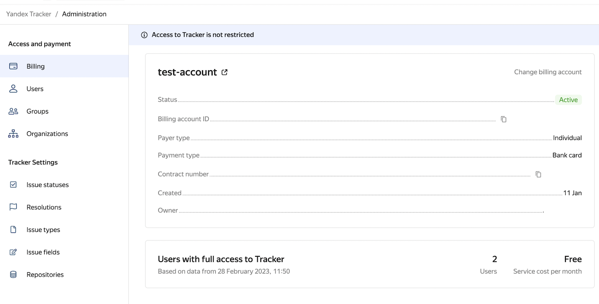

# {{ tracker-full-name }} revision history for January 2023

* [Changing a billing account](#ba-change)
* [Retaining Gantt chart settings](#gantt-diagram)
* [Updating a Gantt chart for a list of projects](#gantt-for-projects)

## Changing a billing account {#ba-change}

You can now switch to any [billing account](../billing-account.md) you previously created, or add a new one. You will be able to switch to a new billing account once the reporting period ends, i.e., at the beginning of next month. Before the end of the current month, the funds will be debited from your current billing account.

## Retaining Gantt chart settings {#gantt-diagram}

The following settings persist when you close or refresh a page with a [Gantt chart](../gantt/overview.md) created based on a filter or a queue:

* Selected chart scale.
* Display of issue names.
* Display of issue assignees.
* Display of links between issues on the chart.
* Display of missed deadlines.
* Automatic shift of dependent issues if the deadline of their blocker issue changes.

For a Gantt chart created based on a [list of projects](../gantt/project.md), only the chart scale is retained.

## Updating a Gantt chart for a list of projects {#gantt-for-projects}

The timeline and list of issues for a Gantt chart are updated if:
* Issue deadlines change.
* Issue is added to a project.
* Issue is removed from a project.
* Sequence of issues in range mode changes.
* Ticket is renamed.
* Issue field values are updated.

If the parameters of an issue are updated, its position in the list changes automatically.

