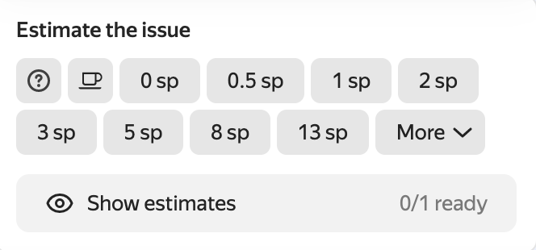

# {{ tracker-full-name }} revision history for April 2023

* [Updates](#top-news)
* [Fixes and improvements](#fixes)

## Updates {#top-news}

### Choosing a color for issues on a project's Gantt chart {#issues-colors}

A [Gantt chart for projects](../manager/gantt-project.md) now allows you to set a color for issues depending on the selected parameter (queue, status, etc.). To do this, click **Chart settings** on the Gantt chart page and select **by issue parameters** under **Issue color**.

You can edit the list of values by adding and deleting values and choosing their color.

If an issue has two or more color components, the resulting color will be selected from the list of values by priority.

### Retaining settings for a Gantt chart created based on a filter {#save-the-columns}

The settings of a [Gantt chart created based on a filter](../manager/gantt.md#section_pwy_tgx_tdb) and issue parameters in the list to the left of the chart persist and are not reset when you refresh a page.

### Creating an issue from a comment {#task-from-comment}

The  **Comment actions** menu now contains an item named **Create issue from comment**. This item will create a linked issue with the comment text in its description. You can edit the description, if required.

### Limiting the number of issues per column {#column-limits}

On [new boards](../manager/agile-new.md), you can set a limit on the number of issues per column. The number of issues and the set limit are displayed next to the column name. If the number of issues exceeds the limit, the column color turns yellow; this will still allow you to continue adding issues.

You can set a limit in the column settings by selecting  → **Edit** → **Maximum number of issues**.

### Setting up a transition from _Any status_ {#meta-transition}

The new workflow editor has the **Allow transitions from any status** setting for statuses. In this case, a diagram gets a status called **Any status**. Previously, you could not edit a transition from **Any status**. Now, you can set up its automation, criteria, and transition screens similarly to any other transition on a diagram.

### Canceling the last action in the workflow editor {#hot-keys}

The workflow editor allows you to use keyboard shortcuts to cancel and restore the last action.
* Windows: **Ctrl** + **Z** to cancel an action and **Ctrl** + **Shift** + **Z** to restore the canceled action.
* Mac OS: **⌘** + **Z** to cancel an action and **⌘** + **Shift** + **Z** to restore the canceled action.

## Fixes and improvements {#fixes}

### Issue filter for a Gantt chart created based on a list of projects

On a [Gantt chart for a list of projects](../manager/gantt-project.md), you can set up an additional filter by issue.

### Invitations to comments in projects {#bell-summons}

You can invite users to comment on projects. Notifications of invitations are sent to a user's email address.

### Choosing a color for an issue status {#statuses-color}

An issue status is additionally highlighted with a color, depending on the status type:
* 
* 
* 
* 
* 

### Updating planning poker on boards {#new-poker-ui}

On [new boards](../manager/agile-new.md), **planning poker** opens to the full height of a board and you can drag an issue to any part of the opened tab.
It is now more convenient to estimate issues: the drop-down list is replaced with buttons that show estimates, a counter of users who voted for issues, and a button to view the estimates.

