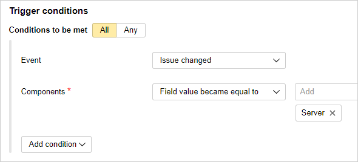

---

__system: {"dislikeVariants":["No answer to my question","Recomendations didn't help","The content doesn't match title","Other"]}
---
# Automate recurring actions

You can automate common actions related to {{ tracker-name }} issues using [triggers, auto actions, and macros](automation.md). This lets you change issue parameters in response to certain events (whether by sending a command or setting up a recurring trigger) as well as create scheduled issues.

Let's look at some examples of how you can automate certain actions in {{ tracker-name }}:

### Pick assignees automatically {#auto-assign-executor}

If a certain issue falls under the responsibility of a specific employee, you can automatically make them an assignee for that issue using [triggers](user/trigger.md). A trigger is activated once specified conditions are fulfilled and automatically changes issue parameters in response.

For example, the tester should start testing a new product feature once the developer changes the issue status to<q>Ready for testing</q>. If you want to automatically assign that tester as the issue's assignee, configure the trigger as follows:

- Trigger conditions: The issue status has changed to <q>Ready for testing</q>.

- Trigger action: Specify the tester in the <q>Assignee</q> field.


Now let's consider a situation where one developer is responsible for the server side of a product while another developer handles the client side. When creating new bug-related issues pertaining to the server or client side of a product, you can automatically assign the corresponding developer to handle the job using components and triggers:

1. [Configure the components](manager/components.md) of your queue corresponding to each side of product development like their <q>Server</q> side and <q>Client</q> side. Add the relevant component when creating a new bug-related issue.

1. Configure the server side bug trigger:

    - Trigger conditions: The value in the <q>Components</q> field changed to <q>Server</q>.

    - Trigger action: Specify the server side developer in the <q>Assignee</q> field.

    

1. Configure the client side bug trigger in a similar manner:

    - Trigger conditions: The value in the <q>Components</q> field changed to <q>Client</q>.

    - Trigger action: Specify the client side developer in the <q>Assignee</q> field.

For a detailed example of setting up triggers, see [{#T}](manager/trigger-examples.md#assign_ticket).

### Remind the assignee about the deadline{#auto-remind-deadline}

If you want to make sure assignees finish their issues on time, you can use auto actions to send them reminders. Auto actions are triggered recurringly and update issue parameters that fit specified criteria.

Let's say you need to check all issues in your queue once a day. If the issue is not solved and the date specified in the <q>Deadline</q> field is less than 3 days away, the issue must be updated with a comment and the assignee must be invited. To do this, configure your auto action as follows:

- Auto action type: **Update issues**.

- Frequency: Once per day.

- Filter parameters: A query written using the [query language](user/query-filter.md):

    ```
    Resolution: empty() AND Deadline: <= today() + 3d
    ```

    

- Issue action: Send a comment and invite the user specified in the <q>Assignee</q> field.

For a detailed example of setting up auto actions, see [{#T}](user/create-autoaction.md#autoaction_example).

### Create recurring issues{#auto-create-task}

You can use auto actions if you need to have recurring issues created based on a specified template. For example, this lets you automatically create a data backup issue every week.

To do this, configure your auto action as follows:

- Auto action type: **Create issues**.

- Frequency: Once a week on Fridays.

    You can set the start and end of the time frame during which issues are created automatically. If the time frame is not specified, recurring issue creation will go on indefinitely.

    

- Queue action: Create an issue. Fill in the fields for the automatic issue creation template.

For a detailed example of setting up auto actions, see [{#T}](user/create-autoaction.md#autoaction_example).