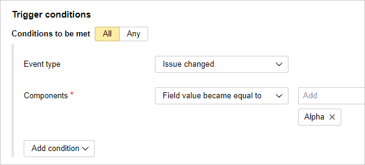

# Examples

Let's look at some examples of how triggers work in {{ tracker-name }}:

- How to [automatically pick assignees](#assign_ticket) based on status or component.
- How to [automatically notify a user](#notify_mail) after an issue was created based on a request sent to the support team via email.
- How to [automatically notify a user](#notify_form) after an issue was created based on a request sent to the support team via Yandex.Forms.
- How to [set up notifications in messengers](#section_vsn_mb2_d3b) via HTTP requests.

## Pick assignees automatically {#assign_ticket}

Different stages of a project are often handled by different employees. When an employee does their part, they transfer the issue to another assignee. In {{ tracker-name }}, each issue stage has its own status. When an issue receives a status update, a new employee can be automatically assigned to work on the issue with a trigger.

However, sometimes employees only handle issues related to their field of expertise and don't collaborate on a single issue. For example, each support team member only processes requests related to the product they were assigned to. To manage this kind of workflow, you can [configure components](components.md) so that they correspond to specific products. When a specific component is added to the issue, the employee responsible for the corresponding product is automatically assigned to work on it via a trigger.

Let's set up a trigger that automatically picks an assignee for our issue:

1. Make sure every employee you might want to assign [has full access to {{ tracker-name }}](../enable-tracker.md).

1. Go to queue settings, open the **Triggers** section, and click [**Create trigger**](../user/create-trigger.md).

1. Set the trigger to react when the issue's <q>Status</q> or <q>Components</q> change:

    1. Choose **Conditions to be met** → **All**.

    1. Add the condition **Event type** → **Issue changed**.

    1. If you want a new assignee to be picked after a status update, add the following condition: **System** → **Status** → **Field value became equal to** and specify the status.

        

        If you want a new assignee to be picked after a component changes, add the following condition: **System** → **Components** → **Field value became equal to** and specify the components.

        

        

        This trigger only works if only one component is specified in the issue.

        

1. Set a trigger action:

    1. Add the action **Change field values**.

    1. Choose **System** → **Assignee** → **Set value** and specify who should be picked as the assignee after the trigger is executed.

        

1. Save your trigger.
To see if you trigger works, pick any issue from the queue with the added trigger and change the issue's status or components.

## Send notifications to instant messengers {#section_vsn_mb2_d3b}

Messengers are a great way to quickly notify employees about important events. If a messenger has an API, you can use {{ tracker-name }} to set up a trigger that sends HTTP requests to the messenger's API when certain events occur. For instance, a request can be triggered once an error with the critical priority status is added to the queue.

To view examples for setting up triggers that send notifications to Slack and Telegram, see [{#T}](../messenger.md).

[Contact support](../troubleshooting.md)

