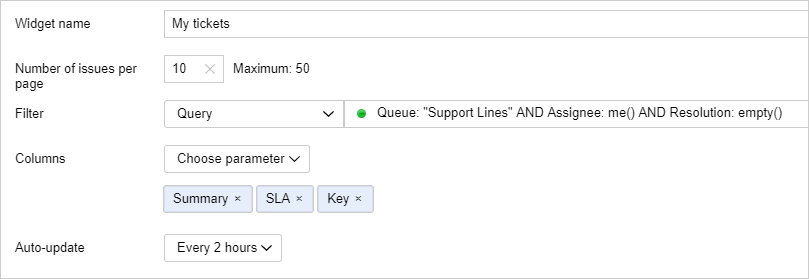
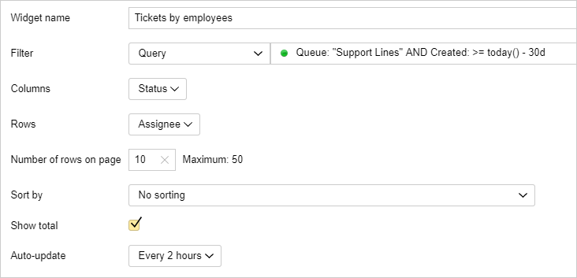
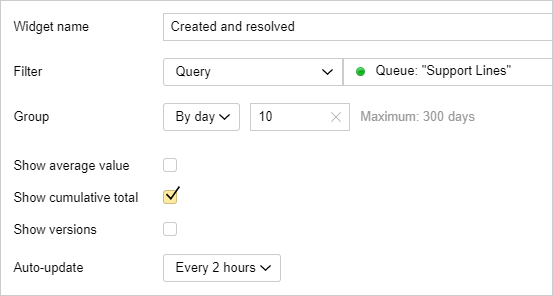
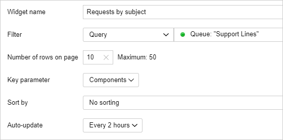

---

__system: {"dislikeVariants":["No answer to my question","Recomendations didn't help","The content doesn't match title","Other"]}
---
# Collect request statistics

Managers and staff members of the support team often require various information about the ongoing issues as well as statistics on previously resolved requests. In {{ tracker-name }}, you can view all relevant information and statistics on a dashboard. First you need to [create a dashboard](user/create-dashboard.md#section_cv2_ck3_pz) and then add [widgets](user/widgets.md#section_ll1_zdp_pz), which may include issue lists, tables, and charts, all of which are created automatically based on filters.

For example, a manager may use a dashboard to display a list of requests without assignees or view data on opened and resolved requests for a specific period. A support team member can view a list of issues they're assigned to and the list of issues with no assignees that need to be dealt with.

Let's look at some widgets in use by support teams:

### My issues {#widget-my-tickets}

Add a widget that displays the list of issues for your support employees to their personal dashboard:

1. On the dashboard page, click  → **Edit**.

1. Add a widget with the **Issues** type.

1. In the **Filter** field, choose **Query** and enter the [query text](user/query-filter.md#section_pgq_xjk_lz):

    ```
    Queue: "<queue name>" AND Assignee: me() AND Resolution: empty()
    ```

    This filter will find all unresolved issues you've been assigned to in the specified queue.

1. To display the [SLA rules timer](#sla), in the issue list, add the **SLA** parameter to the **Columns** field.

    

1. Save the widget.

### List of unassigned issues {#widget-no-assignee}

To help the support team quickly find and resolve unassigned requests, add this issue list to the dashboard:

1. On the dashboard page, click  → **Edit**.

1. Add a widget with the **Issues** type.

1. In the **Filter** field, choose **Query** and enter the [query text](user/query-filter.md#section_pgq_xjk_lz):

    ```
    Queue: "<queue name>" AND Assignee: empty()
    ```

    This filter will find unassigned issues in the specified queue.

1. To display the [SLA rules timer](#sla), in the issue list, add the **SLA** parameter to the **Columns** field.

    

1. Save the widget.

### Table with number of issues per assignee {#widget-worker-tasks}

If you want to learn how many issues have been distributed per employee within the last 30 days, add this widget to your dashboard:

1. On the dashboard page, click  → **Edit**.

1. Add **Summary table** widget.

1. In the **Filter** field, choose **Query** and enter the [query text](user/query-filter.md#section_pgq_xjk_lz):

    ```
    Queue: "<queue name>" AND Created: >= today() - 30d
    ```

    This filter will find all issues in the queue created within the last 30 days.

1. Find the **Columns** field and choose **Status**, then find **Rows** and choose **Assignee**. This displays the number of issues assigned to each user and sorts them by status in the table cells.

1. If you want to display the totals by columns and rows, select **Show total**.

    

1. Save the widget.

### Statistics on open and resolved requests {#widget-created-resolved}

Add a chart to the dashboard to monitor statistics on issue creation and resolution:

1. On the dashboard page, click  → **Edit**.

1. Add a widget of the **"Created vs. Resolved" Chart** type.

1. In the **Filter** field, choose **Query** and enter the [query text](user/query-filter.md#section_pgq_xjk_lz):

    ```
    Queue: "<queue name>"
    ```

    This filter will find all issues in the specified queue.

1. In the **Group** field, choose **By day** and specify the number of days to be displayed on the chart.

1. If you want to display the totals for created and resolved requests on the chart, select **Show total**.

    

1. Save the widget.

### Request statistics by subject {#widget-components}

If you use components to [group issues by subject](#group), you can create a chart that displays issue statistics by components:

1. On the dashboard page, click  → **Edit**.

1. Add an **Issue statistics** widget.

1. In the **Filter** field, choose **Query** and enter the [query text](user/query-filter.md#section_pgq_xjk_lz):

    ```
    Queue: "<queue name>"
    ```

    This filter will find all issues in the specified queue.

1. In the **Key parameter** field, choose **Components**.

    

1. Save the widget.

