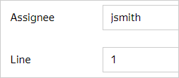
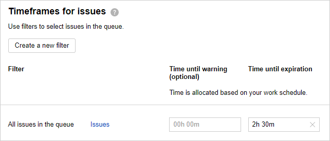
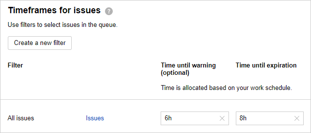
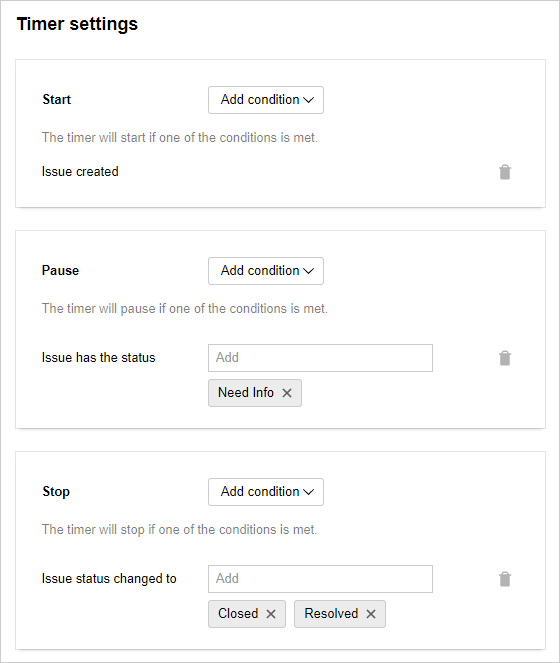
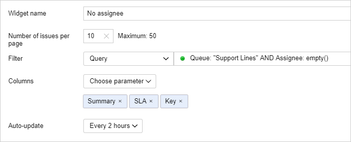

# Example: setting up {{ tracker-name }} for a support team

Let's see how we can use {{ tracker-name }} to organize the workflow for the support team.

{{ tracker-name }} is a great tool for managing user requests because it lets the support team easily communicate with other departments that use {{ tracker-name }}. For example, you can use Tracker to invite developers to comments and solve complex problems together, link issues to other issues relevant to the user's request, and so on.

Let's create a dedicated {{ tracker-name }} [queue](queue-intro.md) for the support team to store issues created from user requests. Now let's configure additional queue features that will help us process user requests more efficiently:

- [Accept requests from users who can't access {{ tracker-name }}.](#mail_forms)

- [Organize multiple support lines to manage requests of different complexity levels.](#lines)


- [Group requests by topic.](#group)

- [Track the time it takes to process a request.](#sla)

- [Collect request statistics.](#dashboards)

- [Configure integration with third-party platforms.](#integration)

## Create a queue for the support team {#create-queue}


1. If your organization doesn't have **{{ tracker-name }}** yet, [activate the service](enable-tracker.md).

1. Make sure all the support staff is added to your organization and [grent them full access to {{ tracker-name }}](enable-tracker.md#access).

1. [Create a queue](manager/create-queue.md) using the <q>Basic support</q> or <q>Multi-tiered support</q> template.

    These [templates](manager/workflows.md) already include preset issue types and statuses that can be useful for managing user requests. The <q>Multi-tiered support</q> template includes issue statuses like <q>Support line 1</q> and <q>Support line 2</q>.

1. Add your support staff to the [queue team](manager/queue-team.md).

1. You can also configure [access rights to issues within the queue](manager/queue-access.md) if needed. For example, you can allow certain user groups to create or view issues in the queue or prevent them from doing so.


## Accept requests by mail and via forms {#mail_forms}

User requests are converted to {{ tracker-name }} issues before they are processed. Most users tend to send their requests via email or a website. In any case, users outside your organization and don't have access to {{ tracker-name }}.

This is why we recommend setting up your request processing pipeline in a way that lets you receive requests via email or forms created in [Yandex.Forms]({{ link-forms }}).


Accepting requests via forms is a better choice if you want users to provide specific data. Your forms may include a list of required and optional questions, and the answers may be saved in the issue parameters in {{ tracker-name }}.

1. Go to [Yandex.Forms]({{ link-forms }}) and create a new form.

1. Add questions that let users provide relevant information necessary to register their request.

1. Set up [{{ tracker-name }} integration](https://yandex.com/support/connect-forms/common/notifications.html#notifications__section_rvr_4jc_tbb) for forms:

    1. Specify your queue and other issue parameters.

    1. Use the **Issue description** field to add answers to the questions included in your form.

    1. If you want to save a specific answer in your issue parameters, add an issue field, click **Variables** → **Answer**, and choose the corresponding question.

    1. Save your integration settings.

1. [Publish](https://yandex.com/support/connect-forms/common/publish.html#publish__section_lmk_gvb_tbb) your form: embed it on a website or provide a link.

## Configure multi-tiered support {#lines}

Support services often use a multi-tiered organization:

- The first support line accepts user requests, collects relevant information, and handles relatively simple problems. The second support line tackles more complex issues.

- The second support line consists of qualified experts that handle complex technical problems.

- Sometimes a third support line can be organized to handle the most complex issues.

You can use {{ tracker-name }} issue statuses to distribute issues between support lines and determine which line they are assigned to. You can also use issue fields to specify support lines for each issue.

### Use statuses

A dedicated issue status can be assigned to each support line. For example, the [<q>Multi-tiered support</q>](manager/workflows.md#section_sup_lines) template includes issue statuses like <q>Support line 1</q> and <q>Support line 2</q>. If you need to set up a third support line, [configure an additional status](manager/workflow.md).

### Use issue fields

Sometimes it may be more convenient to [create a new issue field](user/create-param.md#section_pxn_fp4_xgb). Let's say you [receive user requests via forms](#mail_forms), and you want them to be automatically distributed between your two support lines based on the request subject. When you create an issue based on a form, you can't assign an issue status corresponding to any of the support lines, because all new issues automatically have the <q>Open</q> status. However, you can still assign values to issue fields provided the request has a specific subject. You can then automatically change issue statuses based on the value in that issue field.

To do this in {{ tracker-name }}:


#### Step 1. Create a new issue field

Go to {{ tracker-name }} settings and [create a new field](user/create-param.md#section_pxn_fp4_xgb) with the following parameters:

- Field type: **Dropdown list**.

- Category: **System**.

- Name: <q>Line</q>. You can specify any English name or issue key, such as Line.

- Item selection: **Single item**.

- List items: 1, 2 (for two-tier support).

 

#### Step 2. Set up a request form

1. Go to [Yandex.Forms]({{ link-forms }}) and create a new form.

1. Add questions that let users provide relevant information necessary to register their request.

    To distribute requests between support lines, add a dropdown list to the <q>Request subject</q> form and specify some common problems.

1. Configure [issue creation in {{ tracker-name }}](https://yandex.com/support/connect-forms/common/notifications.html#notifications__section_rvr_4jc_tbb) for the first support line in integration settings:

    1. Configure [notification conditions](https://yandex.com/support/connect-forms/common/notifications.html). The <q>Request subject</q> list displays subjects that should be handled by the first support line.

         

    1. Add the <q>Line</q> issue field and set the value to 1.

         

    1. If you want to assign the issue to the employee responsible for the specified support line, specify their username in the **Assignee** field.

    1. Save your integration settings.

1. Add a new notification group and set up the issue creation condition and issue parameters for the second support line in the same way.

1. Save your integration settings.

#### Step 3. Set up a condition that triggers a status change

In the support team queue, create two triggers that react to changes in the **Line** field and update issue statuses:

1. Go to the queue settings, open the **Triggers** section, and click [**Create trigger**](user/create-trigger.md).

1. Add the condition **System** → **Line** → **Field value became equal to** → **1**.

1. Add the action **Change issue status** → **Support line 1**.

1. Save your trigger.

     

1. Create a similar trigger for the second support line.

Issues created via the form will now automatically be distributed between the two support lines based on their subject.


## Group requests by topic {#group}

You will often need to group requests by certain parameters, such as issue type, product, and so on. This lets you pick assignees with the needed know-how for each specific issue, as well as collect and analyze request statistics.

Use components to group issues by topic:

1. In the support team queue, [create components](manager/components.md) that correspond to request types.

    You can make an employee responsible for a particular component and select **Assign to issues by default**, so that they automatically become the assignee for any issue that contains the component they're responsible for.

1. If you don't want users to be able to view or edit issues containing specific components, [configure access rights for components](manager/queue-access.md#section_tbh_cs5_qbb).

1. If you want to automatically pick an assignee once a component is added to an existing issue, [set up a trigger that does that](manager/trigger-examples.md#assign_ticket).

1. Using components in filters lets you find issues by subject or set up [dashboards with statistics](#dashboards).

## Track the time it takes to process a request {#sla}

When gauging the efficiency of your support team, the most common method is to track the time of their first response and the total time it takes to process a request. The lower these indicators are, the faster your team is at resolving users' issues.

To manage the response handling time in {{ tracker-name }}, [configure SLA rules](manager/sla.md) for your queue's issues. An SLA rule lets you set the time limit for processing a request and enable a timer that starts and stops as certain events are triggered (for example, during issue creation, a status change, when adding an assignee, and so on).

Let's set up SLA rules that will track the time of the support team's first response and the total request processing time.

#### First response time

To measure your support team's first response time, set up a timer that starts when an issue is created and stops when an employee sends a comment or email from the issue page.

1. Go to the queue settings, open the **SLA** section, and click [**Create a rule**](manager/sla.md).

1. Set the rule's name and choose [Work schedule](manager/schedule.md) so that the timer is only active during business hours.

1. In **Timeframes for issues**, set the following parameters for all issues in the queue:

    - Set the time limit for the first response in **Time until expiration**. For example, if you want to set the time to 2 hours and 30 minutes, specify `2h 30m`.

    - In **Time until warning**, choose a time limit which triggers an automatic email reminder after expiring.

    

    If you want different issue groups to have different time limits, click **Create a new filter** and set parameters for grouping these issues.

    

     

1. Set the conditions that start and stop the timer:

    1. Under **Start**, add the condition **Issue created**.

    1. Under **Stop**, add the condition **Queue team responded**.

     

1. If you want to automatically email the employee responsible for the issue once the first response time has expired, find the **Notification** → **Expired** section and specify that employee's name or username in **Email**.

1. Save your rule.

Now the timer will be automatically enabled after the issue is created in the support team queue. It will count down until a support staff member from the [queue team](manager/queue-team.md) sends a comment or email from the issue page.

#### Total request processing time

If you want to gauge the total request processing time, set up a timer that triggers during issue creation and stops once the issue status is updated to <q>Resolved</q> or <q>Closed</q>. You can pause the timer while the issue has the <q>Need info</q> status so that the waiting time is not counted towards the total processing time.

1. Go to the queue settings, open the **SLA** section, and click [**Create a rule**](manager/sla.md).

1. Set the rule's name and choose [Work schedule](manager/schedule.md) so that the timer is only active during business hours.

1. In **Timeframes for issues**, set the following parameters for all issues in the queue:

    - Set the time limit for resolving the issue in **Time until expiration**. For example, set it to `8h` if you want the limit to be 8 business hours.

    - In **Time until warning**, choose a time limit which triggers an automatic email reminder after expiring. For example, set it to `6h` if you want the limit to be 6 business hours.

    

    If you want different issue groups to have different time limits, click **Create a new filter** and set parameters for grouping these issues.

    

     

1. Set the conditions that start and stop the timer:

    1. Under **Start**, add the condition **Issue created**.

    1. Under **Pause**, add the condition **Issue has the status** → **Need info**.

    1. Under **Stop**, add the condition **Issue status changed to** and choose the **Resolved** and **Closed** statuses.

     

1. Under **Notification**, set up notifications that trigger once the time limit is expired:

    - If you specified a warning time limit in the **Timeframes for issues** section, choose **Email** in the **Warning** field and specify the name or username of the employee responsible for the issue. This way, they will receive a notification once the set time limit expires.

    - If you want to automatically email the employee responsible for the issue once the resolution time limit has expired, under **Expired**, choose **Email** and specify that employee's name or username.

1. Save your rule.

Now the timer will be automatically enabled after the issue is created in the support team queue. The timer will be active until the issue status is updated to <q>Resolved</q> or <q>Closed</q>. If a support specialist asks the requester for additional information and updates the issue status to <q>Need info</q>, the timer will be paused and can only be unpaused after another status change.

## Collect request statistics {#dashboards}

Managers and staff members of the support team often require various information about the ongoing issues as well as statistics on previously resolved requests. In {{ tracker-name }}, you can view all relevant information and statistics on a dashboard. First you need to [create a dashboard](user/create-dashboard.md#section_cv2_ck3_pz) and then add [widgets](user/widgets.md#section_ll1_zdp_pz), which may include issue lists, tables, and charts, all of which are created automatically based on filters.

For example, a manager may use a dashboard to display a list of requests without assignees or view data on opened and resolved requests for a specific period. A support team member can view a list of issues they're assigned to and the list of issues with no assignees that need to be dealt with.

Let's look at some widgets in use by support teams:

#### My issues {#widget-my-tickets}

Add a widget that displays the list of issues for your support employees to their personal dashboard:

1. On the dashboard page, click   → **Edit**.

1. Add a widget with the **Issues** type.

1. In the **Filter** field, choose **Query** and enter the [query text](user/query-filter.md#section_pgq_xjk_lz):

    ```
    Queue: "<queue name>" AND Assignee: me() AND Resolution: empty()
    ```

    This filter will find all unresolved issues you've been assigned to in the specified queue.

1. To display the [SLA rules timer](#sla), in the issue list, add the **SLA** parameter to the **Columns** field.

     

1. Save the widget.

#### List of unassigned issues {#widget-no-assignee}

To help the support team quickly find and resolve unassigned requests, add this issue list to the dashboard:

1. On the dashboard page, click   → **Edit**.

1. Add a widget with the **Issues** type.

1. In the **Filter** field, choose **Query** and enter the [query text](user/query-filter.md#section_pgq_xjk_lz):

    ```
    Queue: "<queue name>" AND Assignee: empty()
    ```

    This filter will find unassigned issues in the specified queue.

1. To display the [SLA rules timer](#sla), in the issue list, add the **SLA** parameter to the **Columns** field.

     

1. Save the widget.

#### Table with number of issues per assignee {#widget-worker-tasks}

If you want to learn how many issues have been distributed per employee within the last 30 days, add this widget to your dashboard:

1. On the dashboard page, click   → **Edit**.

1. Add **Summary table** widget.

1. In the **Filter** field, choose **Query** and enter the [query text](user/query-filter.md#section_pgq_xjk_lz):

    ```
    Queue: "<queue name>" AND Created: >= today() - 30d
    ```

    This filter will find all issues in the queue created within the last 30 days.

1. Find the **Columns** field and choose **Status**, then find **Rows** and choose **Assignee**. This displays the number of issues assigned to each user and sorts them by status in the table cells.

1. If you want to display the totals by columns and rows, select **Show total**.

     

1. Save the widget.

#### Statistics on open and resolved requests {#widget-created-resolved}

Add a chart to the dashboard to monitor statistics on issue creation and resolution:

1. On the dashboard page, click   → **Edit**.

1. Add a widget of the **"Created vs. Resolved" Chart** type.

1. In the **Filter** field, choose **Query** and enter the [query text](user/query-filter.md#section_pgq_xjk_lz):

    ```
    Queue: "<queue name>"
    ```

    This filter will find all issues in the specified queue.

1. In the **Group** field, choose **By day** and specify the number of days to be displayed on the chart.

1. If you want to display the totals for created and resolved requests on the chart, select **Show total**.

     

1. Save the widget.

#### Request statistics by subject {#widget-components}

If you use components to [group issues by subject](#group), you can create a chart that displays issue statistics by components:

1. On the dashboard page, click   → **Edit**.

1. Add an **Issue statistics** widget.

1. In the **Filter** field, choose **Query** and enter the [query text](user/query-filter.md#section_pgq_xjk_lz):

    ```
    Queue: "<queue name>"
    ```

    This filter will find all issues in the specified queue.

1. In the **Key parameter** field, choose **Components**.

     

1. Save the widget.

## Configure integration with third-party platforms {#integration}

If you want to integrate {{ tracker-name }} with third-party software (such as a CRM system or call center software), use the {{ tracker-name }} API. For example, you can use the API to create issues in {{ tracker-name }} and then add additional information from third-party software. To learn more about the {{ tracker-name }} API capabilities, see the [Yandex.Tracker API documentation](https://tech.yandex.com/connect/tracker/api/about-docpage/).

If you want to transfer information collected in {{ tracker-name }} to another system (such as sending notifications to another messenger), you can [use triggers](user/trigger.md). To view examples for setting up triggers that send notifications to Slack and Telegram, see [{#T}](messenger.md).


[Contact support](troubleshooting.md)

