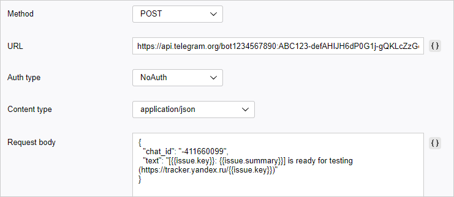

---

__system: {"dislikeVariants":["No answer to my question","Recomendations didn't help","The content doesn't match title","Other"]}
---
# Telegram

Let's say we need to send an automatic notification to the messenger each time the issue status is changed. This could be used, for example, to track whether releases are ready for testing. To do this, we need to [create a trigger](user/trigger.md) that keeps track of issue statuses like <q>Release</q> and sends an HTTP request when the issue status changes to <q>Ready for testing</q>.

Telegram uses bots to automatically send messages to users or group chats. If you want {{ tracker-name }} notifications to be sent to Telegram, create a bot and set up a trigger that will send messages through the bot via HTTP requests.

## Step 1. Setting up a Telegram bot {#bot-setup}

1. Create a new Telegram bot:

    1. Add the `@BotFather` bot to your contacts in Telegram and send it a message that says `/start`.

    1. Send the bot a message that says `/newbot` and follow the instructions: come up with a name for the bot that will be displayed (such as `My Company`) and an account name (such as `MyCompanyBot`). The account name must end with `bot`.

    You will then receive a message confirming the bot has been created successfully. The message will include a token, which a special code needed to access your bot via the API. The token has the format `1234567890:ABC123-defHIJ...`

1. Add the bot you created to the Telegram group chat you want to send {{ tracker-name }} notifications to.
If you want to receive {{ tracker-name }} notifications privately, simply message the bot.

1. Sending notifications to a Telegram chat requires a chat ID. You can view this ID by using a dedicated bot, such as `@myidbot`:
    - To find out the ID of a group chat, add the bot to the chat and send it a message that says `/getgroupid`. Please keep in mind that group chat IDs start with a minus sign `-`.
    - You can send private messages using your account ID. To do this, send the bot a private message that says `/getid`.

To learn more about setting up a Telegram bot, go to [https://core.telegram.org/bots](https://core.telegram.org/bots).

## Step 2. Set up {{ tracker-name }} {#tracker-setup}

1. Log in to {{ tracker-name }}. You must have administrator privileges for the queue you'll set up a trigger for.

1. Go to the queue settings, open the **Triggers** section, and click [**Create trigger**](user/create-trigger.md).

1. Enter a trigger name, such as <q>Telegram notifications</q>.

1. Configure trigger conditions so that the trigger is fired when the status of a **Release** issue changes to **Ready for testing**:

    1. Choose **Conditions to be met** → **All**.

    1. Add the condition **Type** → **Field equals to** → **Release**.

    1. Add the condition **Status** → **Field value became equal to** → **Ready for testing**.

     

1. Click **Add new action** and choose **HTTP request**.

1. Configure the request:
    - Method: **POST**.
    - URL: `https://api.telegram.org/bot<token>/sendMessage`
Don't forget to insert the token value you received when [setting up your Telegram bot](#bot-setup) into the address.
    - Auth type: **NoAuth**.
    - Content type: **application/json**.
    - Request body:

        ```
        {
            "chat_id": "<chat ID>",
            "text": "Issue [not_var{{issue.key}}: not_var{{issue.summary}}](https://tracker.yandex.ru/not_var{{issue.key}}) is ready for testing"
        }
        ```

        As the `chat_id` parameter, specify the chat ID you received when [setting up your Telegram bot](#bot-setup).
To add issue field values to the request body, click **{ }** to the right of the field and choose the field name.
    - Leave the headers empty.

    

    If you want to use other methods and parameters in your HTTP requests, refer to the Telegram bot API guide at [https://core.telegram.org/bots/api](https://core.telegram.org/bots/api).

    

     

1. Save your trigger.

To test the trigger in action, change the issue status from **Release** to **Ready for testing**. The trigger will send a message to your Telegram chat that says: <q>Issue TEST-123 is ready for testing: Configure triggers (https://tracker.yandex.ru/TEST-123)</q>.
