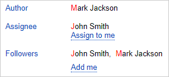

# Personal settings

You can manage your issues more easily by adjusting the {{ tracker-name }} interface.

## Customizing your home page {#sec_my_page}

You can set your [home page](startpage.md) to display any [filter](create-filter.md), [dashboard](dashboard.md), or [issue board](../manager/create-agile-board.md):

1. 

1. Under **My page**, choose the filter, dashboard, or issue board you want to see on the home page.

1. Click **Save**.

## Setting the interface language {#choose-language}

You can use {{ tracker-name }} in English or Russian. To do this:

1. 

1. Under **Interface language**, choose the desired language.

1. Click **Save**.

## Setting the user display type {#sec_display}

By default, the **Author**, **Assignee**, and **Followers** fields display the users' first and last names. If you want to display their usernames or profile pictures instead, change the user display mode.





To change the display method, do the following:

1. 

1. Under **User display**, choose the desired display method:

    - Select **Display login instead of name** to show usernames instead of real names in system issue fields.

        

        

        

    - Select **Show avatars instead of names** to only display user avatars in the user list fields. This setting doesn't affect the **Author** and **Assignee** fields.

        

        

        

1. Click **Save**.

## Setting the date display format {#sec_display_date}

Values responsible for date and time can be displayed in the full (day, month, year, time) or simplified (day and month) formats.

If you want to change the display type for these values, do the following:

1. 

1. Under **Date format**, select the desired format.

1. Click **Save**.

## Configuring notifications {#sec_notifications}

{{ tracker-name }} notifies you of any updates to issues you're subscribed to. You can change your notification settings on the personal settings page:

1. 

1. Set your notification settings:
    - Enable or disable [regular update reports for issues you're subscribed to](notification-digest.md).
    - Set up [username and event type display in emails](notification-settings.md#section_u1f_3w5_xgb).
    - Enable or disable [notifications about changes to issues](subscribe.md#sec_self).

1. Click **Save**.

To learn more about notifications, see the following sections:

- [{#T}](subscribe.md)
- [Notification settings ](notification-settings.md)

## Setting comment display order {#sec_mssg_sort}

By default, issue comments are sorted from oldest to newest. You can change the sorting order of comments from newest to oldest on the personal settings page:

1. 

1. Under **Message order in issues**, select **Newest first**.

1. Click **Save**.

## Enabling the beta version of the new interface {#sec_beta}

To switch to the new interface:

1. 

1. Enable the **New interface beta version**.

