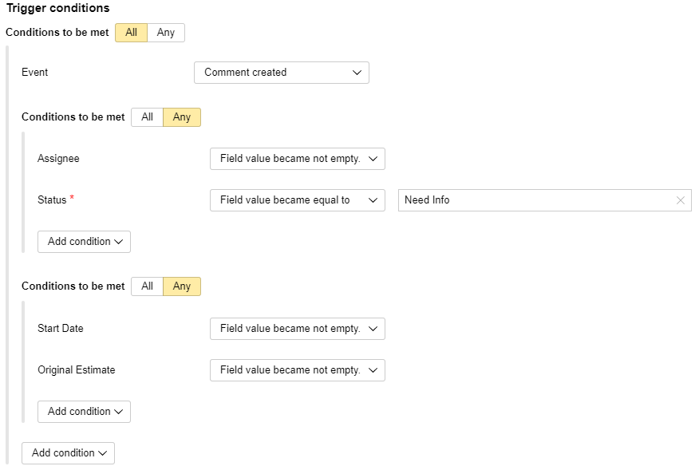

---

__system: {"dislikeVariants":["No answer to my question","Recomendations didn't help","The content doesn't match title","Other"]}
---
# Setting trigger conditions

## Add a condition {#section_set_condition}

1. In the **Trigger conditions** section, click **Add condition**.

1. Select one of the following conditions:

    | Condition | Example |
    | ----- | ----- |
    | Event | Issue created.  Issue changed.  New comment.  Formula fields [changed](set-action.md#section_calc_field). |
    | Comment text | Includes specified snippet. |
    | Comment author | Comment left by user specified. |
    | Comment type | **Comment in {{ tracker-name }}**: A comment left by an internal user. |
    | Issue field | Field value changed or became equal to the specified value. |

1. Choose an event or [comparison operation](#section_cdn_d4j_wfb) depending on the condition type.

1. If you chose a comparison operation, specify the comparison value.

    

1. You can add multiple conditions to a trigger if necessary. By default, the trigger is only activated when all conditions are met simultaneously. If you want your trigger to be activated as soon as at least one of the conditions is met, click **Any**.

   You can add a condition set (two or more) that will be triggered by AND/OR operators.

> **Example**

The trigger will be activated once a set condition is met: New comment AND (one of two conditions is met: User assigned to issue OR issue status changed to Need info) AND (one of two conditions is met: Start date specified OR Original estimate specified).

## Comparison operations {#section_cdn_d4j_wfb}

- If you set a comparison operation as a trigger condition, the condition is checked every time the issue is updated. The trigger activates once the condition is met.

- Various roles can have their own comparison operations.

- You can set additional options for some comparison operations:
  - **No match before change**: Triggers if a field value changed after a comparison operation.
  - **Ignore case**: Treat uppercase characters the same as the same lowercase characters.
  - **Ignore markup**: Ignore Wiki markup in text.

Examples of acceptable comparison operations are listed in the table.

| Comparison operations | Description |
| ----- | ----- |
| Equal to, greater than, greater than or equal to, less than, less than or equal to | Comparison operations for fields with numerical values |
| Became equal to, became greater than, became less than | The trigger activates if a field value changes after a comparison is made |
| Later, later or same, earlier, earlier or same | Comparison operations for date fields |
| Field value empty, field value not empty | Operations check whether the field is filled in |
| Field value set, field value deleted | Operations check whether a field value was added or deleted |
| Element number equal, element number greater than, element number less than | Comparison operations for fields that may contain multiple elements, such as **Tags** |
| Includes no elements, includes all elements, includes any element | Comparison operations for fields that may contain multiple elements, such as **Tags** |
| Includes no fragments, doesn't include fragment, matches, includes any fragment, includes fragment | Comparison operations for the **Comment text** condition, which check for specified text fragments in comments. |
