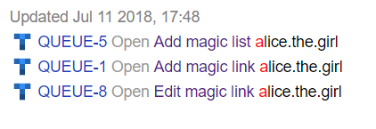

---

__system: {"dislikeVariants":["No answer to my question","Recomendations didn't help","The content doesn't match title","Other"]}
---
# Wiki

You can insert _magic links_ on Wiki pages to link to individual issues and lists of issues. Such links always contain the issue key, name, status, and the assignee's username.

## Insert a link to an issue {#section_hws_qzr_3bb}

To insert a link to an issue, copy the issue key and paste it into the page text:

| Example | Result |
| ----- | ----- |
| ``` TEST-123 ``` |  |

Magic links to issues aren&apos;t just for Yandex.Wiki pages. They also work in other internet services that support Wiki markup.

## Insert a list of issues {#section_oj5_scs_3bb}

In Wiki, you can insert a list of issues from any queue or filter:

1. Open the queue or filter page.

1. In the upper-left corner of the page, select  → **Get the Wiki code**.

1. Copy the code.

1. Insert the code on a Wiki page.

| Example | Result |
| ----- | ----- |
| ``` {{tasks url="https://st.yandex-team.ru/filters/<filter>}} ``` |  |

