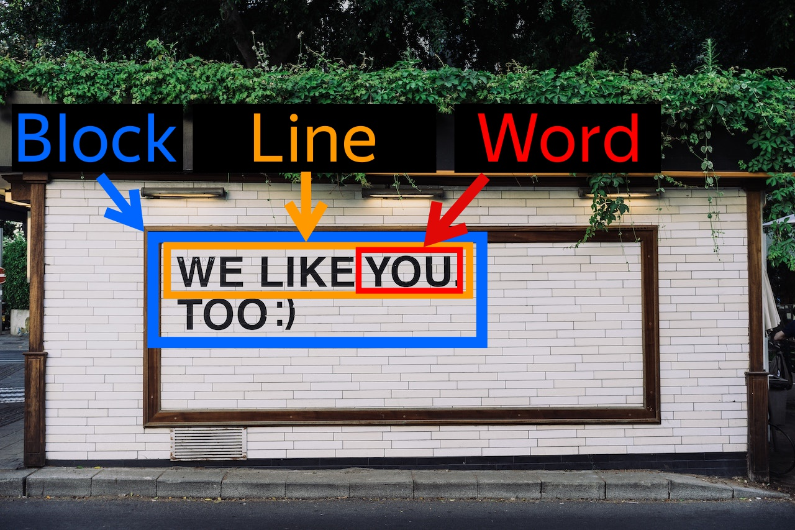

# Optical character recognition (OCR)

This section describes how the _Optical Character Recognition (OCR)_ feature works in the service.

## Text recognition process

Text in an image is recognized in two stages:

1. [Detecting the language model for text recognition](#detect-model).
1. [Detecting text in the image](#detect-text).

As a result of recognition, the service returns a JSON object with the recognized text, its position on the page, and the [recognition confidence](#confidence) value.

### Detecting the language model {#detect-model}

In your request, specify the languages for recognition. The list of languages and their order affect model selection and recognition quality. If the service tries to recognize Chinese in text written in Arabic, the result will be meaningless. For more information, see [{#T}](supported-languages.md).



If your text is in Russian and English, do not specify any other languages in the configuration because the [English-Russian model](supported-languages.md#engrus) works best.



### Detecting text in an image {#detect-text}

The service highlights the text characters found in the image and groups them by level: words are grouped into lines, the lines into blocks, and the blocks into pages.



As a result, the service returns a JSON object, where additional information is provided for each of the levels:

* `pages[]` — Page size.
* `blocks[]` — Position of the text on the page.
* `lines[]` — Position and [recognition](#confidence).
* `words[]` — Position, confidence, text, and language used for recognition.

To show the position of the text, the service returns the coordinates of the rectangle that frames the text. Coordinates are the number of pixels from the upper-left corner of the image.



Example of a recognized word with coordinates:

```json
{
  "boundingBox": {
    "vertices": [{
        "x": "410",
        "y": "404"
      },
      {
        "x": "410",
        "y": "467"
      },
      {
        "x": "559",
        "y": "467"
      },
      {
        "x": "559",
        "y": "404"
      }
    ]
  },
  "languages": [{
    "languageCode": "en",
    "confidence": 0.9412244558
  }],
  "text": "you",
  "confidence": 0.9412244558
}
```

## Image requirements

An image in a request must meet the following requirements:



## Recognition confidence {#confidence}

The recognition confidence shows the service's confidence in the result. For example, the value `"confidence": 0.9412244558` for the line <q>we like you</q> means that the text is recognized correctly with a probability of 94%.

Currently, the recognition confidence value is only calculated for lines. The `confidence` value for words and language is substituted with the line's `confidence` value.

#### What's next

* [View the list of supported languages and models](supported-languages.md)
* [View known restrictions for the current version](known-issues.md)
* [Try recognizing text in an image](../../operations/ocr/text-detection.md)

