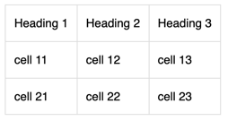

# Inserting a table

## Inserting static tables {#simple-table}

[Simple tables](static-markup/grids.md) are static tables that are created manually using {{ wiki-name }} markup elements or Markdown formatting.

To place a table in the text, use the markup:

```
| Heading 1 | Heading 2 | Heading 3 |
| --- | --- | --- |
| cell 11 | cell 12 | cell 13 |
| cell 21 | cell 22 | cell 23 |
```







## Inserting dynamic tables {#grid}

[Dynamic tables](pages-types.md#grid) are tables where you can specify column data type, sort values, or turn cells into required. You can use a table directly or [embed it in a page](#section-integrate-table).


### Creating and embedding a table in a page created in the old editor {#section-add-table-button}

To create a table and embed it in the text of a page:

1. In the panel at the top of the page, click . The [table code](actions/grid-reference.md) will appear in the text:

   ```
   {{grid page="{{ wiki-pagename }}/grid-2021-01-24t163048" width="100%"}}
   ```

   The created table becomes a subsection of the current page.

1. Click **{{ ui-key.beta-wiki.blocks_common_newgrid.blocks_b-grid-table-settings.save }}**.

1. [Fill in the table](edit-grid-wysiwyg.md).

### Embedding an existing table {#section-integrate-table}

To embed a dynamic table in a page:

1. Open the table you need and click  **{{ ui-key.yacloud.common.table-config }}** in the top-right corner.

1. Select **</> Copy embed code**.

1. Configure the parameters for inserting the table.

1. Copy the table code and paste it into the page text.

### Filtering rows and columns {#filter}

You can filter dynamic tables you embed in a page created in the old editor so that only specific rows and columns are displayed. To do this:

1. Get the table embed code and insert it into the text of the page.

1. To choose columns for display, add the `columns` parameter to your table's code. For more information about using this parameter, see [{#T}](actions/grid-reference.md#col-filter).

1. To filter rows based on values set in specific cells, add the `filter` parameter to your table's code. For more information about using this parameter, see [{#T}](actions/grid-reference.md#row-filter).

### Jumping to the parent table {#go-to-source}

To open the original table embedded in the page:


1. Click  at the bottom of the table.


1. Select **{{ ui-key.beta-wiki.blocks_common_newgrid.blocks_b-grid-table-options.parent_table }}**.

#### See also

- [{#T}](edit-grid-wysiwyg.md)

- [{#T}](import-page.md)

- [{#T}](static-markup/csv.md)