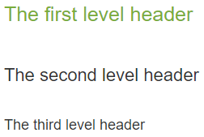
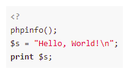

# Formatting text

You can format text using special symbols called markup elements. Markup elements are used to bold or italize a piece of text, add headings and lists to a page, embed links, images, tables, and more.

To add markup elements to your page, use the [formatting toolbar](#buttons) or type [markup symbols](#markup) on your keyboard. You'll see the result in the preview panel on the right.

## Formatting toolbar {#buttons}

Use the toolbar at the top of the page to add common formatting elements to the text.


There are two ways you can use the formatting toolbar:

- To add a markup element to your text, place the cursor in the desired position and click a button on the formatting toolbar. A markup template will appear in the text. Insert your own text in the template. Clicking **Add link** or **Embed code** will open a new window. Enter your text in the window and click **Add**.

- To format text that has already been added to the page, select a text fragment and click a button on the formatting toolbar.

To undo text formatting, delete the markup symbols manually.



You may notice that the toolbar buttons create markup symbols that are different from the Markdown markup. This markup type is supported along with Markdown and is correctly displayed on the page.



## Markup elements {#markup}

{{ wiki-name }} supports [Markdown markup]({{ link-about-markdown }}) with additional formatting elements that are not present in the standard Markdown syntax.

This section lists the most common markup features. For a complete list of supported elements, see [{#T}](static-markup.md).

| Element | Markup | Result |
| --- | --- | --- |
| Headings | `# The first level header`<br/>`## The second level header`<br/>`### The third level header` |  |
| New paragraph | `First line of the paragraph.`<br/>`Second line of the paragraph.`<br/><br/>`New paragraph.` |  |
| Horizontal line | `---` |  |
| Bold | `**Bold text**` |  |
| Italics | `*Italic text*` |  |
| Underline | `__Underlined text__` |  |
| Strikethrough | `~~Strikethrough text~~` |  |
| Highlighted text | `??Highlighted text??` |  |
| Red text | `!!Red text!!` |  |
| Colored text.<br/><br/>Supported colors:<br/><br/><ul><li>`red`;</li><li>`green`;</li><li>`blue`;</li><li>`grey`/`gray`;</li><li>`yellow`;</li><li>`cyan`;</li><li>`orang`;</li><li>`violet`.</li></ul> | `!!(blue)Blue text!!` |  |
| Numbered list | `1. List item`<br/>`2. List item`<br/>`3. List item` |  |
| Bulleted list | `- List item`<br/>`- List item`<br/>`- List item` |  |
| Link | `[link text](http://example.com/)` |  |
| Image | `` |  |
| Quotations | `>Quoted text` |  |
| Collapsed text | `<{Read the entire text`<br/>`you need to click the "Read the entire text" link.`<br/>`}>` |  |
| Code in the line | ``` `code snippet` ``` |  |
| Code block | ` ```php`<br/>`<?`<br/>`phpinfo();`<br/>`$s = "Hello, World!\n";`<br/>`print $s;`<br/>` ``` ` |  |

#### See also

- [{#T}](add-image.md)

- [{#T}](add-grid.md)

- [{#T}](attach-file.md)

- [{#T}](actions/toc.md)

