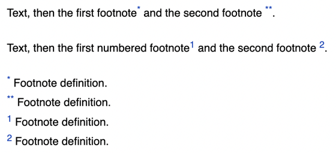

# Links

To design links, use the markup:

```
[link text](URL)
```

For example:

| Markup | Result |
--- | ---
| `[Yandex]({{ link-yandex }})` | [Yandex]({{ link-yandex }}) |

If you paste an address with no markup, it will be converted into a hyperlink anyway:

| Markup | Result |
--- | ---
| `{{ link-yandex }}` | [{{ link-yandex }}]({{ link-yandex }}) |

## Links to {{ wiki-name }} pages {#wiki-ref}

To link to a {{ wiki-name }} page, you can use that page's relative address instead of the full page or cluster address.

### Links to pages {#page-link}

- Specify the address relative to the {{ wiki-name }} homepage. Add the `/` symbol before the address.

   | Where the link goes | Markup |
   --- | ---
   | `{{ wiki-host-name }}/users/{{ username-oleg }}/notes` | `[{{ oleg-notes-title }}](/users/{{ username-oleg }}/notes)` |

- Specify the address relative to the parent of the page where you're placing the link. Don't add `/` before the address.

   | Page URLs | Markup |
   --- | ---
   | Links from: `{{ wiki-host-name }}/users/{{ username-oleg }}/newpage`<br/><br/>Links to: `{{ wiki-host-name }}/users/{{ username-oleg }}/notes` | `[{{ oleg-notes-title }}](notes)` |
   | Links from: `{{ wiki-host-name }}/users/{{ username-oleg }}/notes/note1`<br/><br/>Links to: `{{ wiki-host-name }}/users/{{ username-oleg }}/newpage` | `[New page](../newpage)` |

### Links to clusters {#section-link}

Each page title automatically gets its own *anchor*, which is the cluster ID. Anchors are used for direct links to clusters on the page.

The anchor is generated from the name of a cluster. For example, a cluster named `My cluster` will be assigned the `{{ example-anchor }}` anchor.

To add a link to a cluster, enter the page address followed by the `#` symbol and the anchor:

```
[link text](/page URL/#{{ example-anchor }})
```

Find out the value of the cluster anchor:

1. Hover over the cluster title and click **§** that appears to the right of the title.

1. Copy the cluster address from the browser's address bar.

The anchor is shown after the `#` symbol at the end of the address.

### Link to any place on a page {#place-link}

If you want to link to a specific place on a page, you can always create an anchor ID wherever you need. To set an anchor, use the [dynamic block `not_var{{anchor}}`](../actions/anchor.md):

```
{{anchor name="my-anchor"}}
```

To add an anchor link, enter the page address followed by the `#` symbol and then add the anchor at the end:

```
[link text](http://page URL/#my-anchor)
```

## Links to images {#ref-to-image}

If you paste an image link with no markup, the image itself will be displayed on the page.

To add a link to an image, use the link markup:

```
[link text](image URL)
```

| Markup | Result |
--- | ---
| `[Yandex logo]({{ yandex-logo-link }})` | [Yandex logo]({{ yandex-logo-link }}) |

## Making an image a link {#image-as-ref}

Images can also function as links so that when you click on the image, a page or file opens. To do this, [insert an image](files.md#add-image) in the link markup element instead of text:

```
[](link)
```

| Markup | Result |
--- | ---
| `[]({{ link-yandex }})` | []({{ link-yandex }}) |

## Links to email addresses {#mail-ref}

To add a link to an email address:

- Enclose the email address in angle brackets `< >`.

- Use the link markup and add `mailto:` before the email address.

`[link text](mailto:email-address)`

| Markup | Result |
--- | ---
| `<mail@example.com>` |  |
| `{{ example-link-mail }}` |  |

## Footnotes {#footnotes}

A footnote is a note to the text, usually found at the bottom of the page. To add a footnote to the page:

1. Add double square brackets, an <q>asterisk</q>, and a footnote symbol after the words covered by the footnote. You can use numbers and other symbols or just <q>asterisks</q> for your footnotes.

1. Add double square brackets, the `#` symbol, and the same footnote sign before the footnote text.

For example:

```
Text, then a footnote[[*]] and the second[[**]].

Text, then a digital footnote[[*1]] and the second[[*2]].

[[#*]] First footnote definition.
[[#**]] Second footnote definition.
[[#1]] First digital footnote definition.
[[#2]] Second digital footnote definition.
```





