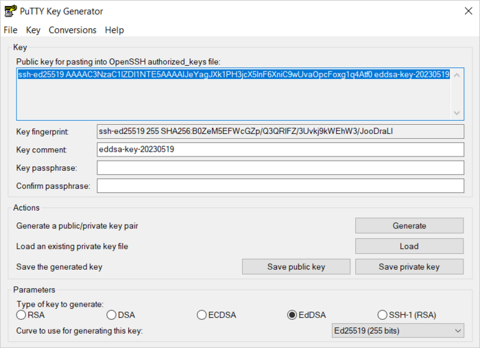

Чтобы подключаться к виртуальной машине по [SSH](../glossary/ssh-keygen.md), нужна пара ключей: открытый ключ размещается на виртуальной машине, а закрытый ключ хранится у пользователя. Такой способ более безопасен, чем подключение по логину и паролю.



Чтобы создать пару ключей:



- Linux/MacOS
  
  1. Откройте терминал.
  1. Создайте новый ключ с помощью команды `ssh-keygen`:

     ```
     ssh-keygen -t ed25519
     ```

     После выполнения команды вам будет предложено указать имена файлов, в которые будут сохранены ключи и ввести пароль для закрытого ключа. По умолчанию используется имя `id_ed25519`, ключи создаются в директории `~/.ssh`.

     Открытый ключ будет сохранен в файле `<имя_ключа>.pub`. Вставьте содержимое файла в поле **SSH-ключ** при создании новой виртуальной машины через консоль управления.
  
- Windows 10

  1. Запустите `cmd.exe` или `powershell.exe`.
  1. Создайте новый ключ с помощью команды `ssh-keygen`. Выполните команду:

     ```
     ssh-keygen -t ed25519
     ```

     После выполнения команды вам будет предложено указать имена файлов, в которые будут сохранены ключи, и ввести пароль для закрытого ключа. По умолчанию используется имя `id_ed25519`. Ключи создаются в директории `C:\Users\<имя_пользователя>\.ssh\` или `C:\Users\<имя_пользователя>\` в зависимости от интерфейса командной строки.

     Открытый ключ будет сохранен в файле с названием `<имя_ключа>.pub`. 
   1. При создании виртуальной машины через консоль управления укажите открытый ключ. Для этого откройте файл `<имя_ключа>.pub` с помощью Notepad и скопируйте значение ключа в поле **SSH-ключ**. Обратите внимание, что ключ должен быть записан **одной строкой** (не должно быть переносов и разрывов строки).

  
- Windows 7/8
  
  Создание ключей для Windows будет выполняться с помощью приложения PuTTY.
  
  1. [Скачайте](https://www.putty.org) и установите PuTTY.
  1. Убедитесь, что директория, куда вы установили PuTTY, присутствует в `PATH`:
     1. Нажмите правой кнопкой на **Мой компьютер**. Выберите пункт **Свойства**.
     1. В открывшемся окне выберите **Дополнительные параметры системы**, затем **Переменные среды** (находится в нижней части окна).
     1. В разделе **Системные переменные** найдите `PATH` и нажмите **Изменить**.
     1. В поле **Значение переменной** допишите путь к директории, куда вы установили PuTTY.
  1. Запустите приложение PuTTYgen.
  1. В качестве типа генерируемой пары выберите **Ed25519**. Нажмите **Generate** и поводите курсором в поле выше до тех пор, пока не закончится создание ключа.
  
     
  
  1. В поле **Key passphrase** введите надежный пароль. Повторно введите его в поле ниже.
  1. Нажмите кнопку **Save private key** и сохраните закрытый ключ. Никогда его никому не передавайте и не говорите никому ключевую фразу от него.
  1. Сохраните ключ в текстовом файле. Для этого скопируйте открытый ключ из текстового поля в текстовый файл с названием `id_ed25519.pub`. Обратите внимание, что ключ должен быть записан **одной строкой** (не должно быть переносов и разрывов строки).
  1. При создании виртуальной машины через консоль управления укажите публичный ключ. Для этого откройте файл `id_ed25519.pub` с помощью Notepad и скопируйте значение ключа в поле **SSH-ключ**.
  

