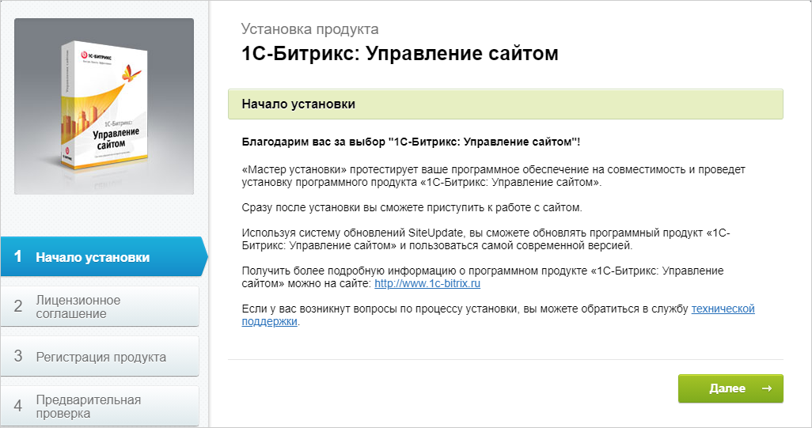
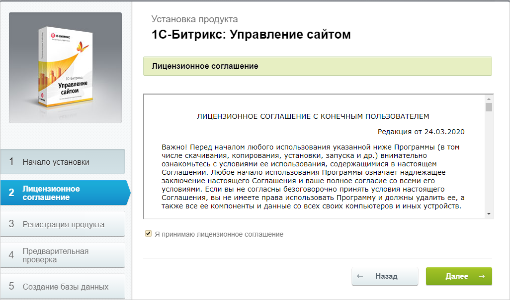
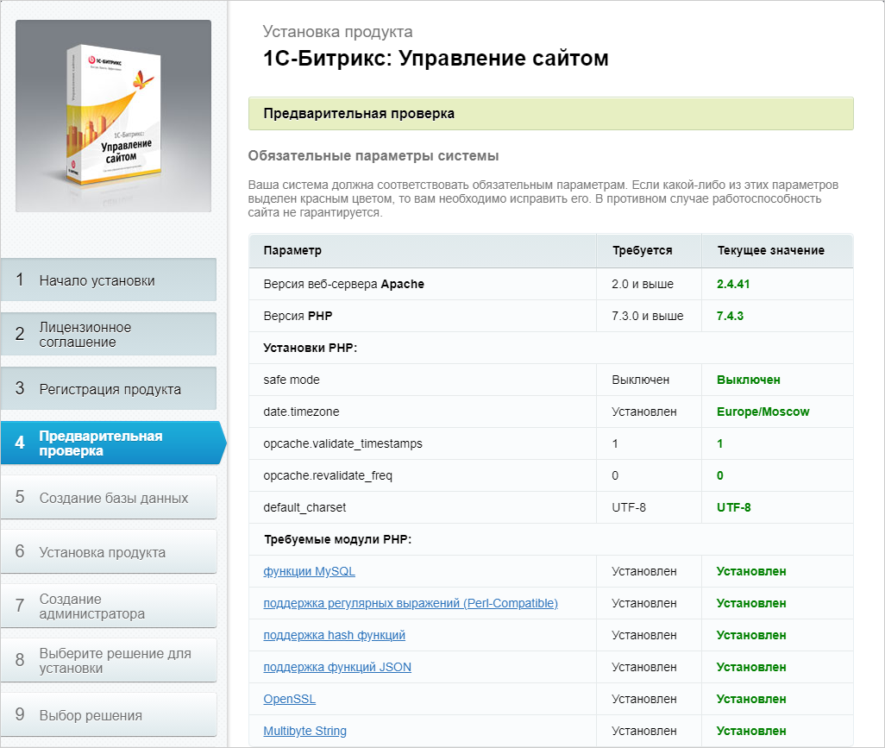
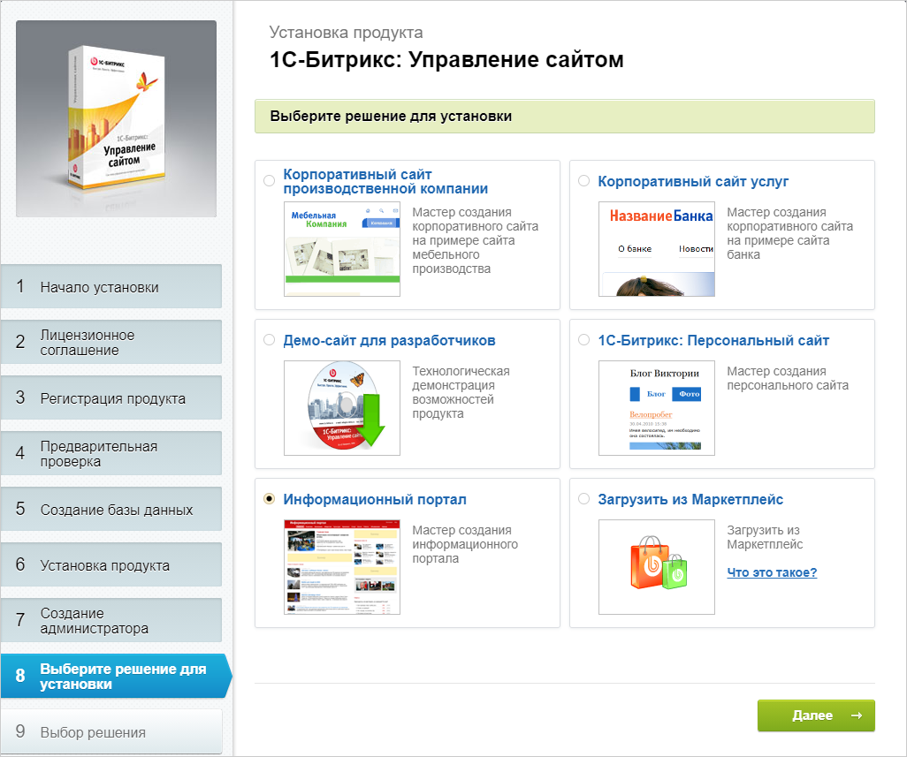
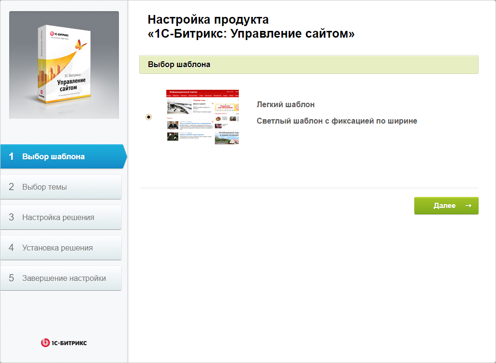
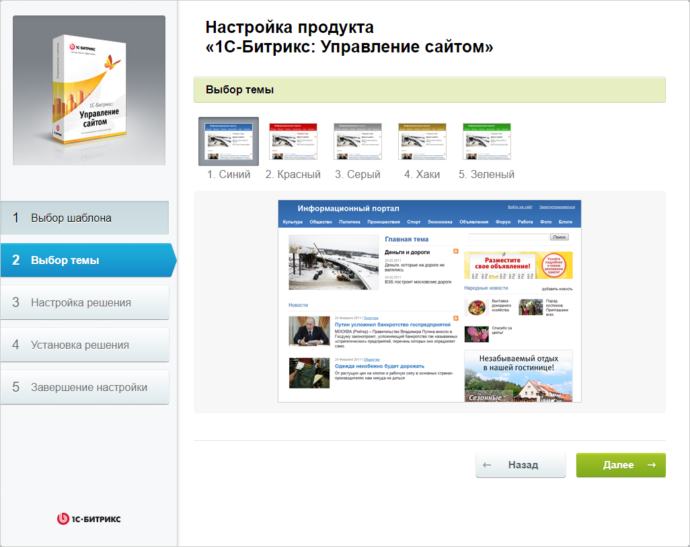
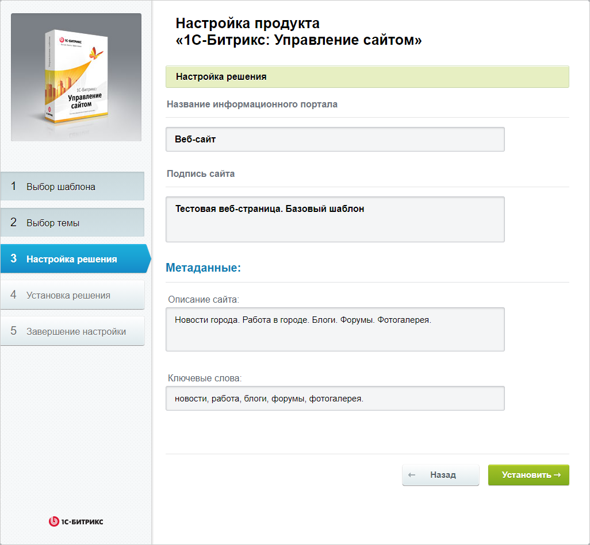
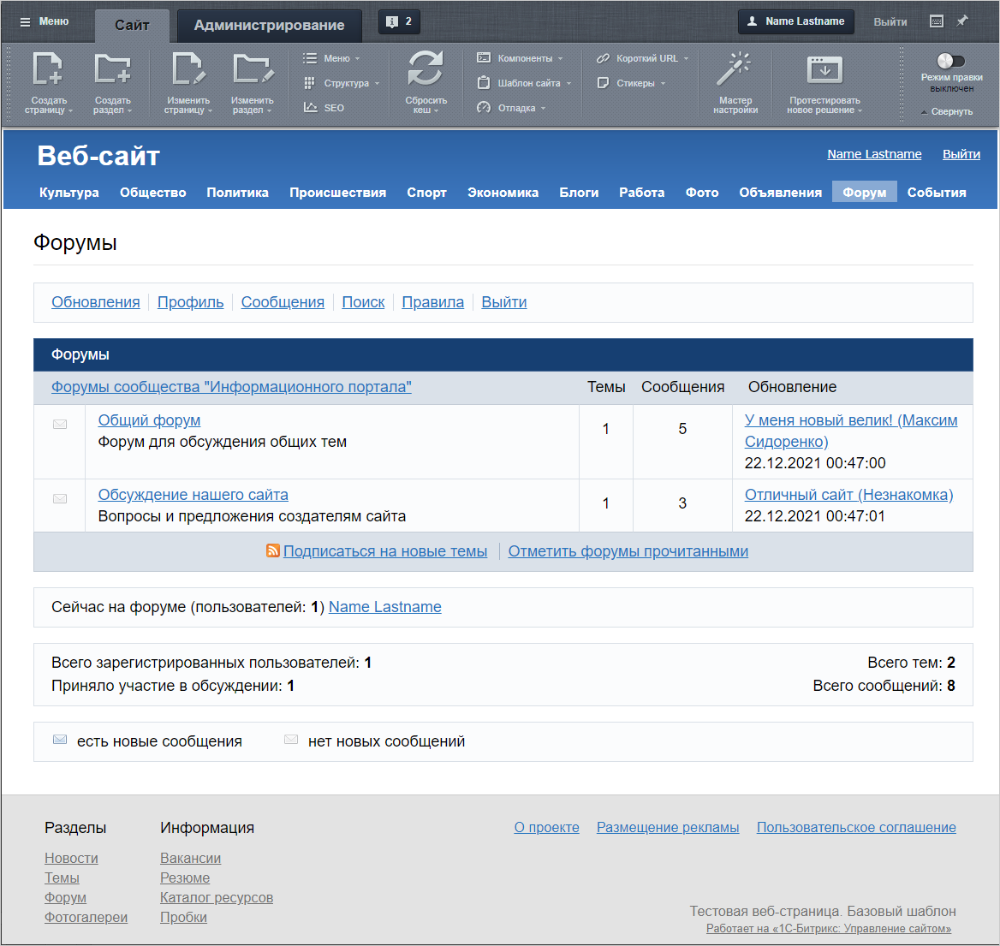
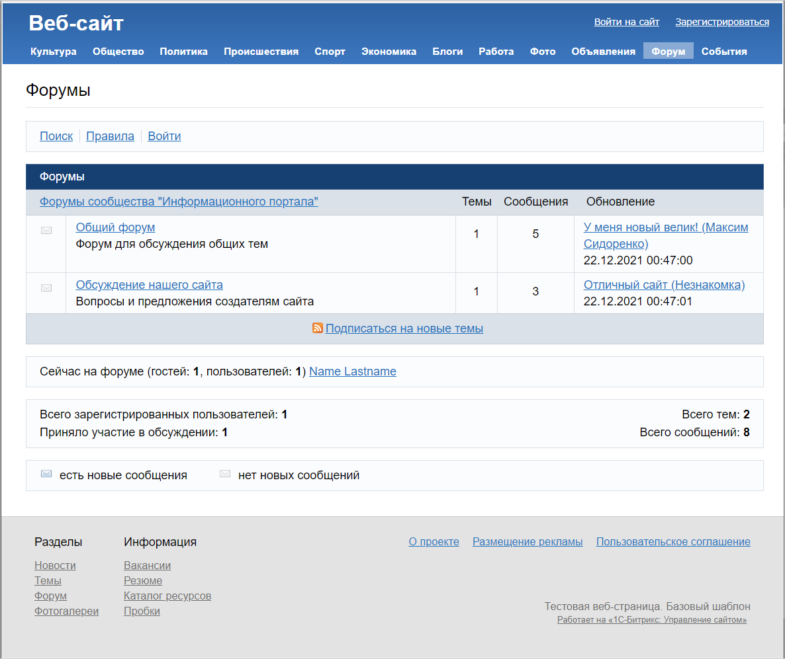

# Веб-сайт на базе 1С-Битрикс

[1С-Битрикс: Управление сайтом](https://www.1c-bitrix.ru/products/cms/) — это система управления веб-проектами от компании 1С-Битрикс. С его помощью вы можете достаточно просто управлять структурой и содержимым вашего веб-сайта, не обладая специальными знаниями программирования и верстки. Техническую часть работы за вас выполнит «1С-Битрикс: Управление сайтом».

В этой инструкции вы развернете и настроите веб-сайт, используя шаблон информационного портала на платформе 1С-Битрикс. В процессе настройки вы создадите виртуальную машину в инфраструктуре {{ yandex-cloud }}, на которой развернете образ платформы 1С-Битрикс и требуемые для нее сервисы. В качестве базы данных вами будет развернут кластер управляемой базы данных MySQL с возможностью обеспечения его отказоустойчивости.

Используемые ресурсы для правильной работы 1С-Битрикс:
* ВМ на базе Ubuntu 20.04 LTS с доступом во внешнюю сеть, на которой будет установлен 1С-Битрикс.
* Кластер MySQL, являющийся базой данных для веб-сайта 1С-Битрикс.

Чтобы развернуть и настроить 1С-Битрикс:
1. [Подготовьте облако к работе](#before-you-begin).
1. [Создайте ВМ в облаке](#create-vm).
1. [Создайте кластер баз данных MySQL](#create-mysql).
1. [Настройте сервер для работы с 1C-Битрикс](#configure-server).
1. [Настройте 1С-Битрикс](#configure-bitrix).

## Подготовьте облако к работе {#before-you-begin}




### Необходимые платные ресурсы

В стоимость поддержки сервера для 1С-Битрикс и базы данных входит:
* плата за диски {{ compute-full-name }} и постоянно запущенную ВМ (см. [тарифы {{ compute-full-name }}](../../compute/pricing.md));
* плата за использование динамического или статического внешнего IP-адреса (см. [тарифы {{ vpc-full-name }}](../../vpc/pricing.md));
* плата за использование управляемой базы данных (см. [тарифы {{ mmy-name }}](../../managed-mysql/pricing.md)).

Для текущего сценария используется пробная версия 1С-Битрикс с ознакомительным периодом в 30 дней. Стоимость электронных версий продукта вы можете уточнить на официальном ресурсе [«1С-Битрикс»](https://www.1c-bitrix.ru).


## Создайте виртуальную машину в облаке {#create-vm}

Чтобы создать ВМ:

1. В [консоли управления]({{ link-console-main }}) выберите каталог, в котором будет создана виртуальная машина.

1. В списке сервисов выберите **{{ compute-name }}**.

1. Нажмите кнопку **Создать ВМ**.

1. В поле **Имя** введите имя ВМ, например `bitrixwebsite`.

1. Зону доступности оставьте выбранной по умолчанию.

1. В блоке **{{ marketplace-name }}** выберите образ операционной системы [Ubuntu 20.04 lts](/marketplace/products/yc/ubuntu-20-04-lts).

1. В блоке **Диски** выберите жесткий диск `SSD` размером `20 ГБ`.

1. В блоке **Вычислительные ресурсы**:

   * Выберите [платформу](../../compute/concepts/vm-platforms.md) ВМ.
   * Для корректной работы системы 1С-Битрикс укажите конфигурацию:
     * **Платформа** - `Intel Ice Lake`.
     * **Гарантированная доля vCPU** — `20%`.
     * **vCPU** — `2`.
     * **RAM** — `4 ГБ`.

1. В блоке **Сетевые настройки**:

   * Выберите **Сеть** и **Подсеть**, к которым нужно подключить ВМ. Если нужной сети или подсети еще нет, вы можете создать их прямо на странице создания ВМ.
   * В поле **Публичный адрес** оставьте значение **Автоматически**, чтобы назначить ВМ случайный внешний IP-адрес из пула {{ yandex-cloud }}, или выберите статический адрес из списка, если вы зарезервировали его заранее.

1. В блоке **Доступ** укажите данные для доступа к ВМ:

   * В поле **Логин** введите предпочтительное имя пользователя, который будет создан на ВМ, например `ubuntu`.
   * В поле **SSH-ключ** скопируйте ваш открытый SSH-ключ. Пару ключей для подключения по SSH необходимо создать [самостоятельно](../../compute/operations/vm-connect/ssh.md).

1. Нажмите кнопку **Создать ВМ**.

В процессе работы вам может потребоваться сохранять [снимки диска](../../compute/operations/disk-control/create-snapshot.md) ВМ. Они содержат копию файловой системы ВМ на момент создания снимка.

Вы можете использовать снимки для различных целей, например:
* перенос данных с одного диска на другой — например, на диск в другой зоне доступности;
* создание резервной копии диска перед операциями, которые могут повлечь повреждение данных;
* версионирование диска путем регулярного создания снимков диска.

## Создайте кластер баз данных MySQL {#create-mysql}

Чтобы создать кластер баз данных MySQL:

1. На странице каталога в [консоли управления]({{ link-console-main }}) выберите сервис **{{ mmy-name }}**.

1. Нажмите кнопку **Создать ресурс** и выберите пункт **Кластер MySQL**.

1. В поле **Имя** введите имя кластера, например `BitrixMySQL`.

1. В блоке **Класс хоста** выберите `s2.micro`. Данных характеристик хватит для работы системы 1С-Битрикс.

1. В блоке **Размер хранилища** выберите тип хранилища — `network-ssd` размером 10 ГБ.

1. В блоке **База данных** укажите:

   * **Имя БД**. В этой инструкции оставьте значение по умолчанию `db1`.
   * **Имя пользователя**, которое является логином для подключения к базе данных. В этой инструкции оставьте значение по умолчанию `user1`.
   * **Пароль**, будет использоваться для доступа системой 1С-Битрикс к базе данных MySQL, например `p@s$woRd!`.

1. В блоке **Хосты**, при необходимости, поменяйте **Зону доступности**, в которой должна находиться база данных. Для этого нажмите значок  в строке с деталями о хосте. В открывшемся окне выберите нужную зону доступности и нажмите кнопку **Сохранить**.

   Рекомендуется выбрать ту же зону доступности, которую вы выбрали при создании ВМ. Это позволит уменьшить задержку (latency) между ВМ и базой данных.

   

1. Для обеспечения отказоустойчивости вы можете добавить дополнительные хосты для вашей базы данных. Для этого выберите **Добавить хост** и укажите, в какой зоне доступности он будет размещен.

1. Остальные поля оставьте без изменений.

1. Нажмите на кнопку **Создать кластер**.

Создание кластера БД может занять несколько минут. Проверить доступность созданного кластера вы можете в консоли управления {{ yandex-cloud }}, выбрав сервис **{{ mmy-name }}**. На вкладке **Кластеры** статус кластера должен быть **Running**, состояние **Alive**.

## Настройте сервер для работы с 1C-Битрикс {#configure-server}

Для настройки сервера для работы с 1С-Битрикс выполните следующие шаги:

1. Войдите на созданную ВМ с помощью [SSH](../../compute/operations/vm-connect/ssh.md).

   ```bash
   ssh ubuntu@<публичный-IP-адрес-ВМ>
   ```

   Где:
   * `ubuntu` — имя пользователя в поле **Логин**, которое вы указывали при [создании ВМ](#create-vm).

   Чтобы узнать публичный IP-адрес вашей ВМ на странице каталога в [консоли управления]({{ link-console-main }}):

   1. Выберите блок **{{ compute-name }}**.
   1. Нажмите на имя вашей ВМ (в данном примере — **bitrixwebsite**).
   1. Откроется окно с общей информацией о вашей ВМ. Публичный IP-адрес вы можете найти в блоке **Сеть**, в поле **Публичный IPv4**.

1. Установите необходимое программное обеспечение:

   ```bash
   sudo apt-get update
   sudo apt-get install -y apache2 libapache2-mod-php php-gd php-mbstring php-mysql
   ```

1. Перейдите в рабочий каталог проекта и скачайте дистрибутив <q>1С-Битрикс: Управление сайтом</q>:

   ```bash
   cd /var/www/html/
   sudo wget https://www.1c-bitrix.ru/download/standard_encode.tar.gz
   ```

1. Распакуйте полученный архив и после этого удалите ненужные файлы:

   ```bash
   sudo tar -zxf standard_encode.tar.gz
   sudo rm -f index.html standard_encode.tar.gz
   ```

1. Назначьте пользователя `www-data` владельцем рабочего каталога проекта:

   ```bash
   sudo chown -R www-data:www-data /var/www/html
   ```

   Проверьте права и владельцев рабочего каталога:
   
   ```bash
   ls -l
   ```

   Результат:

   ```text
   total 76
   drwxrwxr-x 6 www-data www-data  4096 May 15 13:50 bitrix
   -rwxrwxr-x 1 www-data www-data  1378 May 15 13:50 index.php
   -rwxrwxr-x 1 www-data www-data   150 Mar 11  2013 install.config
   -rwxrwxr-x 1 www-data www-data 30741 Apr 10 14:36 license.html
   -rwxrwxr-x 1 www-data www-data   113 Nov 20  2012 license.php
   -rwxrwxr-x 1 www-data www-data 14054 Feb  6  2017 readme.html
   -rwxrwxr-x 1 www-data www-data   112 Mar 27  2013 readme.php
   drwxrwxr-x 2 www-data www-data  4096 May 15 13:50 upload
   -rwxrwxr-x 1 www-data www-data   691 Oct 27  2009 web.config
   ```

1. Для корректной работы 1С настройте параметры PHP. Для этого воспользуйтесь встроенным редактором `nano` и отредактируйте следующие переменные в файле конфигурации `php.ini`:

   ```bash
   sudo nano /etc/php/7.4/apache2/php.ini
   ```

   Было                                           | Стало                                         
   :----------------------------------------------| :---------------------------------------------
   `short_open_tag = Off`                         | `short_open_tag = On`
   `memory_limit = 128M`                          | `memory_limit = 256M`
   `;date.timezone =`                             | `date.timezone = Europe/Moscow`
   `;opcache.revalidate_freq =2`                  | `opcache.revalidate_freq =0`
   `;session.save_path = "/var/lib/php/sessions"` | `session.save_path = "/var/lib/php/sessions"`

   

   Чтобы найти нужный параметр в редакторе `nano` нажмите сочетание клавиш **Ctrl** + **W**. Найдите требуемый параметр из таблицы выше, далее сохраните изменения при помощи сочетания клавиш **Ctrl** + **O**. Выход из редактора **Ctrl** + **X**.

   

1. Настройте веб-сервер Apache. Для этого отредактируйте файл конфигурации `/etc/apache2/sites-enabled/000-default.conf`.

   1. Откройте файл в текстовом редакторе:

      ```bash
      sudo nano /etc/apache2/sites-enabled/000-default.conf
      ```

   1. Добавьте после строки `DocumentRoot /var/www/html` следующий блок:

      ```
      <Directory /var/www/html>
      Options Indexes FollowSymLinks
      AllowOverride All
      Require all granted
      </Directory>
      ```

   1. Перезапустите веб-сервер, чтобы все измененные настройки применились.

      ```bash
      sudo service apache2 restart
      ```

После выполнения этих команд серверная часть будет сконфигурирована для корректной работы 1С-Битрикс.

## Настройте 1С-Битрикс {#configure-bitrix}

Установите и настройте 1С-Битрикс:

1. Откройте веб-интерфейс 1С-Битрикс: Управление сайтом: перейдите по адресу `http://<публичный-IP-адрес-ВМ>/`. Должна открыться страница с приглашением установить 1С-Битрикс.

1. Нажмите кнопку **Далее**.

   

1. Ознакомьтесь с лицензионным соглашением и выберите **Я принимаю лицензионное соглашение**. Затем нажмите кнопку **Далее**.

   

1. Регистрация необязательна, поэтому уберите соответствующую галочку, но оставьте **Установить в кодировке UTF-8** и нажмите кнопку **Далее**.

   

1. Система проверит, верно ли сконфигурирован сервер. Просмотрите все параметры на данной странице и нажмите кнопку **Далее**.

   

1. Укажите параметры созданной базы данных:

   1. В поле **Сервер** укажите полное доменное имя созданной вами базы данных. Чтобы его узнать:
      1. В [консоли управления]({{ link-console-main }}) перейдите в новой вкладке браузера на страницу каталога.
      1. Выберите раздел **Managed Service for MySQL**.
      1. В таблице выберите созданную вами базу данных.
      1. В меню слева выберите вкладку **Хосты**.
      1. Подведите курсор к **Имени хоста** (вида `rc1c-cfazv1dbzv02u4qk`) и скопируйте полное доменное имя базы данных, нажав появившийся значок . К имени хоста добавится полное доменное имя, в результате в поле **Сервер** должно быть указано имя вида `rc1c-cfazv1dbzv02u4qk.{{ dns-zone }}`.
   1. В полях **Имя пользователя** и **Пароль** укажите данные, с которыми вы создавали базу данных в разделе [Создайте кластер баз данных MySQL](#create-mysql).
   1. В поле **Имя базы данных** укажите имя созданной базы данных (`db1`).
   1. Нажмите кнопку **Далее**.

   

1. Дождитесь инициализации базы данных {{ MY }}.

   

1. Создайте аккаунт администратора, который сможет вносить изменения в вашу систему. Заполните все поля и нажмите кнопку **Далее**.

   

1. Выберите шаблон **Информационный портал** и нажмите кнопку **Далее**.

   

1. Подтвердите выбор единственного шаблона оформления, нажав кнопку **Далее**.

   

1. Выберите цветовое оформление и нажмите кнопку **Далее**.

   

1. Заполните все поля в соответствии с требованиями к веб-сайту и нажмите кнопку **Установить**. Начнется установка и настройка всех компонентов системы. Дождитесь ее окончания.

   

1. Через некоторое время появится страница, уведомляющая о том, что система установлена и настроена. Для начала работы с веб-сайтом нажмите кнопку **Перейти на сайт**.

   

1. Вы попали в веб-интерфейс полностью готовой для дальнейшей эксплуатации системы и находитесь в режиме редактирования содержимого.

   

1. Чтобы увидеть главную страницу сайта глазами пользователя, нажмите **Выйти** из панели администрирования вашим сайтом, в правом верхнем углу страницы, затем перейдите по адресу `http://<публичный-IP-адрес-ВМ>/`. Чтобы вернуться обратно в режим редактирования, авторизуйтесь на сайте с теми учетными данными, которые вы указали для администратора 1С-Битрикс.

   

## Как удалить созданные ресурсы {#clear-out}

Чтобы перестать платить за развернутый сервер:

1. [Удалите виртуальную машину](../../compute/operations/vm-control/vm-delete.md) `bitrixwebsite`.

   Если вы зарезервировали статический публичный IP-адрес специально для этой ВМ:
    1. Откройте сервис **Virtual Private Cloud** в вашем каталоге.
    1. Перейдите на вкладку **IP-адреса**.
    1. Найдите нужный адрес, нажмите значок  и выберите пункт **Удалить**.

1. [Удалите кластер баз данных](../../managed-mysql/operations/cluster-delete.md) `BitrixMySQL`.
