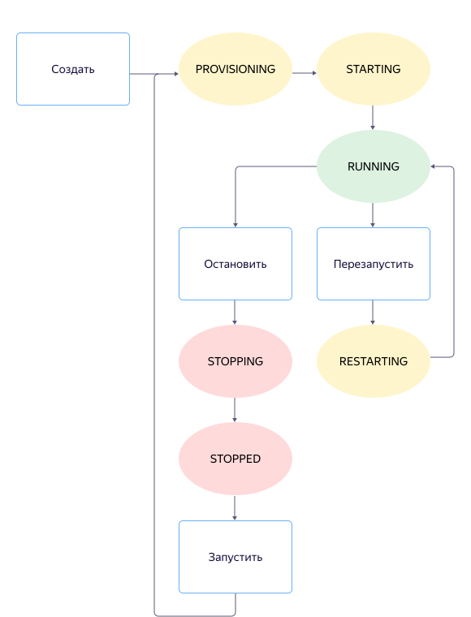

# Статусы виртуальной машины

Виртуальная машина может находиться в одном из следующих статусов:

- `PROVISIONING` — выделение ресурсов виртуальной машине.
- `STARTING` — запуск.
- `RUNNING` — виртуальная машина запущена и работает.
- `STOPPING` — останавливается.
- `STOPPED` — остановлена.
- `RESTARTING` – перезагружается.
- `UPDATING` — обновляется.
- `CRASHED` — ошибка гипервизора.
- `ERROR` — фатальная ошибка.
- `DELETING` — удаляется.

Эта диаграмма отображает переходы между статусами при штатной работе виртуальной машины. Диаграмма показывает следующие действия, выполняемые с виртуальной машиной:
* [создание](#create);
* [остановка и запуск](#stop-and-start);
* [перезапуск](#restart).

Статусы, возникающие при [обновлении](#update) или [удалении](#delete) виртуальной машины, а также при [возникновении ошибки](#error) рассматриваются отдельно, чтобы не усложнять диаграмму. Переход в эти статусы возможен почти из любого другого статуса.

## Создание {#create}

[При создании](../operations/vm-create/create-from-image.md) виртуальная машина находится в статусе `PROVISIONING`. В это время виртуальной машине выделяются ресурсы: виртуальные ядра и память, IP-адрес, создаются диски.

После этого виртуальная машина будет автоматически запущена и перейдет в статус `STARTING`.

Если запуск произошел успешно, машина перейдет в статус `RUNNING` и начнется загрузка операционной системы. Когда операционная система будет загружена, вы сможете подключиться к виртуальной машине.

## Остановка и запуск {#stop-and-start}

Если вы [остановите](../operations/vm-control/vm-stop-and-start.md#stop) виртуальную машину, она перейдет в статус `STOPPED` и будет ожидать команды запуска.

Когда вы снова [запустите](../operations/vm-control/vm-stop-and-start.md#start) виртуальную машину, она пройдет те же статусы, что и при создании: `PROVISIONING → STARTING → RUNNING`

## Перезапуск {#restart}

Если вы [перезапустите](../operations/vm-control/vm-stop-and-start.md#restart) виртуальную машину, то она перейдет в статус `RESTARTING`. Так как все необходимые ресурсы виртуальной машине уже выделены, она сразу вернется в статус `RUNNING`.

## Обновление {#update}

Вы можете обновить параметры виртуальной машины независимо от того, в каком статусе она находится, например изменить ее имя. Останавливать или перезагружать виртуальную машину не требуется.

Если вы обновите [метаданные](vm-metadata.md), они станут доступны из виртуальной машины сразу после обновления.

## Удаление {#delete}

Когда вы [удаляете](../operations/vm-control/vm-delete.md) виртуальную машину, она не удаляется сразу. Сначала отменяются или завершаются все текущие запущенные операции.

После этого запускается операция удаления и виртуальная машина переходит в статус `DELETING`.

Когда удаление завершено - виртуальная машина исчезнет из списка ресурсов.

## Возникновение ошибки {#error}

Есть два статуса, означающих ошибку: `CRASHED` и `ERROR`.

Статус `CRASHED` означает, что произошла ошибка гипервизора и виртуальная машина не может продолжать работу. Если виртуальная машина перешла в этот статус, Яндекс.Облако попытается перезапустить ее. Это будет происходить до дех пор, пока виртуальная машина не будет успешно запущена или не перейдет в статус `ERROR`.

Статус `ERROR` означает, что произошла фатальная ошибка и виртуальная машина не может быть восстановлена.

Если машина перешла в статус `ERROR` или постоянно переходит в статус `CRASHED`, [удалите](../operations/vm-control/vm-delete.md) виртуальную машину или обратитесь в [техническую поддержку](../../support/overview.md).