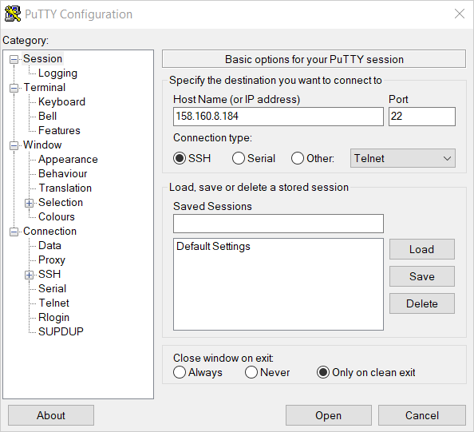
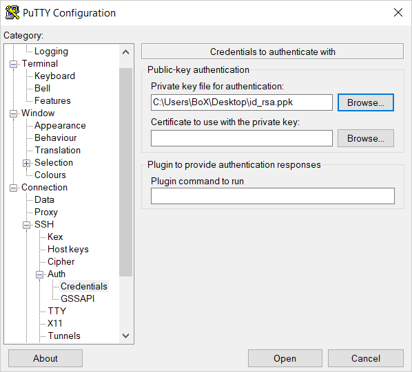
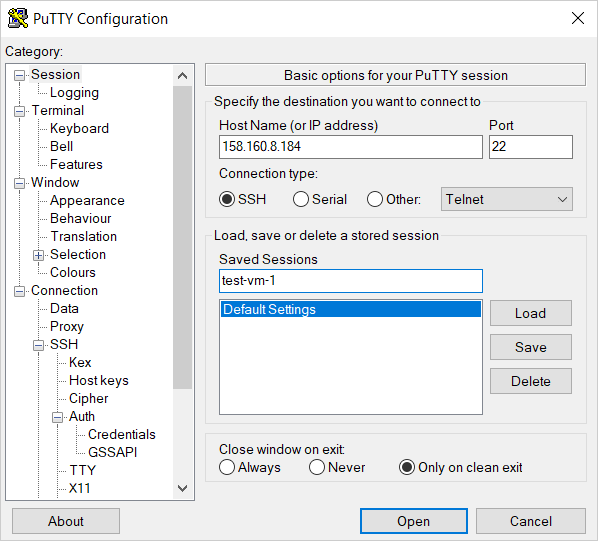
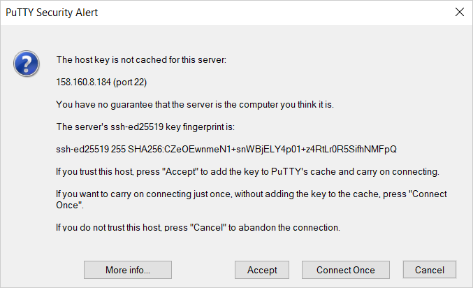
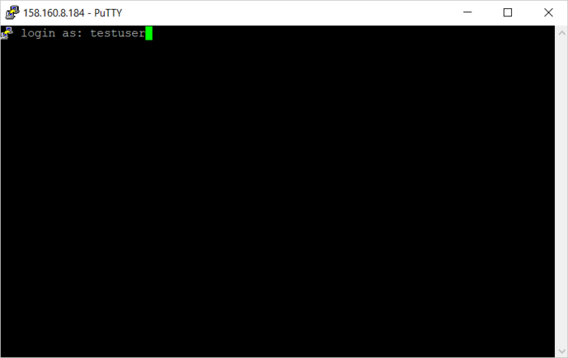

# Подключиться к виртуальной машине Linux по SSH

Рекомендуемый способ подключения к виртуальной машине по SSH основан на использовании пары ключей: открытый ключ размещается на ВМ, а закрытый ключ хранится у пользователя. Подключение с помощью пары ключей более безопасно, чем подключение по логину и паролю.

## Создание пары ключей SSH {#creating-ssh-keys}





Надежно сохраните закрытый ключ: без него подключиться к ВМ будет невозможно.



## Копирование публичного ключа в буфер обмена {#copy-key}

Скопируйте ключ из файла `<имя_ключа>.pub` с помощью любого текстового редактора, например Notepad. Обратите внимание, что ключ должен быть записан **одной строкой** (не должно быть переносов и разрывов строки).

Ключ можно скопировать и с помощью командной строки:



- Windows

  1. Запустите `cmd.exe` или `powershell.exe`.

  1. Выведите на экран содержимое файла:

     ```bash
     type C:\Users\<имя_пользователя>\.ssh\<имя_ключа>.pub
     ```
     Где:

     * `<имя_пользователя>` — название вашей учетной записи Windows, например, `User`.
     * `<имя_ключа>` — название ключа, например, `id_ed25519` или `id_rsa`.

     Открытый ключ будет выведен на экран. Чтобы скопировать ключ, выделите его и нажмите правую кнопку мыши. Например: `ssh-ed25519 AAAAC3NzaC1lZDI1NTE5ABFLIFyapYheN7OZNhTaNqEHefjmU5mtzK7roNnfzL+gRPCz`.

  1. Можно сразу скопировать содержимое файла в буфер обмена:

     ```bash
     type C:\Users\User\.ssh\id_ed25519.pub | clip
     ```
     Вставьте открытый ключ в поле **SSH-ключ** при создании ВМ через [консоль управления]({{ link-console-main }}).

- Linux

  1. Запустите терминал.

  1. Выведите на экран содержимое файла:

     ```bash
     cat ~/.ssh/<имя_ключа>.pub
     ```
     Где `<имя_ключа>` — название ключа, например, `id_ed25519` или `id_rsa`.

     Открытый ключ будет выведен на экран. Выделите текст и скопируйте его в буфер обмена. Например: `ssh-ed25519 AAAAC3NzaC1lZDI1NTE5ABFLIFyapYheN7OZNhTaNqEHefjmU5mtzK7roNnfzL+gRPCz user@Desktop`.

  1. Можно сразу скопировать содержимое файла в буфер обмена:

     ```bash
     cat ~/.ssh/id_ed25519.pub | xclip -selection clipboard
     ```
     Вставьте открытый ключ в поле **SSH-ключ** при создании ВМ через [консоль управления]({{ link-console-main }}).

- macOS

  1. Запустите терминал.

  1. Выведите на экран содержимое файла:

     ```bash
     cat ~/.ssh/<имя_ключа>.pub
     ```
     Где `<имя_ключа>` — название ключа, например, `id_ed25519` или `id_rsa`.

     Открытый ключ будет выведен на экран. Выделите текст и скопируйте его в буфер обмена. Например: `ssh-ed25519 AAAAC3NzaC1lZDI1NTE5ABFLIFyapYheN7OZNhTaNqEHefjmU5mtzK7roNnfzL+gRPCz user@Desktop`.

  1. Можно сразу скопировать содержимое файла в буфер обмена:

     ```bash
     cat ~/.ssh/id_ed25519.pub | pbcopy
     ```
     Вставьте открытый ключ в поле **SSH-ключ** при создании ВМ через [консоль управления]({{ link-console-main }}).



## Подключение к виртуальной машине {#vm-connect}

Вы можете подключиться к виртуальной машине в статусе `RUNNING` по протоколу SSH. Для инициализации всех служб после [запуска](../vm-control/vm-stop-and-start.md#start) ВМ может потребоваться время. Если возникла ошибка соединения, попробуйте снова через несколько минут.

Для подключения можно использовать утилиту `ssh` в Linux/macOS/Windows 10 и программу [PuTTY](https://www.chiark.greenend.org.uk/~sgtatham/putty/) для Windows 7/8.

[Группы безопасности](../../../vpc/concepts/security-groups.md) виртуальной машины должны разрешать входящий трафик по протоколу TCP на порт 22.



Для подключения необходимо указать публичный адрес виртуальной машины. Публичный IP-адрес можно узнать в консоли управления в поле **Публичный IPv4** блока **Сеть** на странице виртуальной машины. Если вы создали машину только с внутренним адресом, [привяжите к ней публичный адрес](../vm-control/vm-attach-public-ip.md).

Также можно использовать внутренние IP-адреса и FQDN для установки SSH-соединения между виртуальными машинами внутри одной облачной сети {{ yandex-cloud }}.



- Linux/macOS

  В терминале выполните команду:

  ```bash
  ssh <имя_пользователя>@<публичный_IP-адрес_виртуальной_машины>
  ```

  Если у вас несколько закрытых ключей, укажите нужный:

  ```bash
  ssh -i <путь_к_ключу/имя_файла_ключа> <имя_пользователя>@<публичный_IP-адрес_виртуальной_машины>
  ```

  При первом подключении к машине появится предупреждение о неизвестном хосте:

  ```
  The authenticity of host '130.193.40.101 (130.193.40.101)' can't be established.
  ECDSA key fingerprint is SHA256:PoaSwqxRc8g6iOXtiH7ayGHpSN0MXwUfWHkGgpLELJ8.
  Are you sure you want to continue connecting (yes/no)?
  ```

  Введите в терминале слово `yes` и нажмите **Enter**.

- Windows 10

  Убедитесь, что учетная запись Windows обладает правами на чтение файлов в папке с ключами.

  Для подключения к виртуальной машине в командной строке выполните команду:

  ```powershell
  ssh <имя_пользователя>@<публичный_IP-адрес_виртуальной_машины>
  ```

  Если у вас несколько закрытых ключей, укажите нужный:

  ```powershell
  ssh -i <путь_к_ключу\имя_файла_ключа> <имя_пользователя>@<публичный_IP-адрес_виртуальной_машины>
  ```

  При первом подключении к машине появится предупреждение о неизвестном хосте:

  ```
  The authenticity of host '130.193.40.101 (130.193.40.101)' can't be established.
  ECDSA key fingerprint is SHA256:PoaSwqxRc8g6iOXtiH7ayGHpSN0MXwUfWHkGgpLELJ8.
  Are you sure you want to continue connecting (yes/no)?
  ```

  Введите в командной строке `yes` и нажмите **Enter**.


- Windows 7/8

  В Windows соединение устанавливается с помощью приложения PuTTY.

  1. Запустите приложение Pageant.
     1. Нажмите правой кнопкой мыши на значок Pageant на панели задач.
     1. В контекстном меню выберите пункт **Add key**.
     1. Выберите сгенерированный PuTTY приватный ключ в формате `.ppk`. Если для ключа задан пароль, введите его.
  1. Запустите приложение PuTTY.
     1. В поле **Host Name (or IP address)** введите публичный IP-адрес виртуальной машины, к которой вы хотите подключиться. Укажите порт `22` и тип соединения **SSH**.

        

     1. Откройте в дереве слева пункт **Connection** - **SSH** - **Auth**.
     1. Установите флаг **Allow agent forwarding**.
     1. В поле **Private key file for authentication** выберите файл с приватным ключом.

        

     1. Вернитесь в меню **Sessions**. В поле **Saved sessions** введите любое название для сессии и нажмите кнопку **Save**. Настройки сессии сохранятся под указанным именем. Вы сможете использовать этот профиль сессии для подключения с помощью Pageant.

        

     1. Нажмите кнопку **Open**. Если вы подключаетесь к машине в первый раз, может появиться предупреждение о неизвестном хосте:

        

        Нажмите кнопку **Да**. Откроется окно терминала с предложением ввести логин пользователя, от имени которого устанавливается соединение. Введите имя пользователя, которое вы указали при создании виртуальной машины и нажмите **Enter**. Если все настроено верно, будет установлено соединение с сервером.

        

  Если вы сохранили профиль сессии в PuTTY, в дальнейшем для установки соединения можно использовать Pageant:

  1. Нажмите правой кнопкой мыши на значок pageant на панели задач.
  1. Выберите пункт меню **Saved sessions**.
  1. В списке сохраненных сессий выберите нужную сессию.



## Добавление SSH-ключей для других пользователей {#vm-authorized-keys}

Вы можете добавить SSH-ключи для другого пользователя виртуальной машины. Для этого нужно создать нового пользователя и добавить для него файл с авторизованными ключами.

1. Зайдите на виртуальную машину под именем пользователя, которого вы указали при создании виртуальной машины в консоли управления. Если виртуальная машина создавалась через CLI, то пользователь по умолчанию `yc-user`.

   

   Получить информацию о виртуальной машине вместе с пользовательскими метаданными можно с помощью команды:

   ```bash
   yc compute instance get --full <имя-виртуальной-машины>
   ```

   

1. Создайте нового пользователя и укажите для него оболочку `bash` для использования по умолчанию:

   ```bash
   sudo useradd -m -d /home/testuser -s /bin/bash testuser
   ```

1. Переключитесь на созданного пользователя:

   ```bash
   sudo su - testuser
   ```

1. Создайте папку `.ssh` в домашней директории нового пользователя:

   ```bash
   mkdir .ssh
   ```

1. Создайте в папке `.ssh` файл `authorized_keys`:

   ```bash
   touch .ssh/authorized_keys
   ```

1. Добавьте в файл `authorized_keys` публичный ключ нового пользователя:

   ```bash
   echo "<публичный_ключ>" > /home/testuser/.ssh/authorized_keys
   ```

1. Измените права доступа к файлу `authorized_keys` и каталогу `.ssh`:

   ```bash
   chmod 700 ~/.ssh
   chmod 600 ~/.ssh/authorized_keys
   ```

1. Отключитесь от виртуальной машины командой `exit`.
1. Перезапустите виртуальную машину.
1. Проверьте подключение для нового пользователя:

   ```bash
   ssh testuser@<публичный_IP-адрес_виртуальной_машины>
   ```

#### Что дальше {#what-is-next}

* [Узнайте, как работать с {{ yandex-cloud }} изнутри виртуальной машины](auth-inside-vm.md)
