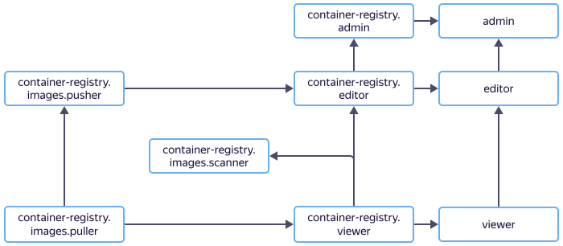

# Управление доступом

В этом разделе вы узнаете:
* [на какие ресурсы можно назначить роль](#resources);
* [какие роли действуют в сервисе](#roles-list);
* [какие роли необходимы](#choosing-roles) для того или иного действия.



## На какие ресурсы можно назначить роль {#resources}

Вы можете назначить роль на [облако](../../resource-manager/concepts/resources-hierarchy.md#cloud), [каталог](../../resource-manager/concepts/resources-hierarchy.md#folder), [реестр](../concepts/registry.md) или [репозиторий](../concepts/repository.md). Эти роли будут действовать и на вложенные ресурсы.

## Какие роли действуют в сервисе {#roles-list}



### Сервисные роли

Роль | Разрешения
--- | ---
`container-registry.admin` | Разрешает создавать, изменять и удалять [реестры](../concepts/registry.md).
`container-registry.images.puller` | Позволяет скачивать [Docker-образы](../concepts/docker-image.md), а также просматривать информацию о ресурсах сервиса (реестрах, Docker-образах, репозиториях).
`container-registry.images.pusher` | Позволяет управлять Docker-образами и просматривать информацию о ресурсах сервиса (реестрах, Docker-образах, репозиториях).
`resource-manager.clouds.member` | Роль, необходимая для доступа к ресурсам в облаке всем, кроме [владельцев облака](../../resource-manager/concepts/resources-hierarchy.md#owner) и [сервисных аккаунтов](../../iam/concepts/users/service-accounts.md).
`resource-manager.clouds.owner` | Дает полный доступ к облаку и ресурсам в нем. Можно назначить только на облако.

Более подробную информацию о сервисных ролях читайте на странице [{#T}](../../iam/concepts/access-control/roles.md) в документации сервиса {{ iam-full-name }}.

### Примитивные роли



## Какие роли мне необходимы {#choosing-roles}

В таблице ниже перечислено, какие роли нужны для выполнения указанного действия. Вы всегда можете назначить роль, которая дает более широкие разрешения, нежели указанная. Например, назначить `editor` вместо `viewer`.

Действие | Методы | Необходимые роли
--- | --- | ---
**Просмотр информации** | |
Получение списка [реестров](../operations/registry/registry-list.md)| `list` | `container-registry.images.puller` на каталог
Получение информации о реестрах, [Docker-образах](../operations/docker-image/docker-image-list.md) и [репозиториях](../operations/repository/repository-list.md) | `get`, `list` | `container-registry.images.puller` на реестр с указанным ресурсом
[Скачивание Docker-образа](../operations/docker-image/docker-image-pull.md) | — | `container-registry.images.puller` на указанный реестр или репозиторий
Получение информации о [политиках удаления](../operations/lifecycle-policy/lifecycle-policy-list.md) и результатах их [тестовых запусков](../operations/lifecycle-policy/lifecycle-policy-dry-run.md) | `get`, `list`, `getDryRunResult`, `listDryRunResults`| `viewer` на реестр или репозиторий, для которого создана политика удаления
**Управление ресурсами** | |
[Создание реестров в каталоге](../operations/registry/registry-create.md) | `create` | `editor` на каталог
[Изменение](../operations/registry/registry-update.md) и [удаление](../operations/registry/registry-delete.md) реестров | `update`, `delete` | `editor` на указанный реестр
[Создание Docker-образов](../operations/docker-image/docker-image-create.md) c использованием базовых Docker-образов из реестра | — | `container-registry.images.puller` на указанный реестр или репозиторий
[Создание Docker-образов](../operations/docker-image/docker-image-create.md) без использования базовых Docker-образов из реестра| — | Не требует ролей
[Загрузка Docker-образов в реестр](../operations/docker-image/docker-image-push.md) | — | `container-registry.images.pusher` на указанный реестр или репозиторий
[Удаление Docker-образов](../operations/docker-image/docker-image-delete.md) | `delete` | `editor` на реестр или репозиторий с Docker-образом
[Создание](../operations/lifecycle-policy/lifecycle-policy-create.md), [изменение](../operations/lifecycle-policy/lifecycle-policy-update.md), [удаление](../operations/lifecycle-policy/lifecycle-policy-delete.md) и [тестовый запуск](../operations/lifecycle-policy/lifecycle-policy-dry-run.md) политики удаления | `create`, `update`, `delete`, `dryRun` | `editor` на реестр или репозиторий, для которого создана политика удаления
**Управление доступом к ресурсам** | |
[Назначение роли](../../iam/operations/roles/grant.md), [отзыв роли](../../iam/operations/roles/revoke.md) и просмотр назначенных ролей на каталог, облако или реестр | `setAccessBindings`, `updateAccessBindings`, `listAccessBindings` | `admin` на этот ресурс

#### Что дальше {what-is-next}

* [Назначить роль](../operations/roles/grant.md).
* [Посмотреть назначенные роли](../operations/roles/get-assigned-roles.md).
* [Отозвать роль](../operations/roles/revoke.md).
* [Подробнее об управлении доступом в {{ yandex-cloud }}](../../iam/concepts/access-control/index.md).
* [Подробнее о наследовании ролей](../../resource-manager/concepts/resources-hierarchy.md#access-rights-inheritance).