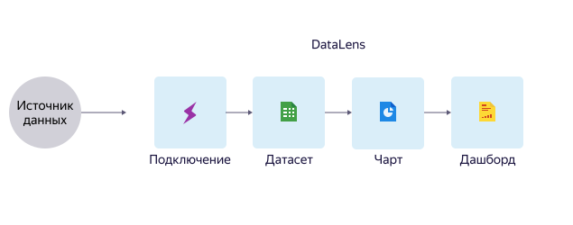

# О сервисе

{{ datalens-full-name }} — это сервис для [бизнес-аналитики](../../glossary/business-analytics). Сервис позволяет подключаться к различным источникам данных, строить визуализации, собирать дашборды и делиться полученными результатами.
С помощью {{ datalens-full-name }} вы можете отслеживать продуктовые и бизнес-метрики напрямую из источников, чтобы принимать решения, основанные на данных.



Количество экземпляров {{ datalens-short-name }} в одном [облаке {{ yandex-cloud }}](../../resource-manager/concepts/resources-hierarchy.md#cloud) — 1.



## Взаимосвязь сущностей {#component-interrelation}

{{ datalens-short-name }} состоит из нескольких сущностей, которые обеспечивают полный цикл работы с данными.

{{ datalens-short-name }} состоит из следующих сущностей:

- **Подключение** — набор параметров для доступа к источнику данных.
- **Датасет** — описание набора данных из источника.
- **Чарт** — визуализация данных из источника данных, датасета в виде таблиц, диаграмм и карт.
- **Дашборд** — набор чартов, селекторов для фильтрации данных и текстовых блоков.

 Вы можете создавать объекты сущностей самостоятельно, а также использовать готовые решения из [{{ datalens-short-name }} Marketplace](marketplace.md). 

