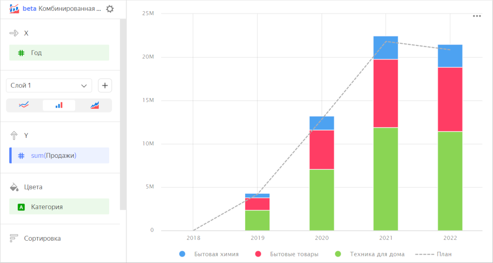
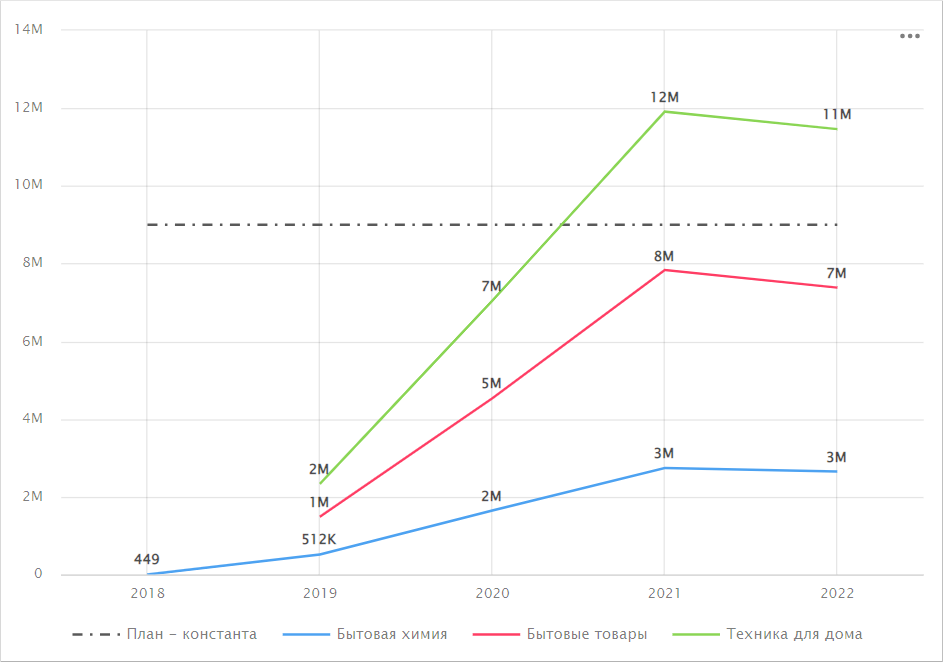

# Комбинированная диаграмма

Комбинированная диаграмма — отдельный тип визуализации, который состоит из слоев. Каждый слой представлен отдельным типом диаграммы. Можно комбинировать [линейные](line-chart.md), [столбчатые](column-chart.md) и [диаграммы с областями](area-chart.md).

Особенности:

* Ось **Х** общая для всех слоев.
* Слои можно добавлять, удалять, менять порядок, переименовывать.
* Каждый слой исполняется в базе отдельным запросом.
* Количество слоев не ограничено.



* В столбчатых диаграммах нет раскраски по показателю.
* В комбинированной диаграмме сортировка применяется только к тем слоям, где она возможна.



Комбинированную диаграмму часто используют для сравнения плана и факта. Линию плана можно показать пунктиром на слое с линейной диаграммой, а столбики факта — разбить по категориям на слое со столбчатой.



|Год|Категория|План|Продажи|
|-----|-----|-----|-----|
|2018|Бытовая химия|435.53|449|
|2018|Бытовые товары|null|null|
|2018|Техника для дома|null|null|
|2019|Бытовая химия|503255|512282|
|2019|Бытовые товары|1457502|1483733|
|2019|Техника для дома|2237228.4|2331805|
|2020|Бытовая химия|1623124|1644668|
|2020|Бытовые товары|4495448|4535567|
|2020|Техника для дома|6711462.8|7046605|
|2021|Бытовая химия|2686134|2737436|
|2021|Бытовые товары|7794310|7836228|
|2021|Техника для дома|11329663.6|11910983|
|2022|Бытовая химия|2512031|2652918|
|2022|Бытовые товары|7013145|7382385|
|2022|Техника для дома|11327092|11461881|



Комбинированную диаграмму в некоторых случаях удобно использовать для однотипных слоев. Например, на одном слое представлены продажи по категориям, а на втором слое — выведена константа плана.

Можно выводить дополнительные линии, рассчитанные через [оконные](../../datalens/function-ref/window-functions.md) или [LOD-функции](../../datalens/function-ref/aggregation-functions.md#syntax-lod). Например, для расчета среднего по категориям можно воспользоваться формулой: `avg(SUM([Продажа] INCLUDE [Категория]))`.

## Секции в визарде {#wizard-sections}

Секция  в визарде| Описание
----- | ----
X | Измерение. Может быть указано только одно поле. Обычно это измерение бывает датой. В этом случае проверьте, что в датасете для этого поля указан тип данных `Дата`. Это необходимо для корректной сортировки, отображения подписей. Для более наглядной визуализации дату можно группировать в недели, месяцы, годы (подробнее в разделе [{#T}](../concepts/chart/settings.md#field-settings)). Секция **Х** общая для всех слоев.
Секция слоя | Позволяет добавлять, удалять, менять порядок, переименовывать слои. Можно выбрать тип диаграммы для слоя: [линейную](line-chart.md), [столбчатую](column-chart.md) или [диаграмму с областями](area-chart.md). Список остальных секций зависит от типа выбранной диаграммы слоя.

## Создание комбинированной диаграммы {#create-diagram}

Чтобы создать комбинированную диаграмму:

1. На [главной странице]({{ link-datalens-main }}) сервиса {{ datalens-full-name }} нажмите **Создать чарт**.
1. В разделе **Датасет** выберите датасет для визуализации.
1. Выберите тип чарта **Комбинированная диаграмма**.
1. Перетащите измерение из датасета в секцию **X**. Значения отобразятся в нижней части графика по оси X.
1. Выберите тип диаграммы слоя: линейную , столбчатую  или диаграмму с областями . При необходимости измените название слоя.
1. Постройте диаграмму соответствующего типа:

   * [{#T}](line-chart.md#create-diagram)
   * [{#T}](column-chart.md#create-diagram)
   * [{#T}](area-chart.md#create-diagram)

1. Добавьте новый слой. Для этого нажмите значок  справа от названия слоя.
