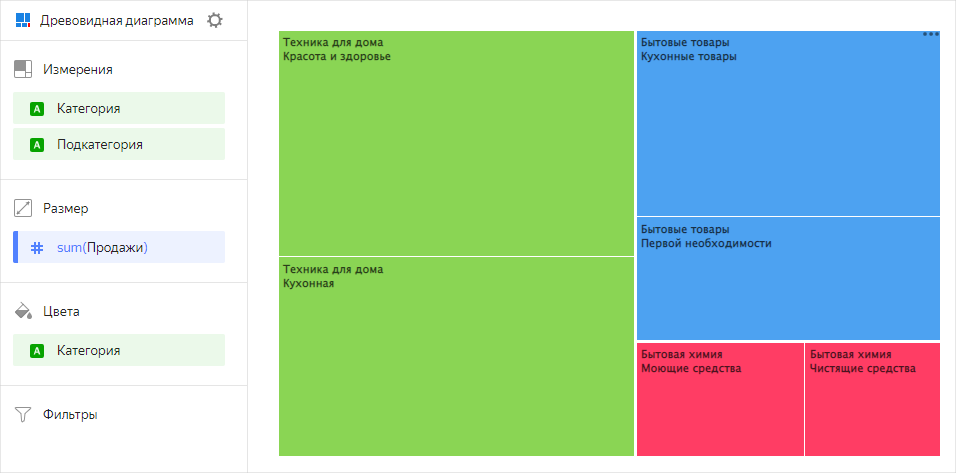

# Древовидная диаграмма

Древовидная диаграмма отражает иерархические данные как набор вложенных прямоугольников. Каждый уровень иерархии соответствует измерению и  представлен цветным прямоугольником, содержащим вложенные прямоугольники. Размер каждого прямоугольника определяется значением показателя: чем выше значение показателя, тем больше размер. Диаграмма экономично расходует место на дашборде даже при большом количестве данных.

Например, с помощью древовидной диаграммы можно показать продажи в разрезе категорий и подкатегорий товаров.



| Категория        | Подкатегория         | Продажи  |
|------------------|----------------------|----------|
| Техника для дома | Кухонная             | 15000000 |
| Техника для дома | Красота и здоровье   | 17000000 |
| Бытовые товары   | Кухонные товары      | 12000000 |
| Бытовые товары   | Первой необходимости | 8000000  |
| Бытовая химия    | Моющие средства      | 4100000  |
| Бытовая химия    | Чистящие средства    | 3300000  |



## Секции в визарде {#wizard-sections}

Секция  в визарде| Описание
----- | ----
Измерения | Измерения. Определяют дерево иерархии вложенности прямоугольников.
Размер | Показатель. Один показатель, который определяет площадь прямоугольника.
Цвета | Измерение или показатель. Влияет на заливку прямоугольников в диаграмме.
Фильтры | Измерение или показатель. Используется в качестве фильтра.

## Создание древовидной диаграммы {#create-diagram}

Чтобы создать древовидную диаграмму:

1. На [главной странице]({{ link-datalens-main }}) сервиса {{ datalens-full-name }} нажмите **Создать чарт**.
1. В разделе **Датасет** выберите датасет для визуализации.
1. Выберите тип чарта **Древовидная диаграмма**.
1. Перетащите одно или несколько измерений из датасета в секцию **Измерения**.
1. Перетащите один показатель из датасета в секцию **Размер**. Значения отобразятся в виде прямоугольников. Площади прямоугольников будут пропорциональны соответствующим значениям выбранного показателя.
1. Перетащите показатель или измерение из секции **Измерения** в секцию **Цвета**. Прямоугольники окрасятся в цвета, зависящие от значения добавленного показателя или измерения. В секции **Цвета** могут быть только те измерения, которые есть в секции **Измерения**.
1. Перетащите измерение или показатель из датасета в секцию **Фильтры**. Поле может быть пустым, тогда фильтрация не будет применена.

## Рекомендации {#recommendations}

* Используйте диаграмму для отображения пропорций между частью и целым.
* При малом количестве категорий (до 6 штук), воспользуйтесь круговой или кольцевой диаграммой.
* На диаграмме нельзя отобразить отрицательные значения.