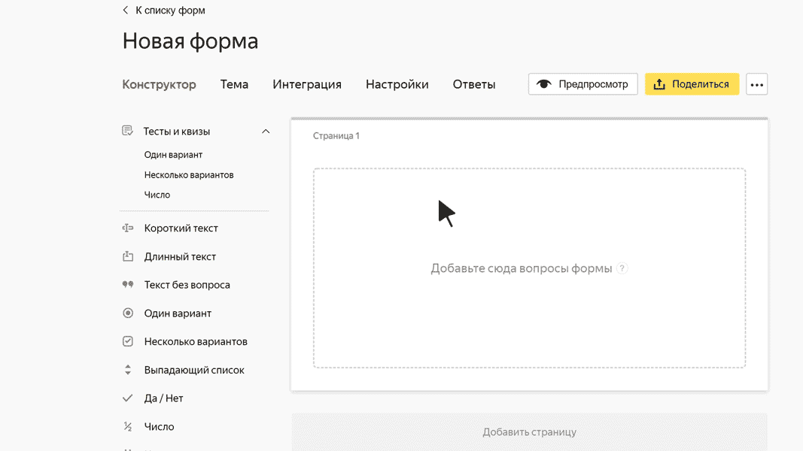

# Выпадающий список

В этом блоке пользователь может выбрать один из пунктов выпадающего списка. Например, семейное положение.

## Настройки блока {#sec_settings}

### Вопрос {#question}

Введите заголовок списка или формулировку вопроса.









### Подставить первый вариант ответа в поле {#first}

Включите эту опцию, чтобы первый вариант ответа в списке подставлялся в поле по умолчанию. Например, если вы считаете, что этот вариант подходит для большинства пользователей. 
Cортировка ответов влияет на то, какой ответ будет подставлен в поле.

### Фильтровать ответы при вводе текста в поле {#filter}

Включите эту опцию, чтобы пользователь мог вводить текст в поле со списком. При этом в списке будут отображаться только те варианты ответа, в которых есть совпадение с введенным текстом.

