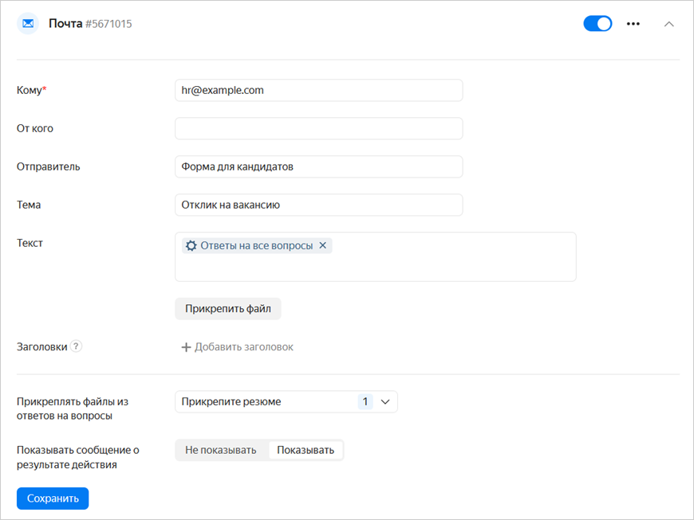

# Отправить письмо

В форме можно настроить интеграцию с Почтой, чтобы автоматически отправлять уведомление при заполнении формы.

## Настроить уведомления {#setup}

1. Выберите форму и перейдите на вкладку **Интеграция**.

1. Выберите [группу действий](notifications.md#add-integration), в которой вы хотите настроить отправку письма, и внизу группы нажмите кнопку  **Почта**.

1. В блоке настройки действия заполните поля:

    - **Кому** — адрес, на который будет отправлено уведомление. Можно перечислить несколько адресов через запятую или указать переменную.

        - Чтобы уведомление пришло на почту автора формы,  выберите переменную **Email автора формы**.

        - Чтобы уведомление пришло на почту аккаунта на Яндексе, с которого пользователь заполнил форму, выберите переменную **Электронная почта**.  Доступно только пользователям [{{ forms-full-name }} для бизнеса](forms-for-org.md).

        - Чтобы уведомление пришло на адрес, указанный пользователем в ответ на вопрос, добавьте переменную **Ответ на вопрос** и выберите вопрос типа <q>Почта</q>. 

    - **Отправитель** — имя отправителя, которое увидит получатель письма.

    - **Обратный адрес** — почтовый адрес, на который получатель может отправить ответ на письмо. Если обратный адрес не указан, вы не сможете получить ответ.

    - **Тема** — тема письма.

    - **Текст** — текст письма.

    - При необходимости добавьте в сообщение заголовки. Для каждого заголовка укажите имя и значение.

    В любое поле можно вставить ответ на вопрос или другие данные из формы:

    - Выберите поле и справа нажмите значок .

    - Выберите в списке [переменную](vars.md), которую нужно добавить в поле. Например, в текст письма можно добавить обращение к пользователю по имени или [результат теста](tests.md).
    
    

1. Чтобы прикрепить к письму файл с вашего компьютера, нажмите кнопку **Прикрепить файл**.

   Чтобы прикрепить к письму файлы, которые пользователь отправил в ответ на форму, в списке **Прикреплять файлы из ответов на вопросы** выберите вопросы типа <q>Файл</q>.

1. Чтобы после заполнения формы показать пользователю сообщение об отправленном письме, под заголовком действия включите опцию **Показывать сообщение о результате действия**.

1. Нажмите кнопку **Сохранить**.

Чтобы отправить несколько почтовых уведомлений одновременно, добавьте новые действия с помощью кнопки  **Почта** внизу группы действий.

Если нужно отправлять уведомление, только когда пользователь ответил на вопросы определенным образом, [задайте условия](notifications.md#section_xlw_rjc_tbb).

> Пример уведомления для формы с анкетой для кандидатов на вакансию. После заполнения формы ответы на вопросы анкеты будут отправлены на почтовую рассылку отдела кадров.
>
> 

## Решение проблем {#troubleshooting}

Если вы настроили отправку уведомлений на почту, но после заполнения формы письма не приходят, проверьте папку со спамом и ошибки при отправке писем.

### Проверьте, попало ли письмо в спам
Если на вашу почту не приходят уведомления, проверьте папку <q>Спам</q>. Для писем от сервиса {{ forms-full-name }}, которые попали в спам, поставьте отметку <q>Не спам</q>.

 Если вы используете собственный почтовый сервер, добавьте в <q>белый список</q> адреса отправителей: `идентификатор_формы@forms-mailer.yaconnect.com` и `sndr.bnc@yandex.ru`.

### Проверьте текст письма

Почтовый сервер может заблокировать письмо, если его текст отсутствует или похож на спам. Заполните или отредактируйте текст письма. 

### Проверьте ошибки при отправке писем

1. Откройте форму, в которой не работают уведомления, и вверху страницы нажмите **Интеграция**.

1. Проверьте, появилось ли в настройках вашего уведомления сообщение об ошибке.

1. Если сообщение об ошибке отображается, попытайтесь [повторно запустить отправку уведомлений](notifications.md#status).

1. Если проблема не решилась, [отправьте обращение в службу поддержки {{ forms-full-name }}](feedback.md).

### Если уведомлений в спаме и ошибок нет

Если вы не нашли уведомлений в папке <q>Спам</q> и ошибок на вкладке **Интеграция**, возможно, что письмо заблокировано на почтовом сервере получателя. Чтобы выяснить причину блокировки письма:

1. Откройте форму, в которой не работают уведомления, и вверху страницы нажмите **Интеграция**.

1. В настройках почтового уведомления в поле **Обратный адрес** укажите вашу личную или рабочую почту.

1. Когда очередное уведомление из формы будет заблокировано почтовым сервером, на указанный обратный адрес придет письмо с сообщением об ошибке. Скопируйте текст сообщения.

1. [Отправьте обращение в службу поддержки {{ forms-full-name }}](feedback.md) и добавьте в него полученное сообщение об ошибке.