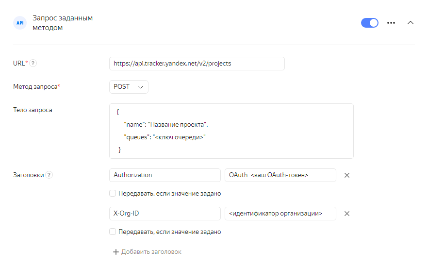

# Отправить HTTP-запрос




Для корректной работы HTTP-запросов необходимо разрешить вашему сервису принимать пакеты из сети {{ forms-full-name }} `2a02:6b8:c00::/40` по протоколу `ipv6`. В ином случае файрвол вашего сервиса может блокировать данные, передаваемые формой.




Чтобы передать данные из формы в веб-сервис через API, используйте HTTP-запросы:


1. Выберите форму и перейдите на вкладку **Интеграция**.

1. Выберите [группу действий](notifications.md#add-integration), в которую вы хотите добавить HTTP-запрос, и внизу группы нажмите кнопку с нужным типом запроса:
    
    - **Запрос JSON-RPC POST** — отправить запрос по протоколу JSON-RPC.
    
    
    - **Запрос заданным методом** — отправить любые доступные данные формы с возможностью задать формат запроса и выбрать HTTP-метод.
    
    
    
    Все запросы выполняются асинхронно.

    

1. Укажите URL сервиса — адрес узла, предоставляющего API.


1. Задайте параметры, которые зависят от выбранного типа запроса:
    
    - Запрос JSON-RPC POST
        
        - Укажите метод сервиса, в который отправляется запрос.

        - Задайте параметры запроса. Для каждого параметра укажите имя и значение. 
        
        - В качестве значений параметров можно использовать [переменные](vars.md). В этом случае включите опцию **Передавать, если значение задано**.
    
    
    - Запрос заданным методом
        
        - Выберите HTTP-метод.
        
        - Задайте тело запроса: укажите передаваемые параметры в формате JSON. Чтобы добавить в тело запроса данные из формы, используйте [переменные](vars.md).
        
        - Добавьте в запрос заголовки. Для каждого заголовка укажите имя и значение. 
        
        - В качестве значений заголовков можно использовать [переменные](vars.md). В этом случае включите опцию **Передавать, если значение задано**.

1. Нажмите кнопку **Сохранить**.

> Пример: создать проект в {{ tracker-full-name}} с заданным названием и ключом очереди.
>
> Создайте запрос к [API {{ tracker-name }}](../tracker/about-api.md), заполнив форму следующим образом:
>
>* **URL** — `https://api.tracker.yandex.net/v2/projects`.
>* **Метод запроса** — `POST`.
>* **Тело запроса** — параметры проекта в формате JSON:
>
>   ```json
>
>       {
>          "name": "Название проекта",
>          "queues": "<ключ очереди>"
>       }
>    ```
>                
>* **Заголовки**:
>  `Authorization` — `OAuth <ваш OAuth-токен>`;
>     `X-Org-ID` — `<идентификатор организации>`.  
>
> 

## Обработка ответов на HTTP-запросы  заданным методом {#http-response}

**Успешный запрос**

Запрос считается успешным, если получен ответ с кодом `200`, `201` или `202`.

**Обработка ошибок**

При возникновении следующих ошибок запрос будет отправлен повторно (до 7 попыток в течение 30 минут):
    
- Истечение таймаута (5 секунд).
    
- Сетевая ошибка.
    
- Ответ с кодом `5XX`.
    
- Ответ с кодом `404`.
    
Все другие ошибки приводят к неуспешному завершению интеграции.

**Редирект**

Если получен ответ с кодом `307`, то запрос будет перенаправлен на URL, указанный в заголовке `Location`.

## Обработка ответов на запрос JSON-RPC POST {#json-response}

**Успешный запрос**

Запрос считается успешным при отсутствии перечисленных ниже ошибок.

**Редирект**

Если получен ответ с кодом `307`, то запрос будет перенаправлен на URL, указанный в заголовке `Location`.

**Обработка ошибок**

Обработка ошибок происходит в следующем порядке:

1. Если ответ не получен из-за сетевой ошибки или по истечении таймаута, запрос будет отправлен повторно.

1. Проверяется тело ответа. Если тело ответа содержит ошибку, запрос будет отправлен повторно при любом коде ошибки, кроме:

    - `-32700` Parse error
    
    - `-32600` Invalid Request
    
    - `-32602` Invalid params

1. Если тело ответа не содержит ошибок, проверяется код состояния HTTP. Запрос будет отправлен повторно при кодах состояния `5XX` и `404`.

Все другие ошибки приводят к неуспешному завершению интеграции.

## Решение проблем {#filters}

### На один ответ в форме отправляется два HTTP-запроса

В некоторых случаях модуль отправки HTTP-запросов может не дождаться ответа от внешнего сервиса о том, что запрос принят. В этом случае запрос будет отправлен повторно, и в сервис придет дубликат запроса с теми же данными. Если требуется отслеживать уникальность HTTP-запросов, воспользуйтесь значением заголовка `x-delivery-id`.

