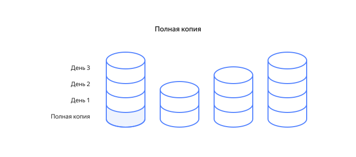
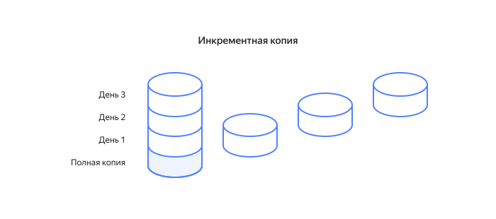
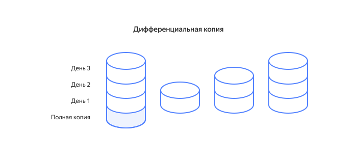

# Бэкап: что такое резервное копирование данных

_Бэкап (backup)_ — это сохранение резервной копии данных на локальном или удаленном носителе. Резервные копии делают для всех данных, которые важны пользователю — операционных систем, виртуальных машин, сайтов, фотографий, видео и многих других данных. Бэкап позволяет предотвратить их потерю и восстановить исходные данные при необходимости.

## Важность бэкапа {#backup-importance}

В современном мире бэкапы помогают обеспечивать безопасность данных.

Бэкапы сохраняют ценную для пользователя информацию — личные фотографии и видео, документы, файлы настроек и сейвы игр. Также создание резервных копий необходимо для компаний, в особенности тех, которые хранят большие объемы данных — финансовые отчеты, клиентские данные, проекты и т.д. Иными словами, бэкап нужен для любых уникальных данных, которыми вы владеете.

Без резервных копий вы рискуете потерять важные данные в случае сбоя оборудования или программного обеспечения, случайного удаления информации или других непредвиденных ситуаций. Использование бэкапов также помогает сократить время на восстановление данных после сбоя и обеспечить непрерывность работы.

Когда поможет бэкап:
* **Поломка оборудования**
  Если оборудование вышло из строя, вы сможете восстановить исходные данные при помощи резервных копий, сохраненных на другом носителе.

* **Неудачное обновление**
  Иногда обновления операционных систем, программ или сервисов приводят к ошибкам. Сделайте бэкап перед обновлением. Вы сможете вернуться к предыдущему состоянию, если обновление пройдет неудачно.

* **Миграция системы**
  Резервные копии помогут при запланированном переносе информации на новый носитель, а также при переезде сайта с одного хостинга на другой.

* **Потеря данных**
  Если данные повреждены или уничтожены, например, вирусами, вы сможете восстановить исходные данные из резервной копии.

## Основные принципы бэкапа {#backup-principles}

Для успешного применения бэкапа, придерживайтесь простых принципов создания резервных копий.

### Регулярность {#regularity}

Бэкап следует делать регулярно, чтобы не потерять важную информацию при сбое системы или другой непредвиденной ситуации.

Период с момента создания последней резервной копии до сбоя называется _целевой точкой восстановления_. Другими словами, это — максимальный период, данными за который некритично пожертвовать из-за какого-либо непредвиденного события. Чем важнее данные, тем короче должен быть этот период.

При этом бэкап должен быть оправдан: затраты на сохранение резервных копий не должны превышать затраты, которые понесет пользователь в случае утери данных. Придерживайтесь этого правила при определении периодичности бэкапа, а также объема данных, для которых вы будете делать бэкап.

### Надежность {#reliability}

Резервная копия должна быть надежной и безопасной, чтобы предотвратить потерю данных.

_Избыточность_ — это критерий надежности, отражающий количество резервных копий. Для важных данных избыточность должна быть высокой — резервные копии нужно сохранить на нескольких носителях. Например, на внешнем жестком диске и в облаке.

### Простота {#simplicity}

Создание резервных копий, а также восстановление данных должно быть легким и удобным процессом. Упростить бэкап помогут специально созданные для этого приложения и облачные сервисы. Сделать процесс восстановления данных проще поможет использование версионирования. 

_Версионирование_ — это сохранение нескольких версий резервных копий. Оно особенно актуально для данных, которые часто меняются. Сохраняя разные версии, вы имеете возможность вернуться к любой из них в случае необходимости. Бэкап важных данных обычно версионируют.

### Масштабируемость {#scalability}

Бэкап должен масштабироваться для работы с большими объемами информации. 

Пересматривайте область резервного копирования, когда меняете инфраструктуру. Все новые устройства, программы и службы используют данные. Старайтесь делать бэкап всего, что не сможете найти в Интернете в случае сбоя.

Когда-то пользователю хватало дискеты 1,44 МБ, чтобы сохранить важную информацию. Сегодня такой размер вызывает лишь улыбку. Данных становится больше с каждым днем. Предусмотрите это, используя для бэкапа ресурсы с возможностью увеличения объема, например, облачное хранилище.

## Виды бэкапа {#backup-types}

Резервное копирование бывает двух основных видов — локальный и облачный бэкап. Локальный бэкап подразумевает создание резервных копий на физическом носителе, а облачный — на удаленных серверах. Выбирайте место для создания резервных копий в зависимости от особенностей данных и требований к их безопасности. Каждый из этих видов резервного копирования имеет свои плюсы и минусы, которые мы рассмотрим ниже. 

### Локальный бэкап {#local-backup}

_Локальный бэкап_ предполагает создание резервной копии данных на локальном устройстве. Сохранение копии фотографий с телефона на компьютере, курсовой работы — на USB-накопителе, а базу данных клиентов — в сетевом хранилище — это локальный бэкап. Создание резервных копий на физическом носителе — наиболее простой, привычный и понятный процесс для большинства пользователей.

#### Типы локальных устройств {#local-devices}

Рассмотрим несколько распространенных типов локальных устройств для создания резервных копий, их плюсы и минусы.

#|
|| **Устройство** | **Преимущества** | **Недостатки** ||
|| Локальный жесткий диск |

Является самым простым и доступным устройством для бэкапа, потому что требует только наличия свободного места. |

Бэкап на локальный жесткий диск самый ненадежный, поскольку резервные копии и исходные данные хранятся на одном физическом носителе. Данные легко ошибочно повредить или удалить. Кроме того, их могут атаковать вирусы. ||

|| Внешний жесткий диск |

Обеспечивает большую безопасность данных по сравнению с локальным жестким диском, поскольку резервные копии хранятся на отдельном устройстве. |

Внешний жесткий диск легко повредить. При выборе его в качестве устройства для бэкапа данных, обращайте особое внимание на прочность корпуса. ||

|| USB-накопитель |

Дешевле внешнего жесткого диска. Удобен для сохранения резервных копий, поскольку он компактный и  легко подключается через USB-порт ко многим устройствам. |

Максимальный объем памяти значительно меньше, чем у внешнего жесткого диска. ||

|| CD/DVD-диск |

Может использоваться для бэкапа операционных систем и важных файлов. |

Имеет очень небольшой объем памяти и его легко повредить. ||

|| Сетевое хранилище (NAS) |

Бэкап при помощи сетевого хранилища позволяет сохранять резервные копии на нескольких компьютерах одновременно, что востребованно для больших организаций или компаний. |

Использование сетевых дисков бывает сложным и дорогостоящим. ||
|#

#### Преимущества локального бэкапа {#local-backup-advantages}

Благодаря локальному бэкапу, вы легко контролируете данные и имеете к ним быстрый доступ в любое время, даже при отсутствии выхода в Интернета.

#### Недостатки локального бэкапа {#local-backup-disadvantages}

Информацию на физическом носителе вы можете случайно удалить или повредить. Также она может быть утеряна из-за поломки устройства. Локальные носители ограничены по размеру и не всегда имеют достаточный объем памяти для хранения необходимого количества бэкапов.

### Облачный бэкап {#cloud-backup}

Облачный бэкап — предполагает создание копии данных на удаленном сервере. Здесь мы можем выделить два разных метода бэкапа:

* **Бэкап в облачное хранилище**
  В этом случае вы создаете резервную копию важной информации в облачное хранилище. К таким хранилищам относятся, например, [Yandex Disk](https://disk.yandex.ru), Dropbox или Google Drive.

* **Сервис бэкапа в облаке**
  Сервис бэкапа в облаке дает возможность создания резервных копий виртуальных машин. В отличии от облачного хранилища, сервис выполняет бэкап автоматически. Для этого нужно только настроить _политику копирования_ — шаблон, определяющий частоту создания копий и правила их хранения. К таким сервисам относится, например, [{{ backup-full-name }}](/services/backup), Azure Backup или Google Cloud Backup and DR. Более подробно о сервисе {{ backup-full-name }} читайте в разделе [Бэкап в {{ yandex-cloud }}](#backup-yandex-cloud).

#### Преимущества облачного бэкапа {#cloud-backup-advantages}

* **Доступность**
  Вы имеете доступ к резервной копии через Интернет в любое время и в любом месте.

* **Масштабируемость**
  Размеры облачного хранилища легко корректируются под ваши требования.

* **Надежность** 
  В отличие от физического носителя, который может сломаться, потеряться, выйти из строя из-за вирусной атаки, удаленные сервера надежно хранят резервные копии.

* **Удобство**
  В сервисах бэкапа резервные копии создаются автоматически. Периодичность создания копий определяется политикой резервного копирования. Это позволяет вам не беспокоиться о том, как давно был сделан последний бэкап — сервис это контролирует.

#### Недостатки облачного бэкапа {#cloud-backup-disadvantages}

* **Стоимость**
  Бэкап в облаке может быть дороже, чем бэкап на локальном устройстве. Однако, у многих облачных хранилищ есть лимит, которым вы можете пользоваться бесплатно. 

* **Безопасность**
  Данные могут быть уязвимыми для атак хакеров и кибератак, если они хранятся на удаленных серверах без достаточной защиты. Так, например, в 2022 году [была обнаружена уязвимость](https://www.vesti.ru/hitech/article/2605742) облачного сервиса Microsoft Azure, которая ставила под угрозу базы данных крупнейших мировых компаний.

  Не существует безопасного на 100% облачного хранилища, поскольку всегда будет угроза со стороны хакеров. Но вы должны понимать, что сервис, которому вы доверяете свои данные, делает все возможное для их безопасности. 

## Методы резервного копирования {#backup-methods}

Вы можете создавать резервные копии разными способами. Рассмотрим самые популярные.

### Полный бэкап {#full-backup}

При полном резервном копировании создаются копии всего, что вы хотите сохранить. Все последующие бэкапы также содержат полный объем копируемых данных.

Этот тип копирования данных считается самым надежным, поскольку каждая из копий содержит полный набор информации. Однако, это делает процесс сохранения копий долгим и требует очень много места.

### Инкрементный бэкап {#incremental-backup}

Инкрементный бэкап является альтернативой полному бэкапу. При таком копировании только первая резервная копия содержит весь объем копируемых данных. Все следующие инкрементные копии содержат только данные, которые были изменены после последнего копирования.

Этот метод занимает значительно меньше места. Однако, полное восстановление занимает больше времени, так как для этого необходимо восстановление не только полной резервной копии, но и всех инкрементных. Также при потере хотя бы одного инкрементного сохранения, полное восстановление будет невозможно.

### Дифференциальный бэкап {#differential-backup}

Еще один метод сохранения резервных копий — дифференциальный бэкап. При таком копировании только первая копия содержит полный объем копируемых данных. Последующие дифференциальные копии содержат те данные, которые были изменены после полного бэкапа.

Такой метод позволяет выполнить полное восстановление быстрее, требуя только полной резервной копии и последней дифференциальной резервной копии. Однако, постепенное увеличение размера дифференциальных резервных копий приводит к увеличению занимаемого места и времени копирования. 

## Бэкап в {{ yandex-cloud }} {#backup-yandex-cloud}

В {{ yandex-cloud }} вы можете создать резервные копии виртуальных машин при помощи сервиса [{{ backup-full-name}}](/services/backup). На стадии [Preview](../overview/concepts/launch-stages) сервис не тарифицируется. 

Копии виртуальных машин создаются по принципу crash-consistent: сохраняются не только данные на дисках, но и промежуточные данные запущенных приложений — память и текущие операции чтения-записи на диски. Такой подход позволяет возобновить работу приложений, работавших на виртуальной машине в момент создания копии, сразу после ее восстановления. Это важно, когда на виртуальной машине запущена система управления базами данных (СУБД).

[Создайте политику резервного копирования](../backup/operations/policy-vm/create.md), и сервис будет автоматически выполнять бэкап виртуальных машин с указанными настройками.

Также для организации бэкапа данных вы можете воспользоваться решениями, которые предлагает сервис [{{ data-transfer-name }}](../data-transfer/concepts/).

Мы знаем насколько важно обеспечить безопасность данных, и делаем все необходимое для этого. Платформа [{{ yandex-cloud }}](https://cloud.yandex.ru/) гарантирует физическую и сетевую безопасность своих серверов, расположенных в трех географических зонах. Контролировать доступ к вашим данным вы можете также с помощью сервиса [{{ iam-name }}](../iam/).

## Заключение {#conclusion}

Согласно [исследованию Avast 2020 года](https://blog.avast.com/ru/65-rossiyan-ne-vypolnyayut-rezervnoe-kopirovanie-svoih-dannyh) 65% россиян не делают бэкап, несмотря на риск потерять важную информацию. А ведь потеря данных — большая проблема в современном мире, поскольку за ней неизбежно следуют затраты времени и денег. Чтобы быть уверенным в сохранности важных данных, необходимо делать бэкапы. Сохранение резервных копий — основная составляющая безопасности данных.

Регулярный бэкап обезопасит ваши данные. Вы всегда сможете вернуться к предыдущему сохраненному состоянию, избежав риска потерять всю информацию.

Настройте процесс создания резервных копий так, чтобы он был простым и удобным. Пользуйтесь бэкапом настолько часто, насколько возможно. Используйте его для телефона, компьютера, виртуальной машины и других устройств, которыми вы пользуетесь.

И тогда закон Мерфи — если существует вероятность того, что некое неприятное событие может произойти, то оно непременно произойдет — не будет вам страшен. При сбое системы, вирусной атаке или случайном удалении данных, вы легко все восстановите.

## Полезные ссылки {#links}

* [Видео о возможностях {{ backup-full-name }}](https://www.youtube.com/results?search_query=yandex+cloud+backup)
* [Статья о работе и развитии сервиса {{ backup-full-name }}](https://cloud.yandex.ru/blog/posts/2022/12/cloud-backup-overview)
* [Сравнение {{ backup-full-name }} и снимков дисков в {{ compute-full-name }}](../backup/concepts/#snapshot-comparison)
