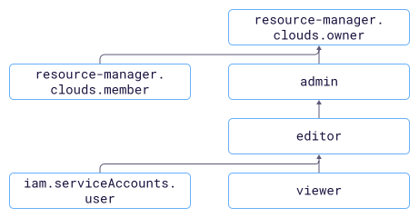

# Управление доступом

В этом разделе вы узнаете:
* [на какие ресурсы можно назначить роль](#resources);
* [какие роли действуют в сервисе](#roles-list);
* [какие роли необходимы](#required-roles) для того или иного действия.



## На какие ресурсы можно назначить роль {#resources}



## Какие роли действуют в сервисе {#roles-list}

На диаграмме показано, какие роли есть в сервисе и как они наследуют разрешения друг друга. Например, в `editor` входят все разрешения `viewer`. После диаграммы дано описание каждой роли.

Роли, действующие в сервисе:

* Сервисные роли:
    * 

        В некоторых сервисах для выполнения операций необходим сервисный аккаунт, например в [{{ ig-name }}]({{ link-cloud-services }}/instance-groups) или [{{ managed-k8s-name }}]({{ link-cloud-services }}/managed-kubernetes). Если вы указали сервисный аккаунт в запросе, то {{ iam-short-name }} проверит, что у вас есть права на использование этого аккаунта.
    * 
    * 
* Примитивные роли:
    * 
    * 
    * 

## Какие роли мне необходимы {#required-roles}

В таблице ниже перечислено, какие роли нужны для выполнения указанного действия. Вы всегда можете назначить роль, которая дает более широкие разрешения, нежели указанная. Например, назначить `editor` вместо `viewer`.

Действие | Методы | Необходимые роли
----- | ----- | -----
**Просмотр информации** | |
[Получение IAM-токена](../operations/iam-token/create.md) | `create` | роли не требуются, только аутентификация
[Просмотр информации о пользователе](../operations/users/get.md) | `get`, `getByLogin` | роли не требуются, только аутентификация
[Просмотр информации о сервисном аккаунте](../operations/sa/get-id.md) | `get`, `list`, `listOperations` | `iam.serviceAccounts.user` или `viewer` на сервисный аккаунт
Просмотр информации о любом ресурсе | `get`, `list` | `viewer` на этот ресурс
**Управление ресурсами** | |
[Создание](../operations/sa/create.md), [изменение](../operations/sa/update.md), [удаление](../operations/sa/delete.md) сервисных аккаунтов | `create`, `update`, `delete` | `editor` на каталог, в котором создается сервисный аккаунт
Создание, изменение, удаление ключей для сервисного аккаунта | `create`, `update`, `delete` | `editor` на сервисный аккаунт
**Управление доступом к ресурсам** | |
[Добавление нового пользователя в облако](../operations/users/create.md) | `setAccessBindings` | `admin` на облако
[Сделать нового пользователя владельцем облака](../operations/roles/grant.md) | `setAccessBindings`, `updateAccessBindings` | `resource-manager.clouds.owner` на это облако
[Назначение роли](../operations/roles/grant.md), [отзыв роли](../operations/roles/revoke.md) и просмотр назначенных ролей на ресурс | `setAccessBindings`, `updateAccessBindings`, `listAccessBindings` | `admin` на этот ресурс

#### Что дальше

* [Как назначить роль](../../iam/operations/roles/grant.md).
* [Как отозвать роль](../../iam/operations/roles/revoke.md).
* [Подробнее об управлении доступом в Яндекс.Облаке](../../iam/concepts/access-control/index.md).
* [Подробнее о наследовании ролей](../../resource-manager/concepts/resources-hierarchy.md#access-rights-inheritance).
