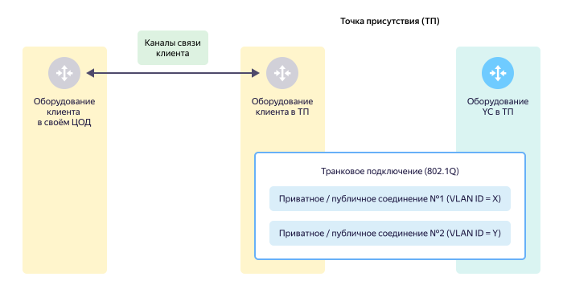

# Транковое подключение (L2)

Транковое подключение — это способ мультиплексирования трафика на втором уровне [модели OSI](https://ru.wikipedia.org/wiki/Сетевая_модель_OSI). В транковом подключении применяется технология тегирования Ethernet-фреймов по стандарту IEEE 802.1Q. Мультиплексирование позволяет передавать в одном [прямом физическом стыке](l1-physical.md) трафик нескольких логических потоков данных. В качестве разделителя логических потоков используется VLAN ID — тег из стандарта 802.1Q. Размерность VLAN ID составляет 12 бит, то есть VLAN ID могут принимать значения от `0` до `4095`.



В {{ yandex-cloud }} разрешается использовать значения VLAN ID только в диапазоне от `2` до `4000` включительно.



На уровне транкового подключения со стороны {{ yandex-cloud }} применяется ограничение скорости приема и передачи данных между облаком и вашим оборудованием в битах/с и пакетах/с в соответствии с выбранным [пакетом трафика](../manual.md#bandwidth). Для этого используется механизм RateLimit (Policing). При превышении скорости передачи в битах/с или пакетах/с данные могут быть отброшены. Это может приводить к ситуациям, когда равномерно передаваемый трафик будет передаваться с более высокой скоростью, чем трафик, передаваемый резкими всплесками.

## Подключение через прямой физический стык (оборудование клиента) {#trunk-over-direct-link}

Транковое подключение организуется поверх прямого физического стыка между оборудованием клиента в [точке присутствия](points-of-presence.md) и оборудованием {{ yandex-cloud }}. 

## Подключение через оператора связи с L2-транзитом до клиентского оборудования {#trunk-over-operator}

Способ применяется, когда у клиента нет собственного оборудования в точке присутствия. При этом:
* Транковое подключение организуется в точке присутствия с привлечением оператора связи, который обеспечивает L2-транзит. 
* Транковое подключение организуется между оборудованием клиента в ЦОД и оборудованием {{ yandex-cloud }}. 
* При подключении клиентского оборудования оператор использует собственные каналы связи. В случае необходимости изменения номеров VLAN ID соединений (трансляция номеров VLAN ID) на L2-транзите оператор связи должен согласовать с клиентом схему трансляции для корректной конфигурации оборудования клиента в своем ЦОД.

## Подключение через прямой физический стык (оборудование оператора связи) {#trunk-over-operator-2}

Способ применяется, когда у клиента нет собственного оборудования в точке присутствия. При этом:
* Транковое подключение организуется в точке присутствия с привлечением оператора связи. 
* Транковое подключение организуется между оборудованием оператора связи в точке присутствия и оборудованием {{ yandex-cloud }}. 
* Связность между оборудованием оператора связи в точке присутствия и оборудованием клиента в своем ЦОД обеспечивается на [третьем уровне взаимодействия](l3-ip-bgp.md). Такой вариант может быть использован, если клиент не желает обеспечивать BGP-связность с оборудованием {{ yandex-cloud }} на своем оборудовании и поручает эту задачу оператору связи.
