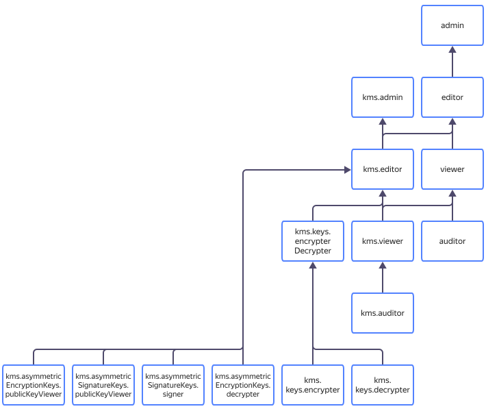

# Управление доступом в {{ kms-name }}

В этом разделе вы узнаете:
* [на какие ресурсы можно назначить роль](#resources);
* [какие роли действуют в сервисе](#roles-list);
* [какие роли необходимы](#choosing-roles) для того или иного действия.



## На какие ресурсы можно назначить роль {#resources}

Роль можно назначить на [облако](../../resource-manager/concepts/resources-hierarchy.md#cloud), [каталог](../../resource-manager/concepts/resources-hierarchy.md#folder) или [ключ](../concepts/key). Эти роли будут действовать и на вложенные ресурсы. Например, в editor входят все разрешения viewer. После диаграммы дано описание каждой роли.

## Какие роли действуют в сервисе {#roles-list}

Управлять доступом к ключам {{ kms-short-name }} можно как с помощью сервисных, так и с помощью примитивных ролей. На диаграмме показано, какие роли есть в сервисе и как они наследуют разрешения друг друга. Например, в `editor` входят все разрешения `viewer`. После диаграммы дано описание каждой роли.

### Сервисные роли {#service}

Сервисные роли обеспечивают более гранулярный, учитывающий специфику сервиса, контроль над ключами {{ kms-short-name }}: предполагают строгое разделение субъектов на администраторов ключей (роль `kms.admin`) и пользователей (роль `kms.keys.encrypterDecrypter`).

Пользователи, у которых отсутствует роль `resource-manager.clouds.owner` или роль `admin`, не могут назначать роли через консоль управления.

Список сервисных ролей:
* `kms.keys.encrypterDecrypter` — позволяет шифровать и расшифровывать данные, а также просматривать информацию о ключах. Включает все права ролей `kms.keys.encrypter` и `kms.keys.decrypter`.
* `kms.keys.encrypter` – позволяет [шифровать](../operations/encryption.md#encryption) данные, а также просматривать информацию о ключах.
* `kms.keys.decrypter` – позволяет [расшифровывать](../operations/encryption.md#decryption) данные, а также просматривать информацию о ключах.
* `kms.admin` — позволяет назначать произвольные роли на ключи с помощью CLI и API, удалять ключи и версии ключей, изменять основную версию. Включает все права роли `kms.editor`.
* `kms.editor` — позволяет управлять ключами (просмотр, создание, изменение, ротация, шифрование и расшифровка данных). Включает все права ролей `kms.viewer` и `kms.keys.encrypterDecrypter`.
* `kms.viewer` — позволяет читать информацию о ключах.

### Примитивные роли {#primitive}

Примитивные роли – общие для всех ресурсов {{ yandex-cloud }}. Назначение любой из них дает некоторые разрешения как в {{ kms-short-name }}, так и в других облачных сервисах. Например, роль `admin`, назначенная на каталог, позволяет удалять любые ключи {{ kms-short-name }} в каталоге, а также дает возможность изменять сам каталог или ресурсы в нем. Управлять примитивными ролями можно с помощью консоли управления.

Список примитивных ролей:
* `viewer` — позволяет только просматривать информацию о ресурсах.
* `editor` — позволяет управлять ресурсами (создавать и изменять их).
* `admin` — позволяет управлять доступом к ресурсам и самими ресурсами (создавать, изменять и удалять их).

## Какие роли мне необходимы {#choosing-roles}

**Пример разграничения доступа к ключам**

С ролями рекомендуется работать следующим образом:
1. Владелец (роль `resource-manager.clouds.owner`) или администратор (роль `admin`) облака назначает роль `kms.admin` администратору {{ kms-short-name }}. 
1. Администратор {{ kms-short-name }} создает необходимое количество ключей и назначает (с помощью CLI или API) роли для их использования: субъекты, представляющие разные команды, получают роли `kms.keys.encrypter`, `kms.keys.decrypter` и `kms.editor` на ключи и каталоги.

Хорошей практикой является хранение ключей {{ kms-short-name }} в выделенном каталоге, отдельно от других ресурсов {{ yandex-cloud }}.

Действие | Методы | Необходимые роли
----- | ----- | -----
**{{ kms-short-name }}** | | 
Получение информации о ключах и версиях | `get`, `listVersions` | `kms.viewer` на ключ на каталог
Операции [шифрования и расшифровки](../api-ref/SymmetricCrypto/) | `encrypt`, `decrypt`, `reEncrypt`, `generateDataKey` | `kms.keys.encrypterDecrypter` на ключ (шифрование и расшифровка), `kms.keys.encrypter` на ключ (только шифрование), `kms.keys.decrypter` на ключ (только расшифровка)
Получение списка ключей в каталоге | `list` | `kms.viewer` на каталог
[Создание](../operations/key.md#create) и [изменение](../operations/key.md#update) ключа | `create`, `update` | `kms.editor` на каталог
[Ротация ключа](../operations/key.md#rotate) | `rotate` | `kms.editor` на ключ
[Смена основной версии](../operations/version.md#make-primary) | `setPrimaryVersion` | `kms.admin` на ключ
[Удаление ключей](../operations/key.md#delete) и [удаление версий](../operations/version.md#delete)| `delete`, `scheduleVersionDestruction`, `cancelVersionDestruction` | `kms.admin` на ключ
[Назначение роли](../../iam/operations/roles/grant.md), [отзыв роли](../../iam/operations/roles/revoke.md) | `setAccessBindings`, `updateAccessBindings` | `kms.admin` на ключ
Просмотр назначенных ролей на ключ | `listAccessBindings` | `kms.viewer` на ключ

#### Что дальше {#what-is-next}

* [Безопасное использование {{ yandex-cloud }}](../../iam/best-practices/using-iam-securely.md)
* [Как назначить роль](../../iam/operations/roles/grant.md).
* [Как отозвать роль](../../iam/operations/roles/revoke.md).
* [Подробнее об управлении доступом в {{ yandex-cloud }}](../../iam/concepts/access-control/index.md).
* [Подробнее о наследовании ролей](../../resource-manager/concepts/resources-hierarchy.md#access-rights-inheritance).
