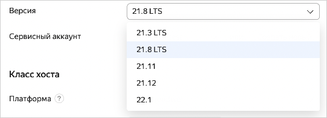

# Изменение версии {{ CH }}

Вы можете изменить версию {{ CH }}, которую использует кластер. Список доступных версий можно увидеть на экране создания или изменения кластера в консоли управления.




## Перед изменением версии {#before-update}

Перед изменением версии {{ CH }} убедитесь, что это не нарушит работу ваших приложений:

1. Посмотрите [историю изменений](https://github.com/yandex/{{ CH }}/blob/master/CHANGELOG_RU.md) {{ CH }} и проверьте, какие из обновлений могут влиять на работу приложений.
1. Попробуйте изменить версию на тестовом кластере (его можно развернуть, например, из резервной копии основного кластера). Обратите внимание, что при развертывании кластера из резервной копии восстановятся только таблицы на движке MergeTree.
1. [Создайте резервную копию](cluster-backups.md#create-backup) основного кластера непосредственно перед изменением версии.

## Изменить версию {#start-update}

Чтобы изменить версию {{ CH }}:



- Консоль управления
  
  1. Откройте страницу сервиса **Managed Service for {{ CH }}** в каталоге, где нужно изменить версию {{ CH }}.
  1. В списке кластеров выберите тот, который нужно изменить.
  1. Нажмите кнопку **Изменить кластер**.
  1. В поле **Версия** выберите версию старше текущей.
  1. Нажмите кнопку **Сохранить изменения**.
  
  После того, как изменение версии запущено, кластер переходит в статус `UPDATING`. Дождитесь окончания операции и проверьте версию кластера.
  
- CLI
  
  1. Получите список ваших кластеров {{ CH }}:
  
     ```
     $ yc managed-clickhouse cluster list
     +----------------------+---------------+---------------------+--------+---------+
     |          ID          |     NAME      |     CREATED AT      | HEALTH | STATUS  |
     +----------------------+---------------+---------------------+--------+---------+
     | c9q8p8j2gaih8iti42mh | clickhouse691 | 2019-04-23 12:44:17 | ALIVE  | RUNNING |
     +----------------------+---------------+---------------------+--------+---------+
     ```
  
  1. Получите информацию о нужном кластере и проверьте версию {{ CH }} в вашем кластере, указанную в параметре `version`:
  
     ```
     $ yc managed-clickhouse cluster get c9q8p8j2gaih8iti42mh
     id: c9q8p8j2gaih8iti42mh
     folder_id: b1gqs1teo2q2a4vnmi2t
     created_at: "2019-04-23T12:44:17.929853Z"
     name: clickhouse691
     environment: PRODUCTION
     monitoring:
     - name: Console
       description: Console charts
       link: https://console.cloud.yandex.ru/folders/b1gqs1teo2q2a4vnmi2t/managed-clickhouse/cluster/c9q8p8j2gaih8iti42mh?section=monitoring
     config:
       version: "19.1"
       clickhouse:
         config:
           user_config: {}
         resources:
           resource_preset_id: s2.micro
           disk_size: "10737418240"
           disk_type_id: network-nvme
       zookeeper:
         resources: {}
     network_id: enp846vf5fus0nt3lu83
     health: ALIVE
     status: RUNNING
     ```
  
  1. Запустите изменение версии {{ CH }}:
  
     ```
     $ yc managed-clickhouse cluster update --id c9q8p8j2gaih8iti42mh --version 19.4
     ```
  
     После того, как изменение версии запущено, кластер переходит в статус `UPDATING`. Дождитесь окончания операции и проверьте версию кластера.
  
- API
  
  Изменить версию {{ CH }} для кластера можно с помощью метода API [update](../api-ref/Cluster/update.md): передайте в запросе нужное значение в параметре `configSpec.clickhouse.config.version`.
  

